Project Creation Lab
====================

In this lab, you use Decision Central to create a customer greeting project, data objects, and decision tables. This project serves as a type of "Hello World" example.

Projects can group a set of business assets together. By using projects, you can organize the assets that affect organization decisions.

## Goals

-   Create a project

-   Practice using data object models

-   Create a decision table

## Pre Reqs

-   Successful completion of the *Environment Setup Lab*

Define Business Case
====================

In this section, you create a decision model to address a simple business problem of greeting a customer. You create a model to produce a customer greeting similar to "Good Morning, Mr. Bond!" A greeting like this is based on the current time of day and includes information about the customer. Such a decision model can be used in an interactive voice response (IVR) system. When you make a call to any customer support system and you are asked to push a button to reach a live agent, you are responding to an IVR system.

Customer greeting variations may be composed of the following elements—a greeting, a salutation (the person’s title), and the person’s name:

Create Customer Greeting Project
================================

1.  Log in to Decision Central.

2.  On the home page, click **Design**.

3.  In the project library view, click **Add Project**:

    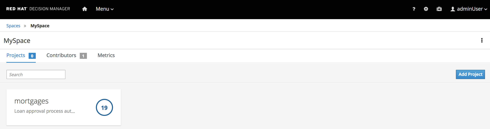

    The context menu icon is located just above **Add Project**. The context menu provides options for importing existing projects that you use later in the course:

    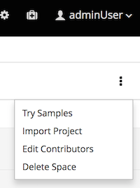

4.  Complete the **Add Project** dialog using these values:

    -   **Project Name**: `customer-greeting`

    -   **Description**: `customer greeting decision project`

        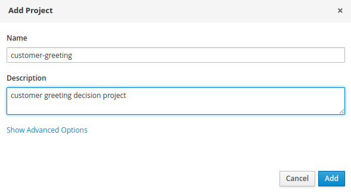

    -   Only the project name is required.

    -   It is a common practice to link the words that make up a project name with hyphens, as done in this case. This is preferred to using spaces between the words, because using spaces results in file names with spaces in them.

    -   Be sure to select short project names—using one to four words.

    -   The **Show Advanced Options** link allows specification of Maven component details that enable projects to link dependencies between each other.

5.  Click **Add**.

    -   Expect to see confirmation that the `customer-greeting` project is successfully created.

    -   An empty project view is displayed for the project:

        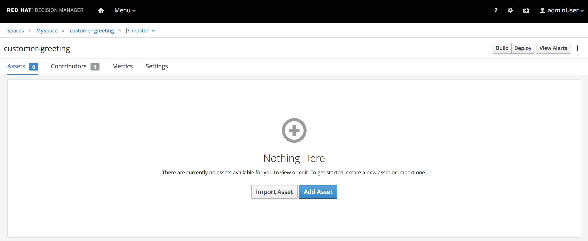

    -   Note the `Add Asset` button that allow you to add assets to the project, as well as the `Import Asset` button to import existing assets.

Define Greeting Decision
========================

In this section, you define the first part of the customer greeting ("Greeting"):

Create Request Data Object
--------------------------

Information is communicated to the engine using *data objects*. Data objects represent the data organized by fields.

Because the greeting used depends on the hour of the day received by the engine, you create the data object that communicates the hour of the day to the engine.

1.  In the empty project view of the `customer-greeting` project, click the `Add Asset` button. In the resulting page, select the "Data Object" option.

    -   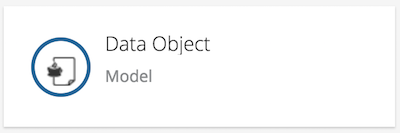

    -   Expect the **Create new Data Object** form to display:

        

    -   **Data Object** is one of 17 item types that allow a designer to easily create different business assets such as rules, processes, decisions, and test scenarios:

        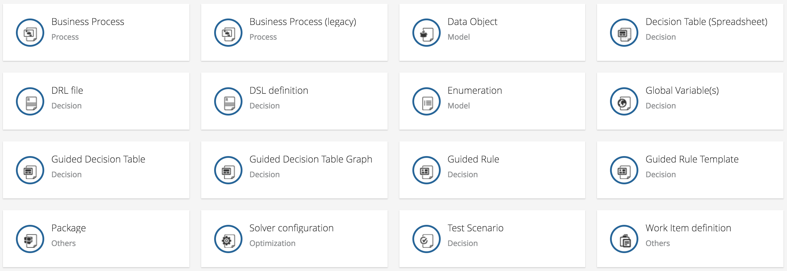

2.  Complete the **Create new Data Object** form using these values:

    -   **Data Object**: `GreetingRequest`

    -   **Package**: `com.myspace.customer_greeting`

    -   **Persistable**: `False` (unchecked)

        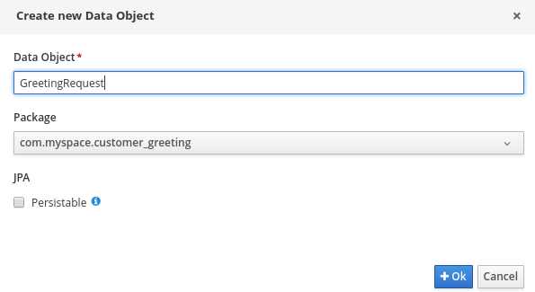

    -   For **Data Object Name**, use Pascal case—that is the practice of writing compound words or phrases such that the first letter of each concatenated word is capitalized. Following this convention helps when you are integrating the data objects with other IT components and reusing the data objects between other entities.

    -   Data objects are organized into packages. By default, the package is defined by the space name and the project. You can also create your own package definitions. Packages help the engine to identify different data objects that are named in the same way. For example, if you define a data object named `Request` in `project1` and another data object also named `Request` in `project2`, and then create dependencies between both projects, the package name where each `Request` data object definition is stored differentiates them. This is also the case with reserved item names—the package name of your data objects allows the engine to differentiate your data objects from built-in data objects with reserved names.

3.  Click **Ok**.

    -   Expect the `GreetingRequest` data object to be displayed in the Project Explorer view.

    -   You use this interface to add fields to the data object definition:

        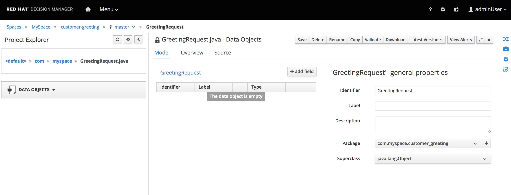

4.  Click **+ add field** and complete the **New Field** form using these values, then click **Create**:

    -   **Id**: `currentHour`

    -   **Label**: `Current Hour`

    -   **Type**: `Integer`

    -   **List**: `False` (unchecked)

        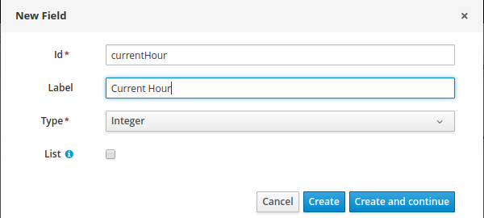

    -   For **Id**, you use Camel case—that is, the practice of writing compound words or phrases in which the first letter of each word in the middle of the phrase is capitalized. The use of Camel case helps to integrate the data object fields with other IT components, to reuse data objects between other entities, and to differentiate data object names from their field names.

5.  At the top of the **Data Object** description, click **Save** to create the field:

    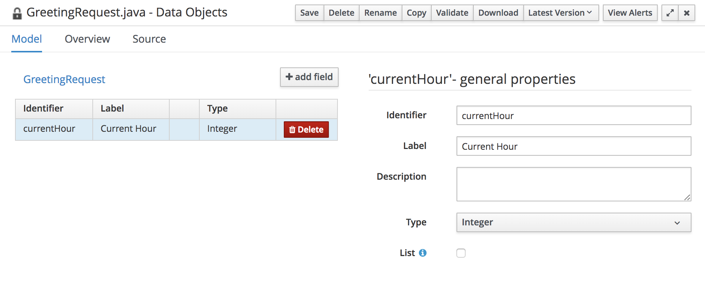

    -   Expect the **Confirm Save** dialog to appear.

    -   Note that you can enter a *save* comment for easier monitoring of your changes by clicking **add a comment**.

6.  Click **Save** to save the changes:

    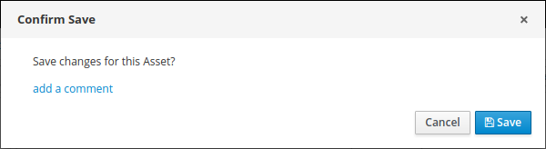

    -   Expect to see a notification that your field is successfully saved.

7.  In the far right upper corner, click the **x** to close the `GreetingRequest` object.

    -   When you close the greeting object, expect the project’s library view to be displayed, containing your new `GreetingRequest` data object.

Create Response Data Object
---------------------------

So far, you have a data object to communicate parameters from the client to Decision Server. In this section, you define the response from Decision Server to the client:

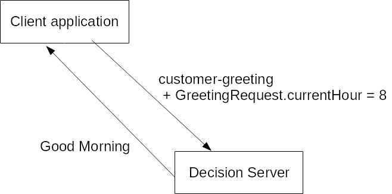

For each decision, a different set of data object models may be required to define the inputs and outputs.

Following the same steps you used in the previous section, create a `GreetingResponse` data object asset.

1.  Create the `GreetingResponse` data object asset.

2.  Add the following fields to the data object:

    <table><colgroup><col style="width: 50%" /><col style="width: 50%" /></colgroup><thead><tr class="header"><th>Field ID</th><th>Type</th></tr></thead><tbody><tr class="odd"><td>
<strong>greeting</strong>
</td><td>
<code>String</code>
</td></tr><tr class="even"><td>
<strong>salutation</strong>
</td><td>
<code>String</code>
</td></tr></tbody></table>

Create Determine Greeting Decision Table
----------------------------------------

Now that the communication models are in place, you create assets that enable Decision Server to provide the required response. To do this, you create a *decision table*.

1.  From the library list of the `customer-greeting` project, click **Add Asset** and select **Guided Decision Table** in the resulting page:

    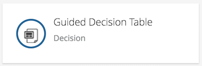

2.  Enter `Determine Greeting` in the **Guided Decision Table** field to name the decision table and check **Use Wizard** to enable the wizard:

    

3.  Click **Ok** to start the wizard.

4.  Explore the steps displayed by the **Guided Decision Table Wizard** to gain an understanding of the options provided by the wizard:

    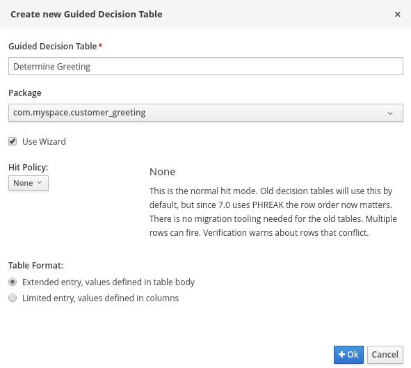

5.  Add the `GreetingRequest` fact pattern to handle the request parameters and the `GreetingResponse` fact pattern to provide the response:

    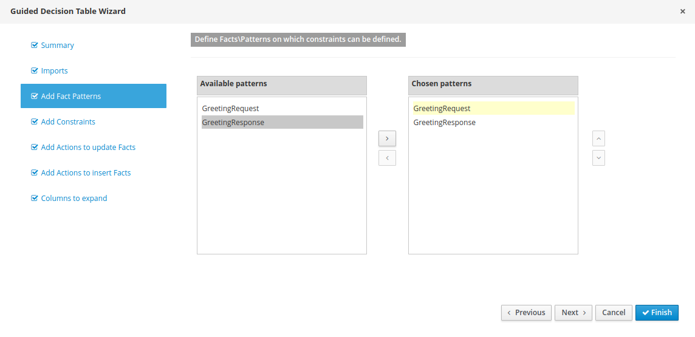

6.  Provide a *binding* for each fact pattern by clicking each of the **Chosen patterns** and entering `request` for the value of **Binding** for the `GreetingRequest` data object and `response` for the value of **Binding** for the `GreetingResponse` data object:

    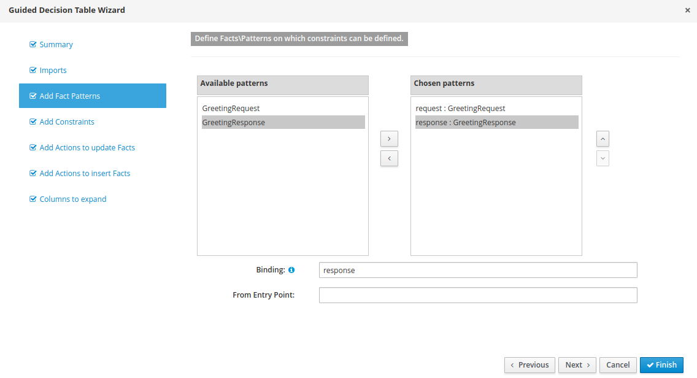

    -   A binding is used to create an internal alias for a given fact in the decision table. With this alias, you can refer to the specific fact later and perform operations and evaluations with it. If you do not specify one, the wizard provides a default binding for you, but it is more difficult to reference your facts later with these default bindings. Red Hat recommends that you provide a binding each time you add a fact pattern.

7.  Add a constraint named `Before Hour` for the `currentHour` field that specifies that the value must be less than a literal value:

    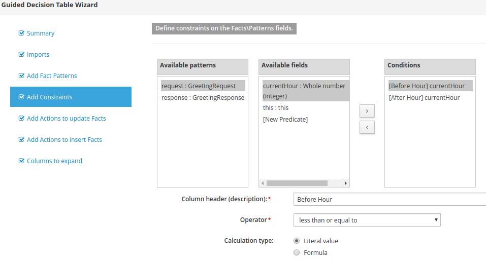

8.  Add a constraint named `After Hour` for the `currentHour` field that specifies that the value must be greater than a literal value:

    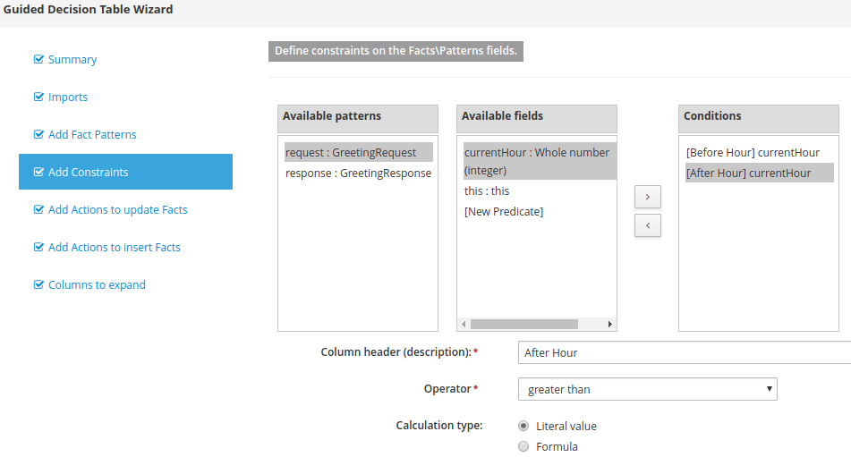

    -   This constraint specifies that a given hour provided by the client must be greater than a specified rule value.

9.  Add a constraint to the `this` field in the `GreetingResponse` data object to detect the presence of a response fact:

    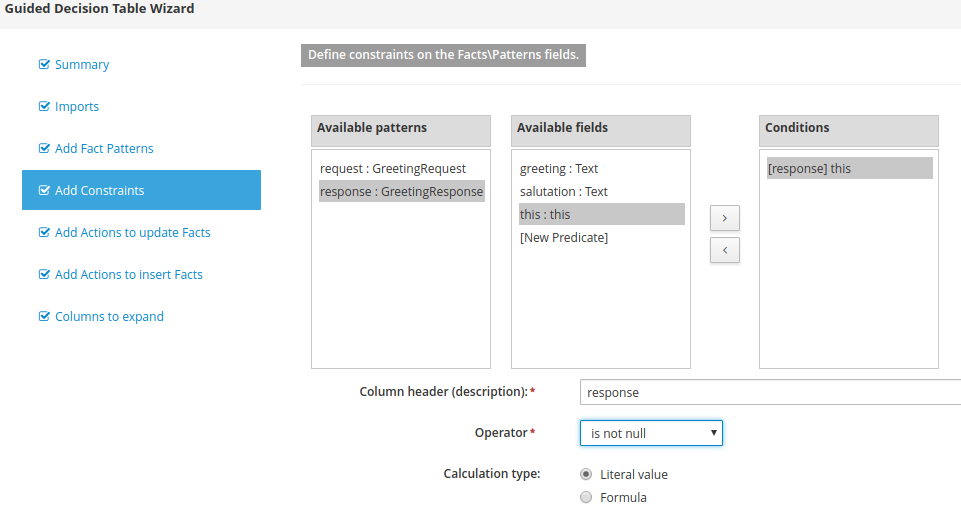

    -   This constraint causes Decision Server to detect that the response fact is present, allowing an action to fill in the appropriate decision value. You define this action next.

10. Add an action to update the `GreetingResponse` with the appropriate value in the `greeting` field:

    

11. Click **Finish**.

    -   Expect the decision table to display, indicating that you defined the constraints and decision result values:

        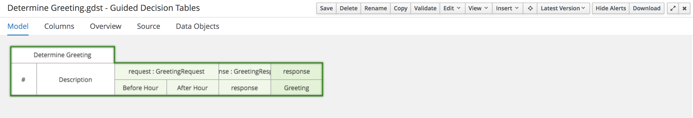

Define Conditions and Actions
-----------------------------

Each row of the decision table is a rule that defines conditions and actions.

1.  From the **Insert** menu, select the **Append row** option:

    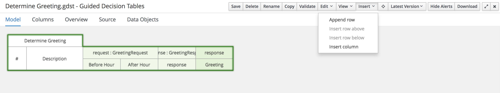

2.  Double click each field in the new row edit the value.

    -   When you are finished editing, the automatic analysis validates your change and shows a green status.

    -   When adding a rule, the automatic analysis is launched.

    -   The newly added row is shown in green:

        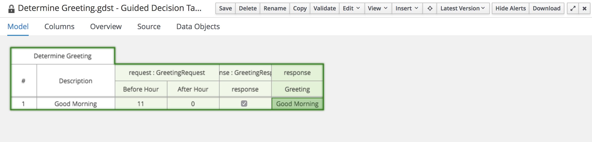

    -   If there is an error in the row, it is shown in yellow.

3.  Continue to add more rules so that the 24-hour period is covered:

    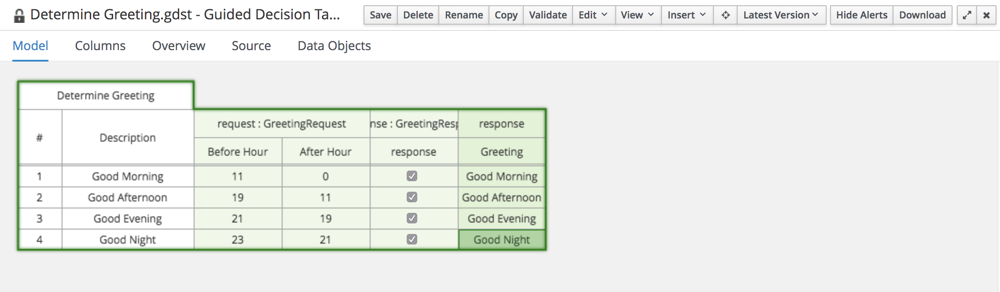

4.  Save and close the decision table.

Create Test Scenarios
=====================

The `Test Scenario` asset allows you to test your decision table.

Create Test Scenario Asset
--------------------------

1.  Click **Add Asset** and select **Test Scenario**:

    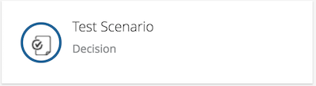

2.  For **Test Scenario**, enter `Good Morning Greeting` for the test scenario name and click **Ok**:

    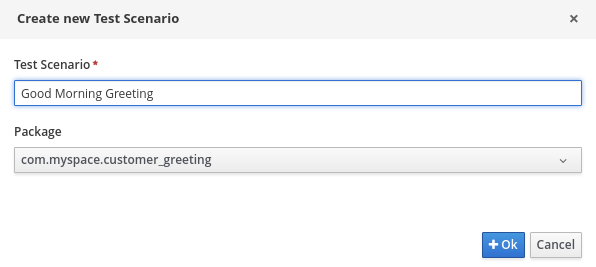

Set Up Inputs and Expected Results
==================================

The two most important—and most involved—parts of the test scenario are the **GIVEN** and **EXPECT** sections:

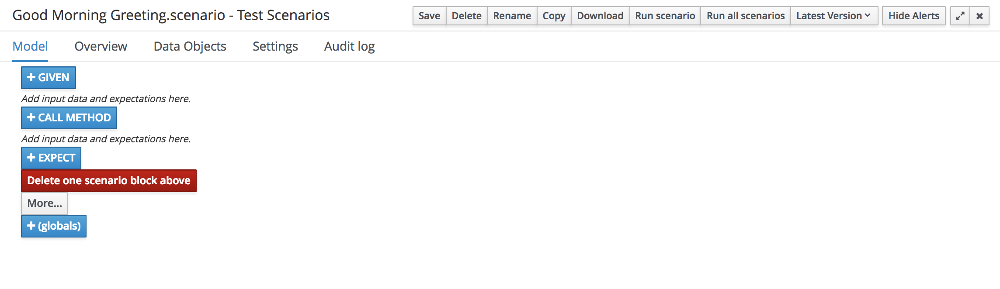

In this section, you complete the **GIVEN** parameters for the test scenario to specify the input facts to Decision Server that you want to test. You also specify the expected results by setting the **EXPECT** parameters.

Set Up Given Facts
------------------

1.  Click **GIVEN** to add a value to the test scenario:

    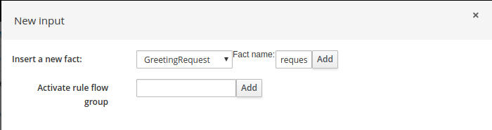

2.  In the **New input** form, insert a new fact of type `GreetingRequest` with the name `request` and click **Add**:

    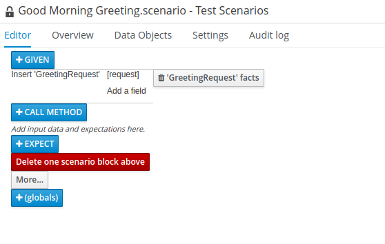

3.  Click **Add a field** to specify the hour of the day that you want to test.

    -   This opens the **Choose a field to add** dialog.

4.  Select **currentHour** and click **Ok**:

    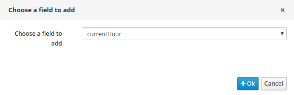

5.  To the right of the `currentHour` field name, click the pencil icon to specify the value:

    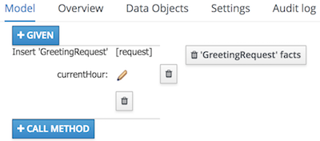

6.  In the **Field value** form, click **Literal value** to enable data entry for the expected **currentHour** value:

    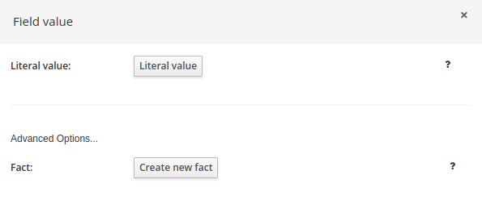

7.  For **currentHour**, enter `8`:

    

8.  Repeat the preceding steps to add a second (`GreetingResponse`) **GIVEN** fact to collect the result values:

    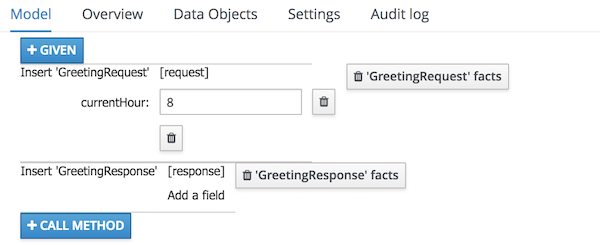

Specify Expected Results
------------------------

In this section, you specify the expected results.

1.  Click **EXPECT**.

2.  In the **New expectation** dialog, add `GreetingResponse` to the **Any fact that matches** field:

    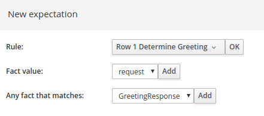

    -   The `GreetingResponse` type is added to the `EXPECT` section.

3.  Save the test scenario.

4.  Click **Run scenario** to execute the test.

Examine Reporting and Audit Log Sections
----------------------------------------

After the scenario is executed, you analyze the `Reporting` and `Audit Log` sections.

1.  Examine the `Reporting` section and expect to see a `Success` result of executing the scenario:

    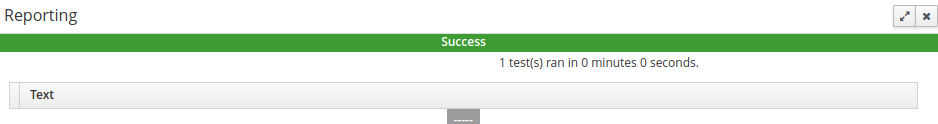

    -   At this point, the test is not examining or checking the response content, so a successful result verifies only that the result has a `GreetingResponse` type.

2.  Examine the `Audit Log` section, paying special attention to the record showing the activation of `Row 1`:

    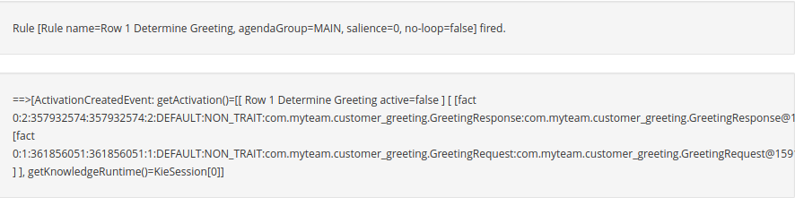

3.  To the right of the **Audit log** rows, note the execution of the `Row 1 Determine Greeting` rule:

    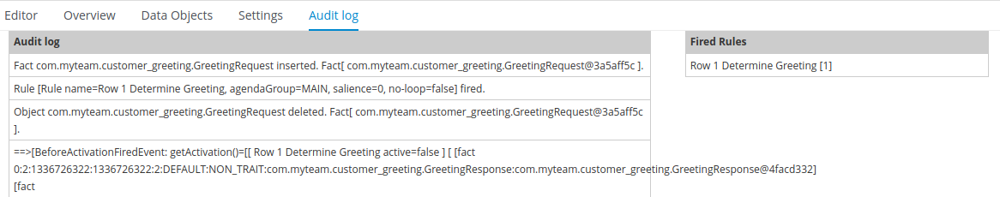

Update Expected Results to Verify Correct Response
--------------------------------------------------

In this section, you update the expected results to check for the correct value in the `GreetingResponse` data object.

1.  In the **EXPECT** section, click `A fact of type GreetingResponse has values:`.

    -   This opens the **Choose a field to add** form.

2.  Select the `greeting` field, and click **Ok**:

    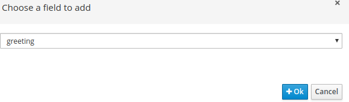

3.  Select the `greeting` field type, and enter `equals` and `Good morning` as the expected result.

    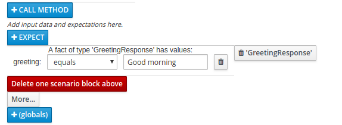

4.  Save and click **Run scenario**.

    -   Expect the test execution to succeed.

5.  Examine the `Reporting`, `Audit Log`, and `Show fired rules` sections.

Finish Creating Scenarios
=========================

In this section, you finish creating the greeting scenarios. You can use **Copy** from the top menu in the test scenario view.

1.  Create a *Good afternoon* greeting scenario.

2.  Create a *Good evening* greeting scenario.

3.  Create a *Good night* greeting scenario.

-   You can see the current version of the `customer-greeting` project in the `greeting` branch of the `Github repository` ([Greeting Repository](https://github.com/gpe-mw-training/dm7-customer-greeting/tree/greeting)).
