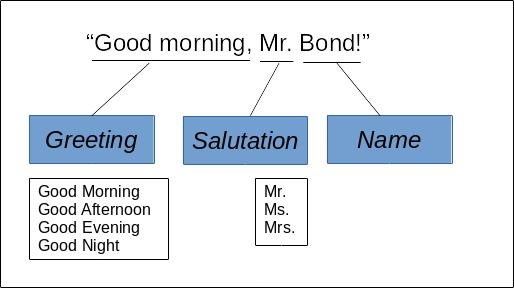
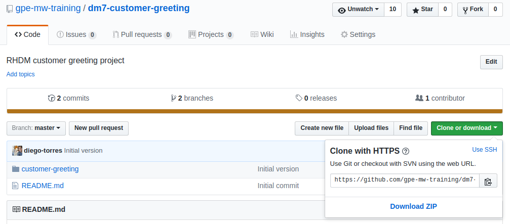
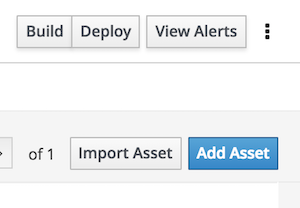
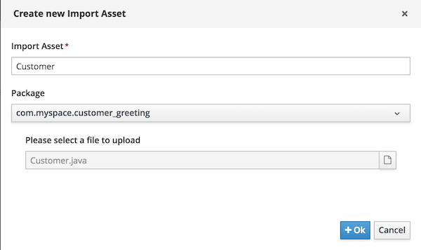
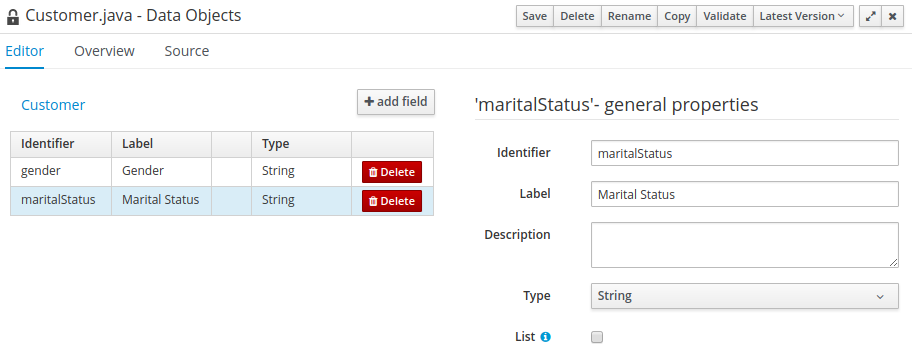
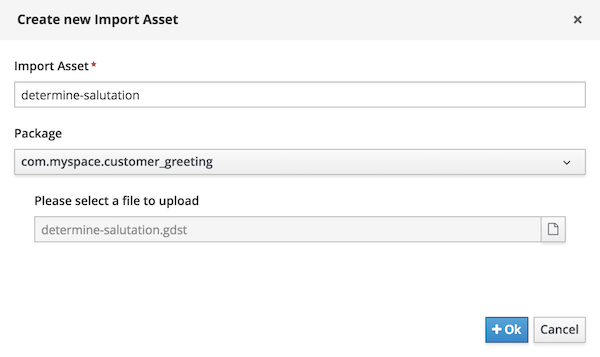
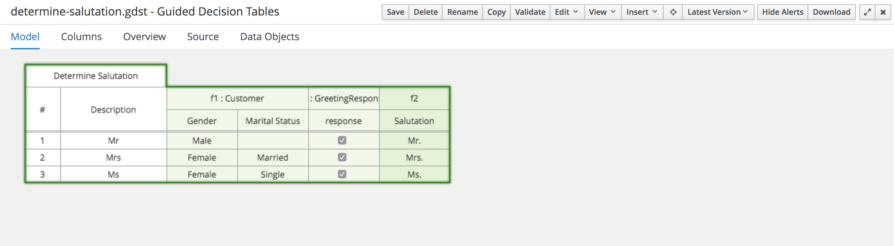

Import Assets Lab
=================

In the previous lab, you created the greeting decision logic for the `customer-greeting` project. In this lab, you create the decision logic to display the salutation (or person’s title):

As you can see in the definition diagram, to choose the correct salutation (or title) for the customer greeting, information about the customer is required, such as gender and marital status. In this lab, you import all of the appropriate assets from the existing [GitHub repository](https://github.com/gpe-mw-training/dm7-customer-greeting).

## Goals

-   Import data objects into an existing project

-   Import decision tables into an existing project

-   Import test scenarios into an existing project

-   Deploy a tested project to Decision Server

-   Test the deployed project using a web application

## Pre-reqs

-   Successful completion of the 02-1-*Create Project Lab*

-   Successful login to Decision Central

-   A `Determine Greeting` decision table in the `customer-greeting` project

Download Existing Assets
========================

In this section, you download the GitHub repository to an accessible directory in the file system.

1.  Navigate to the [GitHub repository](https://github.com/gpe-mw-training/dm7-customer-greeting).

2.  From the **Clone or download** menu on the GitHub web page, click **Download ZIP**:

    

3.  Using your favorite file system navigation tool, locate the downloaded ZIP file and unzip it to a directory in your file system.

    -   From this point forward, this location is referred to as `$PROJECT_HOME`.

Import Customer Data Object
===========================

1.  In Decision Central, click **Import Asset**, you should see the `Create new Import Asset` popup.

    

2.  Name the uploaded file `Customer`, and in the file selection field navigate to the `Customer.java` file under the `$PROJECT_HOME/customer-greeting/src/main/java/com/myspace/customer_greeting` directory, then click **Ok**:

    

3.  Import the asset by clicking **Ok**.

    -   After the import process, expect the `Customer` data object to display:

        

4.  Examine the contents of the `Customer` data object, by selecting each of the fields and noting the displayed values.

5.  Close the data object by clicking the **x** in the upper right of the page.

Import `determine-salutation` Decision Table
============================================

1.  In Decision Central, click **Create New Asset** and select **Uploaded file**:

    

2.  In the **Create new Import Asset** dialog, name the file `determine-salutation` and in **Please select a file to upload**, navigate to the `determine-salutation.gdst` file under the `$PROJECT_HOME/customer-greeting/src/main/resources/com/myspace/customer_greeting/` directory, and click **Ok**:

    

    -   After the import process, expect the `Determine Salutation` decision table to display.

3.  Examine the contents of the `Determine Salutation` decision table:

    

4.  Close the decision table.

Import Test Scenarios and Test
==============================

1.  Using the same method, repeat the steps to import the following scenarios:

    -   `married-female-mrs.scenario`

    -   `married-male-mr.scenario`

    -   `single-female-ms.scenario`

    -   `single-male-mr.scenario`

2.  After importing each scenario, run the test and examine the reported results.
