Decision Tables Modeling Lab
============================

In this lab, you explore using decision tables to model decisions for automated rule evaluations. You explore a policy quote business case. Based on a guided analysis of performance indicators, you modify the existing business assets to adjust to changes that drive operational decisions to a different result.

## Goals

-   Explore an existing decision table in a policy quote use case

-   Create a decision table based on new requirements

-   Create and execute test cases for the newly created decision table

-   Deploy the decision table to Decision Server

## Pre-reqs

-   Successful completion of the *Environment Setup Lab*

-   Successful login to Decision Central

Import and Deploy Policy Quote Project
======================================

In this lab, you explore how easy it is to maintain a predefined set of rules that drive operational decisions based on actions taken as a result of the monitoring of key performance indicators and/or service level agreements (SLAs).

You use a predefined policy quote project, which provides an insurance company with an automated insurance policy quoting process. Customers use a web application to request and receive quotes for their car insurance. Based on the information gathered from the web page, Decision Server determines the correct price of the insurance quote.

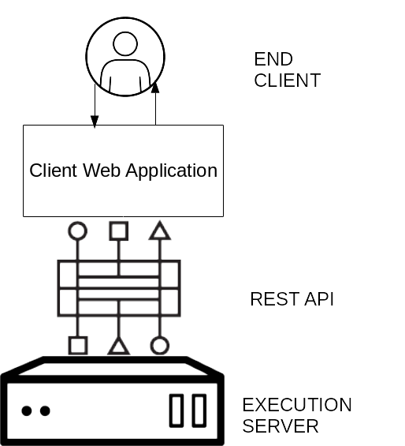

The business manager changes the decision rules when performance indicators show that the current rules are inadequate. These changes are made in Decision Central and impact the decisions made by Decision Server.

In this section, you import the policy quote project and deploy it to Decision Server.

1.  From the **Projects** list, select **Import Project** from the context menu:

    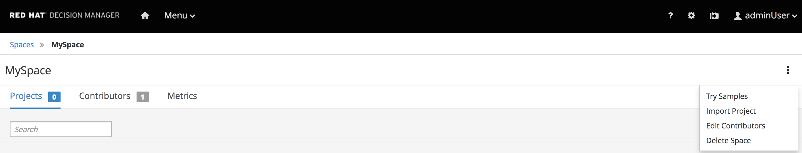

2.  For **Repository URL**, enter `https://github.com/gpe-mw-training/bxms_decision_mgmt_foundations_lab.git`, provide the **adminUser** credentials and then click **Import**:

    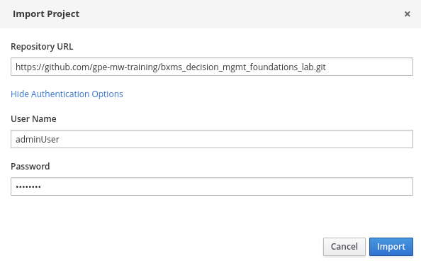

3.  From the list of available projects, select the `policy-quote` project and click **Ok**:

    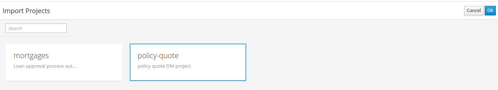

4.  Wait for the assets to load.

5.  When the loading process is complete, click **Build** to build the project and then **Deploy** to deploy the container to the execution server.

    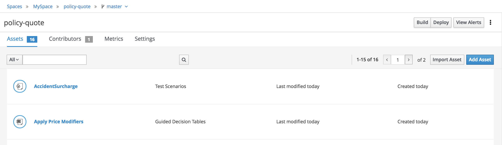

6.  After the success message appears, click the **Home** icon to load the home page.

7.  From the home page, click **Deploy**.

8.  Verify that the `policy-quote_1.0.0` container is up and running:

    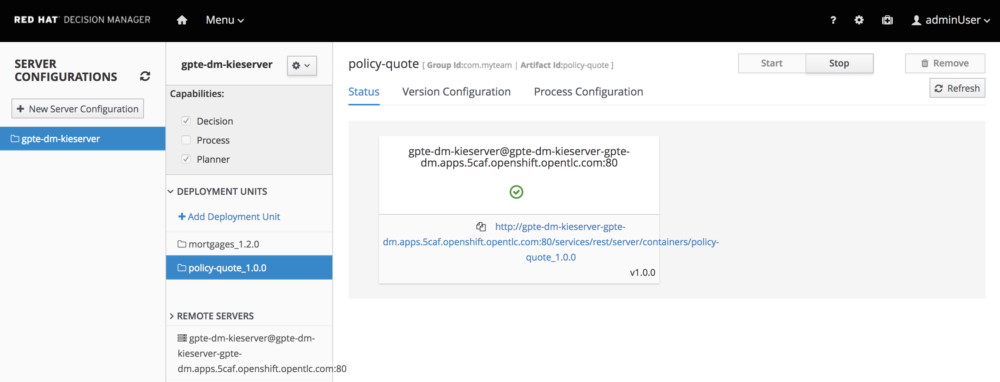

Test Current Functionality [WIP]
==========================

In this section, you test the policy quote component of the `angular` demonstration application.

//TODO: Insert information on how to run`angular-dmf-ng-dmf` using a docker image

2.  From the menu on the left, select the `Policy Quote` demonstration:

    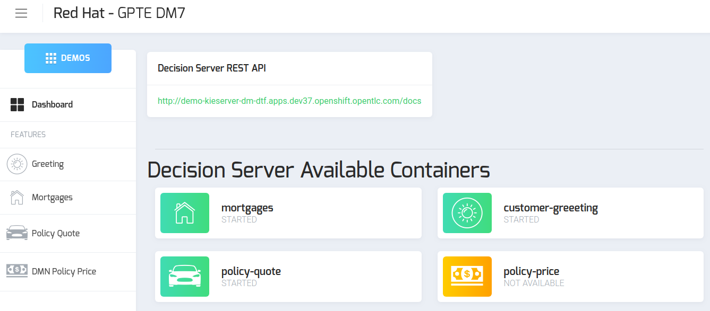

3.  Complete the `Car Policy Quote` request form with these values:

    <table><colgroup><col style="width: 50%" /><col style="width: 50%" /></colgroup><thead><tr class="header"><th>Field</th><th>Value</th></tr></thead><tbody><tr class="odd"><td>
<strong>Driver Name</strong>
</td><td>
<code>John Doe</code>
</td></tr><tr class="even"><td>
<strong>Age</strong>
</td><td>
<code>24</code>
</td></tr><tr class="odd"><td>
<strong>Credit Rate</strong>
</td><td>
<code>450</code>
</td></tr><tr class="even"><td>
<strong>Accidents</strong>
</td><td>
<code>0</code>
</td></tr><tr class="odd"><td>
<strong>Tickets</strong>
</td><td>
<code>0</code>
</td></tr><tr class="even"><td>
<strong>Car Year</strong>
</td><td>
<code>2015</code>
</td></tr><tr class="odd"><td>
<strong>Plates</strong>
</td><td>
<code>AZ3441</code>
</td></tr><tr class="even"><td>
<strong>Plates State</strong>
</td><td>
<code>AL</code>
</td></tr></tbody></table>

4.  Click **Submit**.

    -   Expect to see a pop-up message showing the results of the policy quote evaluation:

        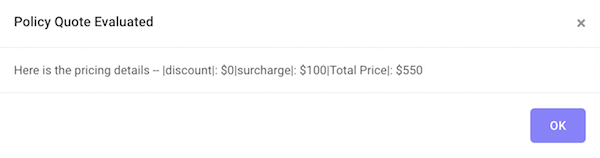

5.  Change the number of accidents, the number of tickets, the driver’s age, and the car’s year to evaluate different policy quotes.

Explore Data Gathering Process
==============================

Red Hat Decision Manager does not provide an out-of-the-box monitoring tool for rules execution. The authors of any decision management solution must define how the components external to Decision Server gather and persist information from the resulting decisions.

In this business use case example, the insurance company retrieves information from the National Highway Traffic Safety Administration regarding winter car accidents. This information indicates an increase in fatal accidents in Ohio and Michigan over the last two years. To maintain a sustainable business model for those states, the insurance company decides to apply a surcharge to new policies coming from those states.

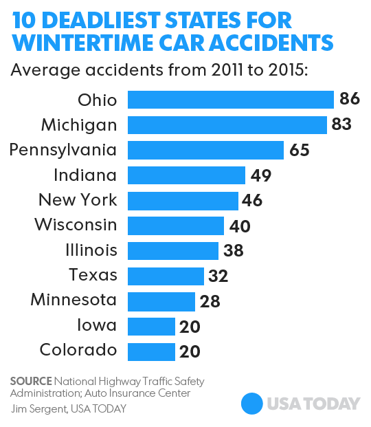

Change Decision Operation
=========================

In this scenario, the insurance company decides that it must change the model to accommodate a decision in new policy applications—car owners with Ohio or Michigan plates must include a surcharge. This change is made within Decision Central.

1.  From the project list, select the `policy-quote` project:

    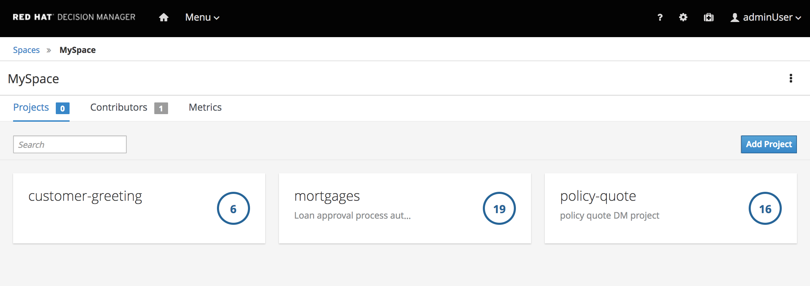

2.  Click **Settings**, and from the project settings view under **General Settings**, change the project version to `1.1.0` and save the changes:

    

3.  Find and open the `Determine State Surcharge` decision table:

    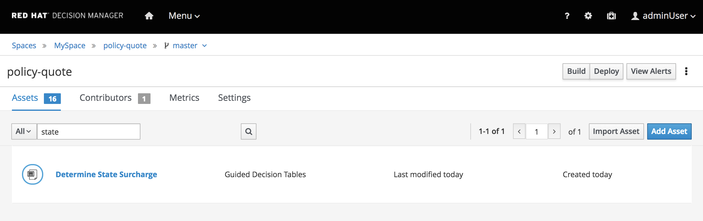

4.  In the `Determine State Surcharge` decision table, right click row `1` and select **Insert row above**:

    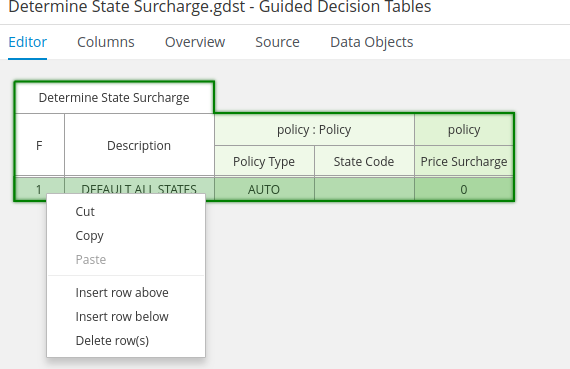

5.  Add a row for Ohio to the decision table to include these values:

    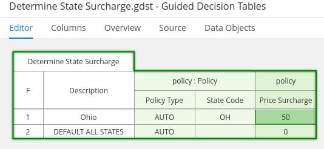

6.  Repeat the steps to add a row for Michigan (State Code MI) with a surcharge price of 50 dollars.

7.  Save the changes to the decision table.

Test Updated Functionality
==========================

In this section, you use the `Angular` demonstration application to test the updated functionality.

1.  Create a test scenario called `OH State Surcharge` to verify the new price surcharge for Ohio:

    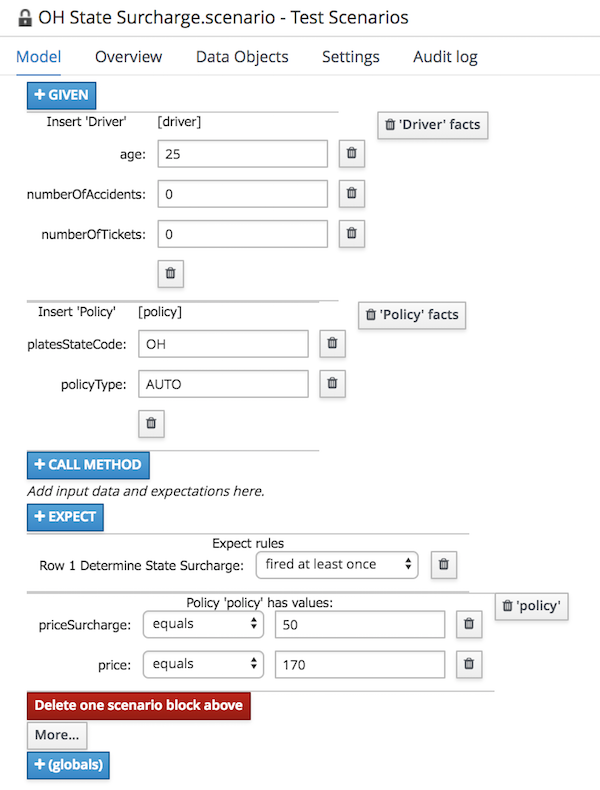

2.  Execute the test scenario and verify that it succeeds.

3.  Save the changes and publish the project by executing the **Build & Deploy** operation from the project’s library view.

4.  Using the `Angular` demonstration application, select either `MI` (Michigan) or `OH` (Ohio) for **Plates State** and submit the quote to see whether the surcharge and price changes are as you expect.
