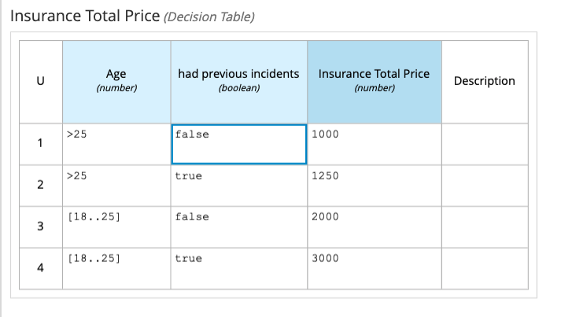
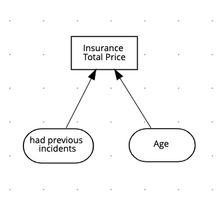
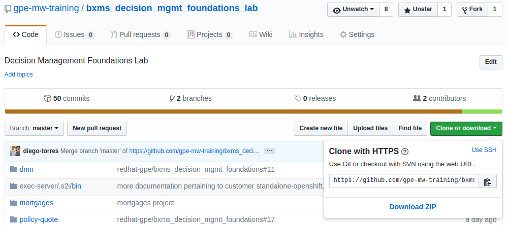
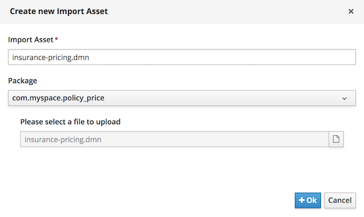
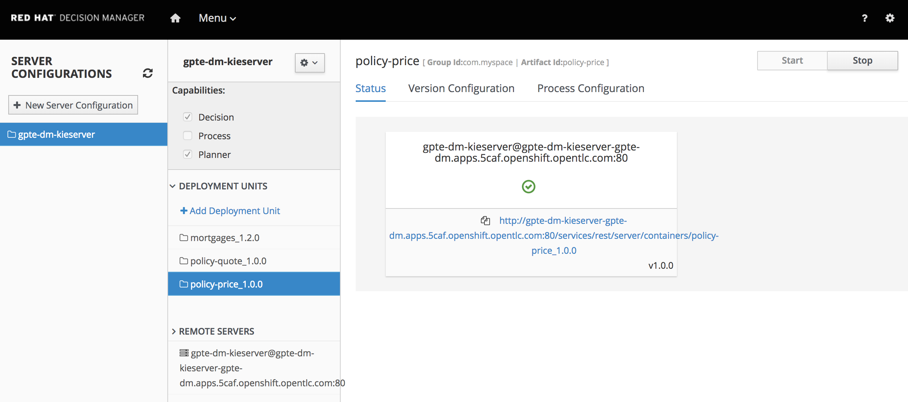

Decision Model Notation Lab
===========================

This lab introduces you to the deployment of externally created Decision Model and Notation (DMN) projects.

## Goals

-   Explore an existing DMN diagram

-   Deploy the existing DMN project to Decision Server

## Pre reqs

-   Successful completion of the *Environment Setup Lab*

Examine Existing DMN Diagram
============================

The following example describes an *insurance* price calculator based on an applicant’s age and accident history. This is a simple decision process based on the following decision table:

**DMN Decision Table.**

-   The decision table was designed without using Decision Central tools.

-   The DMN decision table includes a *hit policy*, inputs, and outputs.

-   Unlike the decision tables in the previous labs created by Decision Central, input and output names in DMN decision tables accept spaces.

-   The conditions for the `Age` input is defined using the Friendly Enough Expression Language (FEEL).

The *decision* can also be represented by the following decision requirements diagram:

-   In this decision requirements diagram, note that the applicant’s age and accident history are the required inputs for the decision table.

-   The DMN component is currently stored in the [DMN GitHub repository](https://github.com/gpe-mw-training/bxms_decision_mgmt_foundations_lab/tree/master/dmn).

Download DMN File
=================

In this section, you download the GitHub repository to an accessible directory in your file system.

1.  Navigate to the [GitHub repository](https://github.com/gpe-mw-training/bxms_decision_mgmt_foundations_lab).

2.  From the GitHub web page, click **Clone or download** on the right and then select **Download ZIP**:

    

3.  Using your favorite file system navigation tool, locate the downloaded ZIP file and unzip it to a directory in your file system.

    -   From this point forward, this location is referred to as `$PROJECT_HOME`.

Upload DMN File to Decision Central
===================================

1.  Log in to Decision Central.

    -   See the *Environment Setup Lab* for a reminder on how to access the Decision Central web application.

2.  Create a project in Decision Central called `policy-price`.

3.  In the empty project library view for the `policy-price` project, click **Import Asset**.

    

4.  In the **Create new Uploaded file** dialog, enter `insurance-pricing.dmn` in the **Uploaded file** field:

    

5.  Using the browse button at the far right of the field labeled **Please select a file to upload**, navigate with the file browser to the `$PROJECT_HOME` directory where the unzipped Git repository is located.

6.  Select the `$PROJECT_HOME\dmn\insurance-pricing.dmn` file.

7.  Click **Ok** to import the DMN asset.

8.  Select the library view for the `policy-price` project and verify that the `insurance-pricing` asset is added to your project assets:

    

9.  From the `policy-price` project’s library view, click **Build**, then **Deploy** to deploy the project to the execution server.

10. After receiving the build confirmation, navigate to the container deployment list by selecting **Menu → Deploy → Execution Servers**.

11. Verify that `policy-price_1.0.0` shows a *green* status:

    

Test DMN Solution
=================

In this section, you test the DMN solution with the Angular demonstration application.

//TODO: Insert information on how to run`angular-dmf-ng-dmf` using a docker image

1. Open the Angular demonstration application by clicking **DMN Policy Price** from the menu in the left panel:

3.  You should see the following:

    

4.  Complete the form with different values for the age and accident history, and compare the results with the decision table:

    
