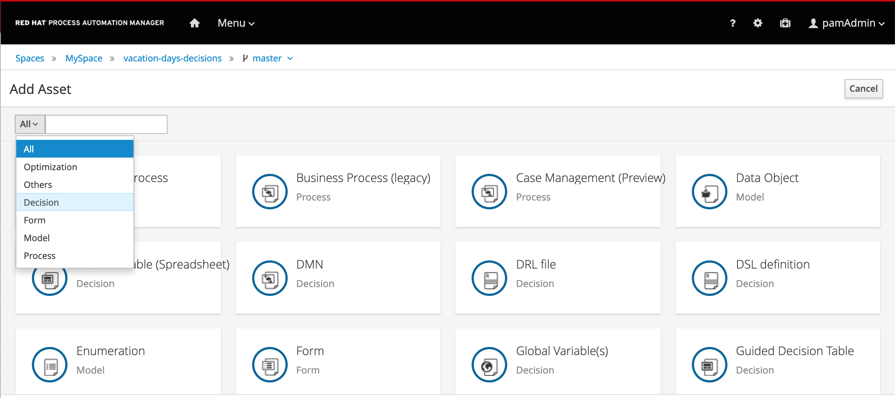
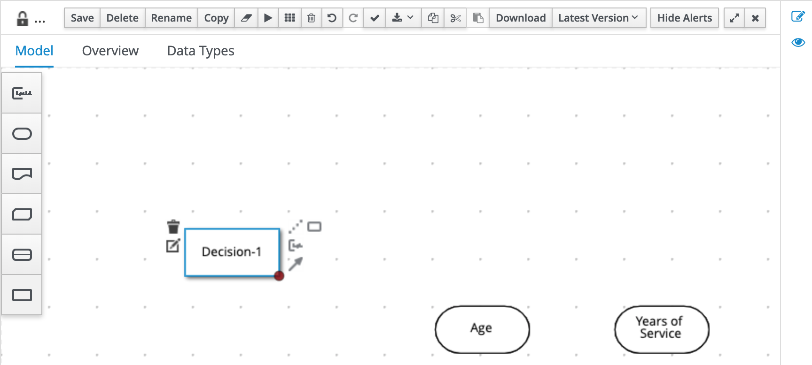
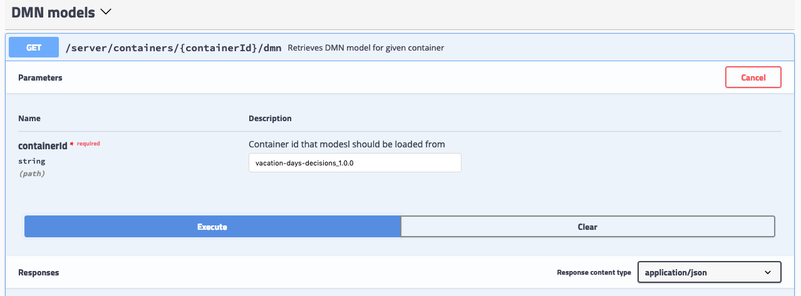

Decision Model & Notation Lab: Intermediate
===========================================

This is an intermediate Decision Model & Notation lab that combines DMN decision tables with literal expressions It also explores a number of different FEEL constructs and expressions like, for example, ranges.

## Goal

-   Implement a DMN model using the Red Hat DM/PAM DMN editor

-   Deploy the existing DMN project to Decision Server

## Pre reqs

-   Successful completion of the *Environment Setup Lab* or

-   An existing, accessible, DM/PAM 7.3+ environment.

Problem Statement
=================

In this lab we will create a decision that determines the number of vacation days assigned to an employee. The number of vacation days depends on age and years of service

-   Every employee receives at least 22 days.

-   Additional days are provided according to the following criteria:

    1.  Only employees younger than 18 or at least 60 years, or employees with at least 30 years of service will receive 5 extra days

    2.  Employees with at least 30 years of service and also employees of age 60 or more, receive 3 extra days, on top of possible additional days already given

    3.  If an employee has at least 15 but less than 30 years of service, 2 extra days are given. These 2 days are also provided for employees of age 45 or more. These 2 extra days can not be combined with the 5 extra days.

Create a Decision Project
=========================

To define and deploy a DMN decision model, we first need to create a new project in which we can store the model. To create a new project:

1.  Navigate to [Business Central](http://localhost:8080/business-central)

2.  Login to the platform with the provided username and password.

3.  Click on **Design** to navigate to the Design perspective.


1.  In the Design perspective, create a new project. If your space is empty, this can be done by clicking on the blue **Add Project** button in the center of the page. If you already have projects in your space, you can click on the blue **Add Project** icon at the top right of the page.

2.  Give the project the name `vacation-days-decisions`, and the description "Vacation Days Decisions".


1.  With the project created, we can now create our DMN model. Click on the blue **Add Asset** button.

2.  In the **Add Asset** page, select **Decision** in the dropdown filter selector.



1.  Click on the **DMN** tile to create a new DMN model. Give it the name `vacation-days`. This will create the asset and open the DMN editor.


DMN Editor
==========

The DMN Editor consists of a number of components:

-   **Decision Navigator**: shows the nodes used in the Decision Requirements Diagram (DRD, the diagram), and the decisions behind the nodes. Allows for quick navigation through the model.

-   **Decision Requirements Diagram Editor**: the canvas in which the model can be created.

-   **Palette**: Contains all the DMN constructs that can be used in a DRD, e.g. Input Node, Decision Node, etc.

-   **Expression Editor**: Editor in which DMN boxed expressions, like decision tables and literal expressions, can be created.

-   **Property Panel**: provides access to the properties of the model (name, namespace, etc), nodes, etc.

-   **Data Types**: allows the user to define (complex) datatypes.


Solution
========

You can do this lab in 2 ways:

1.  If you already have (some) DMN knowledge, we would like to challenge you to build the solution by yourself. After you’ve built solution, you can verify your answer by going to the next module in which we will explain the solution and will deploy it onto the runtime.

2.  Follow this step-by-step guide which will guide you through the implementation.

**Input Nodes.**

The problem statement describes a number of different inputs to our decision:

-   **Age** of the employee

-   **Years of Service** of the employee

Therefore, we create 2 input nodes, one for each input:

1.  Add an **Input** node to the diagram by clicking on the **Input** node icon and placing it in the DRD. 

2.  Double-click on the node to set the name. We will name this node `Age`.

3.  With the `Age` node selected, open the property panel. Set the **Output data type** to `number`.


1.  In the same way, create an **Input** node for `Years of Service`. This node should also have its **Output data type** set to `number`.


1.  Save the model.

**Constants.**

The problem statement describes that every employee receives at least 22 days. So, if no other decisions apply, an employee receives 22 days. This is can be seen as a constant input value into our decision model. In DMN we can model such constant inputs with a **Decision** node with a **Literal** boxed expression that defines the constant value:

1.  Add a **Decision** node to the DRD



1.  Give the node the name `Base Vacation Days`.

2.  Click on the node to select it and open the property panel. Set the node’s **Output data type** to `number`.

3.  Click on the node and click on the **Edit** icon to open the expression editor.


1.  In the expression editor, click on the box that says **Select expression** and select **Literal expression**.


1.  Simply set the **Literal Expression** to `22`, the number of base vacation days defined in the problem statement.


1.  Save the model.

**Decisions.**

The problem statement defines 3 decisions which can cause extra days to be given to employees based on various criteria. Let’s simply call these decision:

-   Extra days case 1

-   Extra days case 2

-   Extra days case 3

Although these decisions could be implemented in a single decision node, we’ve decided, in order to improve maintainability of the solution, to define these decisions in 3 separate decision nodes.

1.  In your DRD, create 3 decision nodes with these given names. Set their **Output data types** to `number`.

2.  We need to attach both input nodes, **Age** and **Years of Service** to all 3 decision nodes. We can do this by clicking on an Input node, clicking on its arrow icon, and attaching the arrow to the Decision node.


1.  Select the **Extra days case 1** node and open its expression editor by clicking on the **Edit** button.

2.  Select the expression **Decision Table** to create a boxed expression implemented as a decision table.

3.  The first case defines 2 decisions which can be modelled with 2 rows in our decision table as such:

    1.  employees younger than 18 or at least 60 years will receive 5 extra days, or …

    2.  employees with at least 30 years of service will receive 5 extra days


1.  Note that the **hit-policy** of the decision table is by default set to `U`, which means `Unique`. This implies that only one rule is expected to fire for a given input. In this case however, we would like to set it to `Collect Max`, as, for a given input, multiple decisions might match, but we would like to collect the output from the rule with the highest number of additional vacation days. To do this, click on the `U` in the upper-left corner of the decision table. Now, set the **Hit Policy** to `Collect` and the **Builtin Aggregator** to `MAX`.

 \[start=6\] . Finally, we need to set the default result of the decision. This is the result that will be returned when none of the rules match the given input. This is done as follows: .. Select the output/result column of the decision table. In this case this is the column `Extra days case 1` .. Open the properties panel on the right-side of the editor. .. Expand the **Default output** section. .. Set the `Default output property` to `0`.  . Save the model

The other two decisions can be implemented in the same way. Simply implement the following two decision tables:


**Total Vacation Days.**

The total vacation days needs to be determined from the base vacation days and the decisions taken by our 3 decision nodes. As such, we need to create a new Decision node, which takes the output of our 4 Decision nodes (3 decision tables and a literal expression) as input and determines the final output. To do this, we need to:

1.  Create a new Decision node in the model. Give the node the name `Total Vacation Days` and set its **Output data type** to `number`.

2.  Connect the 4 existing Decision nodes to the node. This defines that the output of these nodes will be the input of the next node.


1.  Click on the `Total Vacation Days` node and click on **Edit** to open the expression editor. Configure the expression as a literal exprssion.

2.  We need to configure the following logic:

    1.  Everyone gets the Base Vacation Days.

    2.  If both case 1 and case 3 add extra days, only the extra days of one of this decision is added. So, in that case we take the maximum.

    3.  If case 2 adds extra days, add them to the total.

3.  The above logic can be implemented with the following FEEL expression:


1.  Save the completed model.

Deploying the Decision Service
==============================

With our decision model completed, we can now package our DMN model in a Deployment Unit (KJAR) and deploy it on the Execution Server. To do this:

1.  In the bread-crumb navigation in the upper-left corner, click on `vacation-days-decisions` to go back to the project’s Library View.

2.  Click on the **Deploy** button in the upper-right corner of the screen. This will package our DMN mode in a Deployment Unit (KJAR) and deploy it onto the Execution Server (KIE-Server).

3.  Go to the **Execution Servers** perspective by clicking on "Menu → Deploy → Execution Servers". You will see the **Deployment Unit** deployed on the Execution Server.

Test DMN Solution
=================

In this section, you will test the DMN solution with Execution Server’s Swagger interface.

The Swagger interface provides the description and documentation of the Execution Server’s RESTful API. At the same time, it allows the APIs to be called from the UI. This enables developers and users to quickly test a, in this case, a deployed DMN Service .

1.  Navigate to [KIE Server](http://localhost:8080/kie-server/docs)

2.  Locate the **DMN Models** section. The DMN API provides the DMN model as a RESTful resources, which accepts 2 operations:

    1.  `GET`: Retrieves the DMN model.

    2.  `POST`: Evaluates the decisions for a given input.

3.  Expand the `GET` operation by clicking on it.

4.  Click on the **Try it out** button.

5.  Set the **containerId** field to `vacation-days-decisions_1.0.0` and set the **Response content type\* to `application/json` and click on**Execute\*\* 

6.  If requested, provide the username and password of your **Business Central** and **KIE-Server** user.

7.  The response will be the model-description of your DMN model.

Next, we will evaluate our model with some input data. We need to provide our model with the **age** of an employee and the number of **years of service**. Let’s try a number of different values to test our deicions.

1.  Expand the `POST` operation and click on the **Try it out** button

2.  Set the **containerId** field to `vacation-days-decisions_1.0.0`. Set the **Parameter content type** and **Response content type** fields to `application/json`.

3. Pass the following request to lookup the number of vacation days for an employee of 16 years old with 1 year of service (note that the namespace of your model is probably different as it is generated. You can lookup the namespace of your model in the response/result of the `GET` operation you executed ealier, which returned the model description). 

   ```json
   { "model-namespace":"https://github.com/kiegroup/drools/kie-dmn/\_D0E62587-C08C-42F3-970B-8595EA48BEEE", "model-name":"vacation-days", "decision-name":null, "decision-id":null, "dmn-context":{ "Age":16, "Years of Service":1 } }
   ```

4. Click on **Execute**. The result value of the `Total Vacation Days` should be 27.

5. Test the service with a number of other values. See the following table for some sample values and expected output.

<table><colgroup><col style="width: 33%" /><col style="width: 33%" /><col style="width: 33%" /></colgroup><tbody><tr class="odd"><td><p>Age</p></td><td><p>Years of Service</p></td><td><p>Total Vacation Days</p></td></tr><tr class="even"><td><p>16</p></td><td><p>1</p></td><td><p>27</p></td></tr><tr class="odd"><td><p>25</p></td><td><p>5</p></td><td><p>22</p></td></tr><tr class="even"><td><p>44</p></td><td><p>20</p></td><td><p>24</p></td></tr><tr class="odd"><td><p>44</p></td><td><p>30</p></td><td><p>30</p></td></tr><tr class="even"><td><p>50</p></td><td><p>20</p></td><td><p>24</p></td></tr><tr class="odd"><td><p>50</p></td><td><p>30</p></td><td><p>30</p></td></tr><tr class="even"><td><p>60</p></td><td><p>20</p></td><td><p>30</p></td></tr></tbody></table>

Using the KIE-Server Client
===========================

Red Hat Decision Manager provides a KIE-Server Client API that allows the user to interact with the KIE-Server from a Java client using a higher level API. It abstracts the data marshalling and unmarshalling and the creation and execution of the RESTful commands from the developer, allowing him/her to focus on developing business logic.

In this section we will create a simple Java client for our DMN model.

1.  Create a new Maven Java JAR project in your favourite IDE (e.g. IntelliJ, Eclipse, Visual Studio Code).

2. Add the following dependency to your project: 

   ````xml
   <dependency> 
     <groupId>org.kie.server</groupId> 
     <artifactId>kie-server-client</artifactId> 
     <version>7.18.0.Final</version> 
     <scope>compile</scope> 
   </dependency>
   ````

3. Create a Java package in your `src/main/java` folder with the name `org.kie.dmn.lab`.

4. In the package you’ve just created, create a Java class called `Main`.

5. Add a `public static void main(String[] args)` method to your main class.

6. Before we implement our method, we first define a number of constants that we will need when implementing our method (note that the values of your constants can be different depending on your environment, model namespace, etc.): 

   ````java
   private static final String KIE_SERVER_URL = "http://localhost:8080/kie-server/services/rest/server"; 
   private static final String CONTAINER_ID = "vacation-days-decisions_1.0.0"; 
   private static final String USERNAME = "pamAdmin"; 
   private static final String PASSWORD = "redhatpam1!"; 
   private static final String DMN_MODEL_NAMESPACE = "https://github.com/kiegroup/drools/kie-dmn/_D0E62587-C08C-42F3-970B-8595EA48BEEE";
   private static final String DMN_MODEL_NAME = "vacation-days";
   ````

7. KIE-Server client API classes can mostly be retrieved from the `KieServicesFactory` class. We first need to create a `KieServicesConfiguration` instance that will hold our credentials and defines how we want our client to communicate with the server: 

   ```java
   KieServicesConfiguration kieServicesConfig = KieServicesFactory.newRestConfiguration(KIE_SERVER_URL, new EnteredCredentialsProvider(USERNAME, PASSWORD)); 
   ```

8. Next, we create the `KieServicesClient`: 

   ```java
   KieServicesClient kieServicesClient = KieServicesFactory.newKieServicesClient(kieServicesConfig); 
   ```

9. From this client we retrieve our DMNServicesClient: 

   ```java
   DMNServicesClient dmnServicesClient = kieServicesClient.getServicesClient(DMNServicesClient.class); 
   ```

10. To pass the input values to our model to the Execution Server, we need to create a `DMNContext`: \`\`\` 

    ```java
    DMNContext dmnContext = dmnServicesClient.newContext();
    dmnContext.set("Age", 16); dmnContext.set("Years of Service", 1);
    ```

    

11. We now have defined all the required instances needed to send a DMN evaluation request to the server: 

    ```java
    ServiceResponse<DMNResult> dmnResultResponse = dmnServicesClient.evaluateAll(CONTAINER_ID, DMN_MODEL_NAMESPACE, DMN_MODEL_NAME, dmnContext);
    ```

12. Finally we can retrieve the DMN evaluation result and print it in the console:

    ```java
    DMNDecisionResult decisionResult = dmnResultResponse.getResult().getDecisionResultByName("Total Vacation Days"); System.out.println("Total vacation days: " + decisionResult.getResult()); 
    ```

    

13. Compile your project and run it. Observe the output in the console, which should say: **Total vacation days: 27**

    

The complete project can be found here: <https://github.com/DuncanDoyle/vacation-days-dmn-lab-client>
