Business Automation OpenShift Operator Lab (OCP3)
==========================================

In this lab we will use the new Business Automation OpenShift Operator version **7.3** to provision, manage and maintain an Red Hat Process Automation Manager environment in OpenShift **3**.

## Goals

-   Provision an RHPAM 7.3 Trial Environment using the operator.
-   Explore Operator reconciliation features.
-   Provision an RHPAM Production Environment using the operator.
-   Add additional Execution Server groups to the installation using the Operator configuration.

## Pre Requirements

-   An existing, accessible, PAM 7.3+ environment with an operator subscribed project provisioned.
-   Existing OCP 3.11 environment;

Problem Statement
=================

In this lab, the goal is to provision and manage various Red Hat Process Automation Manager architectures using the Business Automation Operator

-   We deploy an RHPAM Trial environment, which is a basic ephemeral environment that does not require any form of storage (e.g. persistent volume, database).

-   We explore Operator reconciliation features by removing provisioned resources like Services and Deployment Configs.

-   We provision a more sophisticated Production environment, to show creation of PVCs, deployment of databases and integration with RHPAM Smart Router.

-   We alter the deployment through the Operator to show how the provisioned environment changes.

Inspect the Lab environment
===========================

For this lab we’ve provisioned an environment for each user that already has a subscription to the Business Automation Operator. These Operator subscriptions are managed by the OpenShift cluster admin.

1.  Navigate to [OpenShift Master Console](https://master.rotterdam-a2a2.openshiftworkshop.com/console)

2.  Login to the platform with the provided username and password.

3.  

1.  Open the project. Observe that the `kie-cloud-operator` has already been provisioned to your project. This has been done by the cluster-admin by subscribing your project to the Business Automation Operator. 

2.  Navigate to the [OpenShift Cluster Console](https://console.apps.rotterdam-a2a2.openshiftworkshop.com)

3.  Login to the console with the provided username and password.

4.  Click on **Operators → Cluster Service Versions**. This will list the **Kie Cloud** Operator subscription in your project. 

5.  Click on **Kie Cloud** to access the **Kie Cloud** Operator instance in your project. 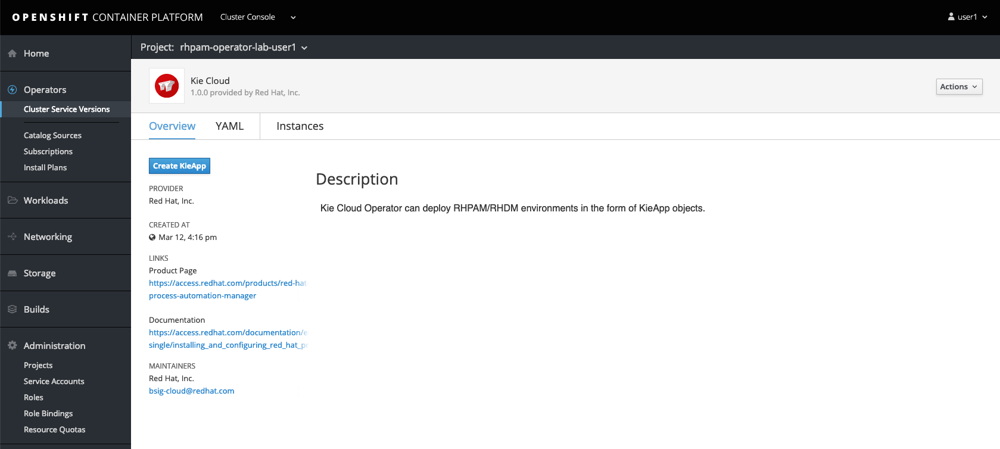

Deploy an RHPAM Trial Environment
=================================

1.  From the **Kie Cloud** page in the OpenShift Cluster Console, click on **Create KieApp**. 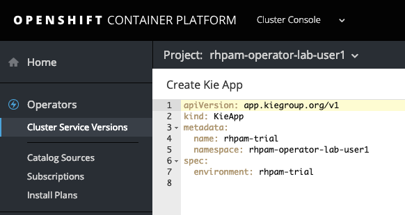

2.  In the YAML definition that is presented, notice the `environment` field. In this field we define the type of the environment we want to provision. In this case we want to provision the **Trial** environment, so we accept the default values.

3.  Click on the **Create** button at the bottom of the page.

4.  In the **Instances** tab, we can see our new **rhpam-trial** environment being listed.

5.  Navigate back to your project in [OpenShift Master Console](https://master.rotterdam-a2a2.openshiftworkshop.com/console), observer that the Operator has created a new **Application** called `rhpam-trial`, which contains an ephemeral **Business Central** and an ephemeral **KIE Server** deployment. 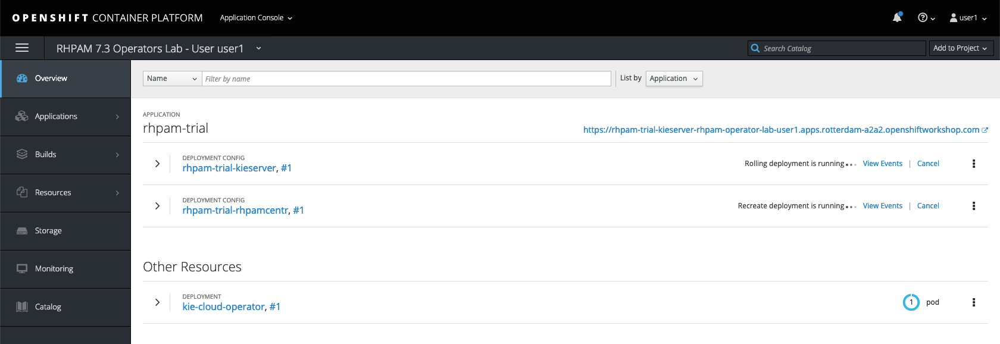

6.  Wait for the pods to be fully deployed

7.  Go back to the [OpenShift Cluster Console](https://console.apps.rotterdam-a2a2.openshiftworkshop.com).

8.  In the **Instances** tab of the Operator, click on the `rhpam-trial` entry. 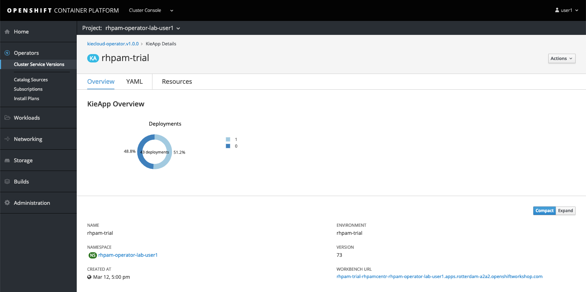

9.  In the lower-right corner, click on the **WORKBENCH URL** link to navigate to **Business Central**

10. As the Operator is responsible for deployment and configuration of the platform, we can find the details if this deployment in the **KieApp** instance details screen in the **OpenShift Cluster Console**. Go back to the [OpenShift Cluster Console](https://console.apps.rotterdam-a2a2.openshiftworkshop.com), and click on the **YAML** tab in the **KieApp** instance screen. 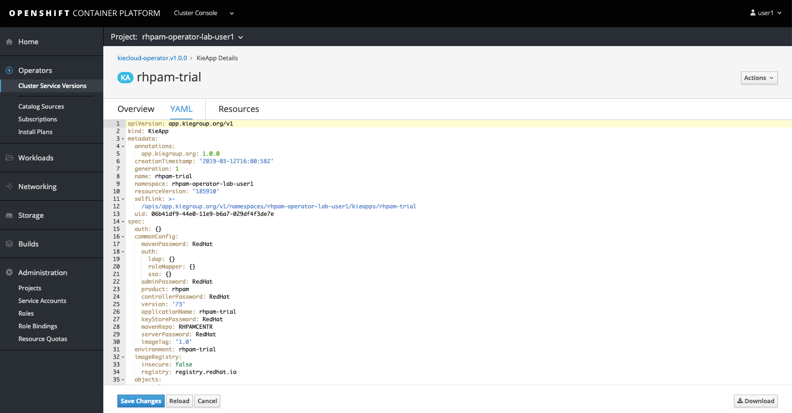

11. We can see in the YAML description that the **adminPassword** has been set to `RedHat`. Navigate back to the **Business Central** workbench and login with u: `adminUser` p: `RedHat`.

12. Explore the **Business Centrall** workbench. In particular, go to **Menu → Deploy → Execution Servers** to see the **Execution Server** connected to the workbench.

Reconciliation
==============

The OpenShift Operators provide functionality to reconciliate an existing environment in order to bring it back to its expected state. We will now test this feature by removing one of the required resources from our deployment.

1.  In the [OpenShift Cluster Console](https://console.apps.rotterdam-a2a2.openshiftworkshop.com), navigate to our `rhpam-trial` **KieApp** deployment.

2.  Open the **Resources** tab. This will show all the resources of the application deployed and managed by the Operator. 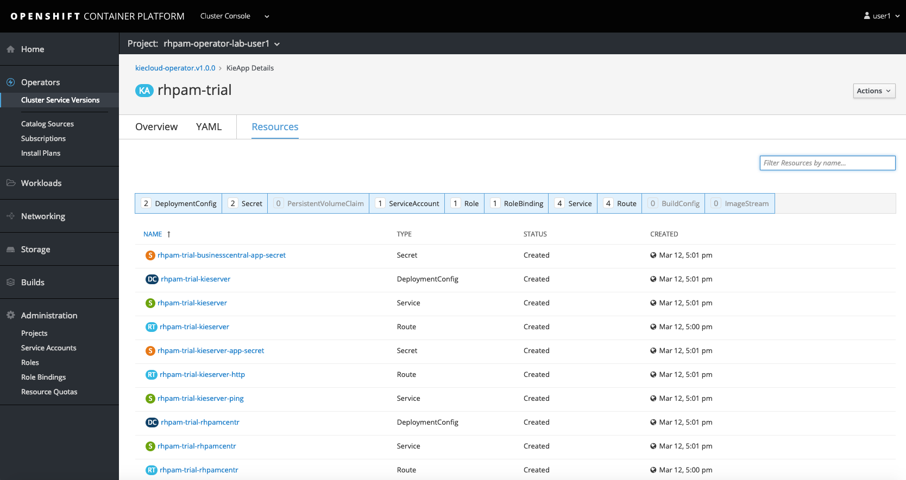

3.  On the third row, we can see the `rhpam-trial-kieserver` **Service** resource.

4.  Navigate back to the [OpenShift Master Console](https://master.rotterdam-a2a2.openshiftworkshop.com/console).

5.  In your project, go to **Application → Services**. Open `rhpam-trial-kieserver`.

6.  Delete the **Service** by clicking on the **Actions** button at the upper right of the screen and clicking on **Delete**.

7.  Notice the **Service** disappearing and immediately reappearing. This is the Operators reconciliation logic at work, bringing the environment back in its expected state.

Deploy an RHPAM Trial Environment
=================================

The Business Automation Operator supports the deployment of multiple types of environment (basically all the types that were supported by the templates). Earlier we’ve deployed a simple, ephemeral `rhpam-trial` environment. This time we will deploy a more complex `rhpam-production` environment. This environment consists not only of a **Business Central** workbench and **KIE-Server**, but also contains **PostgreSQL** databases, **SmartRouters**, etc.

1.  Navigate to the [OpenShift Cluster Console](https://console.apps.rotterdam-a2a2.openshiftworkshop.com).

2.  Go to **Operators → Cluster Service Versions** and click on the **Kie Cloud** operator.

3.  Click on **Create KieApp**.

4.  In the YAML description, set the **name** to `rhpam-prod` (the name needs to be unique, so should not clash with our already deployed `rhpam-trial` deployment). Set the **environment** to `rhpam-production` 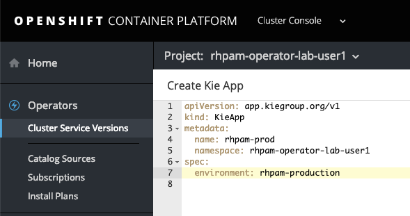

5.  Click on the **Create** at the bottom of the screen. This will start the creation and provisioning of the environment. 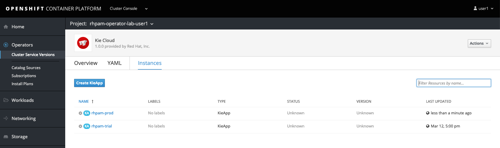

6.  Navigate back to the [OpenShift Master Console](https://master.rotterdam-a2a2.openshiftworkshop.com/console). Your project now contains a second application called `rhpam-prod`. Notice that the environment is a lot more complex than our `rhpam-trial` application, consisting of 4 **Deployment Configs**, using **Persistent Volume Claims**, etc. 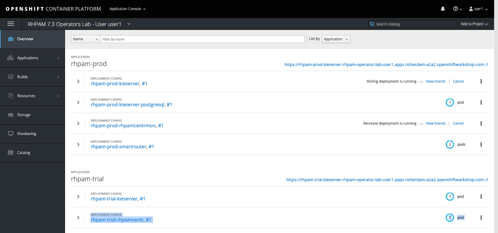 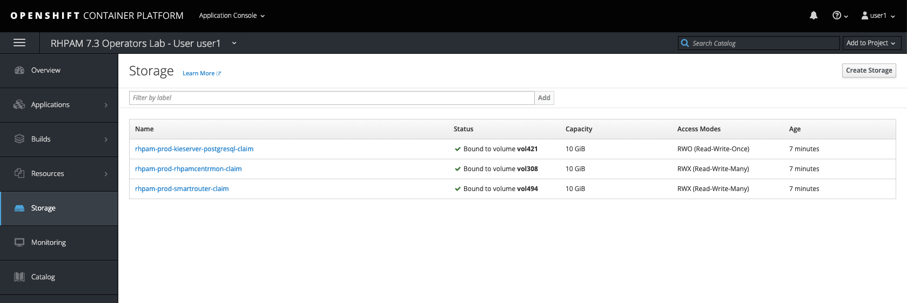

Add additional KIE-Server Groups
================================

Our `rhpam-prod` application currently only has 1 **KIE-Server** **Deployment Config**. I.e., all the PODs that are deployed as part of that **DC** will have the same configuration and thus belong to the same **KIE-Server Group**. The Business Automation Operator allows to easily change the number of **KIE-Server Groups** by simply changing the number of server instances in the configuration of our `rhpam-prod` application.

1.  

2.  Go to **Operators → Cluster Service Version**. Click on the **Kie Cloud** operator and open the **Instances** tab.

3.  Click on the `rhpam-prod` instance to open its overview page.

4.  Open the **YAML** tab.

5.  In the YAML editor, search for the `spec/objects/servers/deployments` entry. Its current value should be `1`.

6.  Set the value to `3` and click the **Save Changes** button. 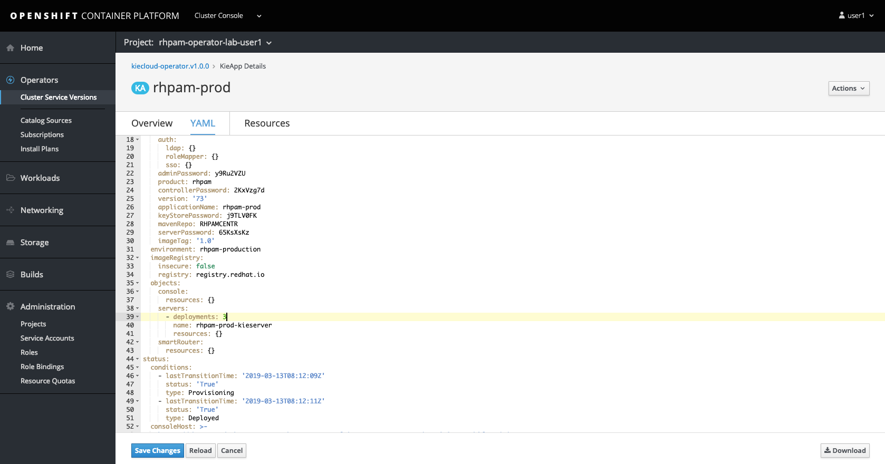

7.  Navigate back to the [OpenShift Master Console](https://master.rotterdam-a2a2.openshiftworkshop.com/console).

8.  Observe that the operator has deployed 2 additional **KIE-Server** **Deployment Configs**. 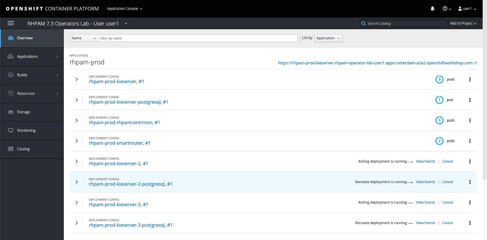

Deleting an application
=======================

Apart from provisioning an RHPAM application, the Operator also allows us to easily delete an application.

1.  Navigate to the [OpenShift Cluster Console](https://console.apps.rotterdam-a2a2.openshiftworkshop.com).

2.  Go to **Operators → Cluster Service Versions**. Click on the **Kie Cloud** operator and open the **Instances** tab.

3.  Click on the `rhpam-trial` instance to open its overview page.

4.  Click on the **Action** button in the upper right corner and select **Delete Kie App**. Click on **Confirm**. 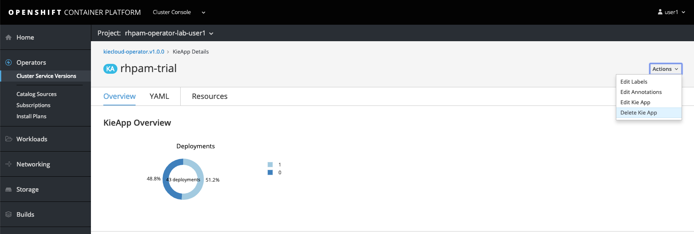

5.  Navigate back to the [OpenShift Master Console](https://master.rotterdam-a2a2.openshiftworkshop.com/console) and observe that the `rhpam-trial` application has been removed.

Conclusion
==========

This concludes the lab on the Business Automation Operator. If you have time left, feel free to explore more features of the operator: \* try to deploy an `rhpam-trial` environment that uses a non-default admin password for the admin user. \* try to deploy another type of environment, for example an **authoring** or **authoring ha** enviroment.
