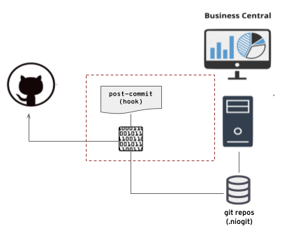
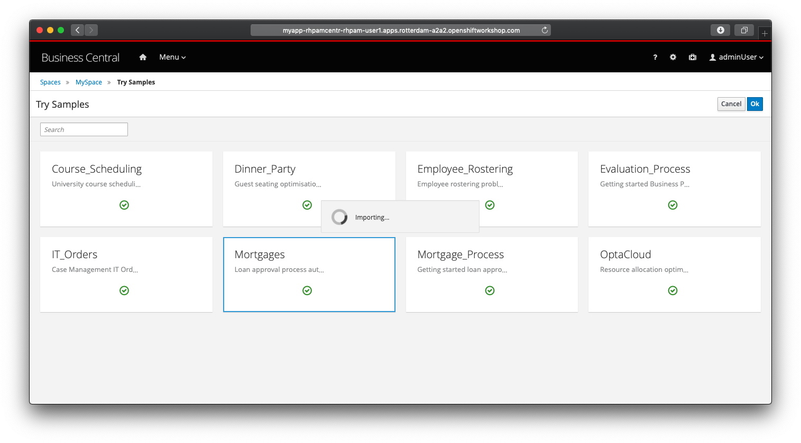
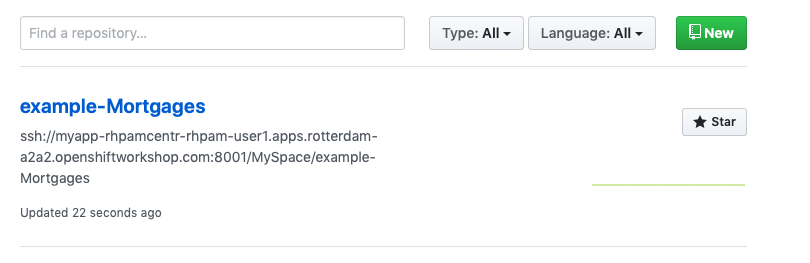
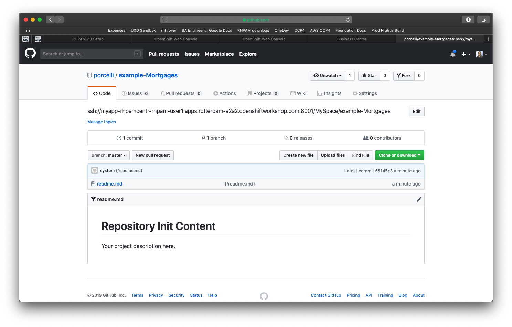
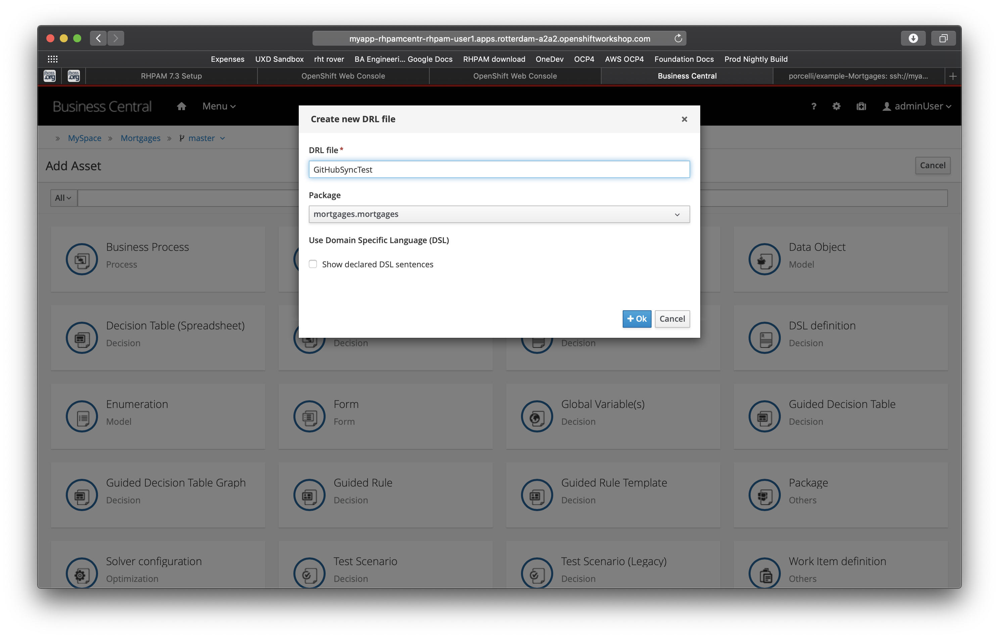
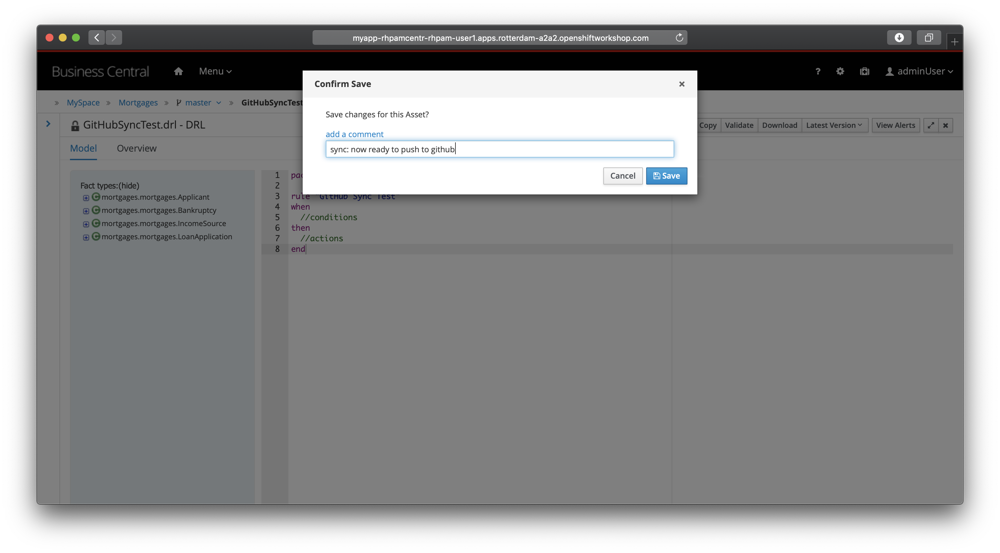
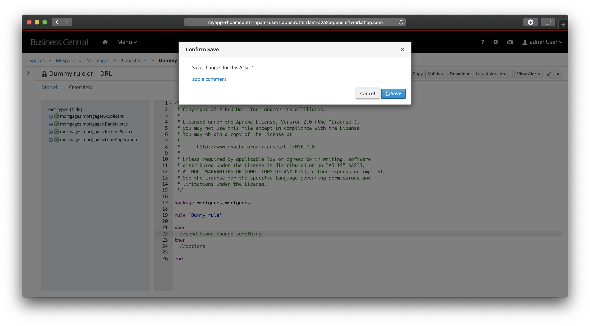
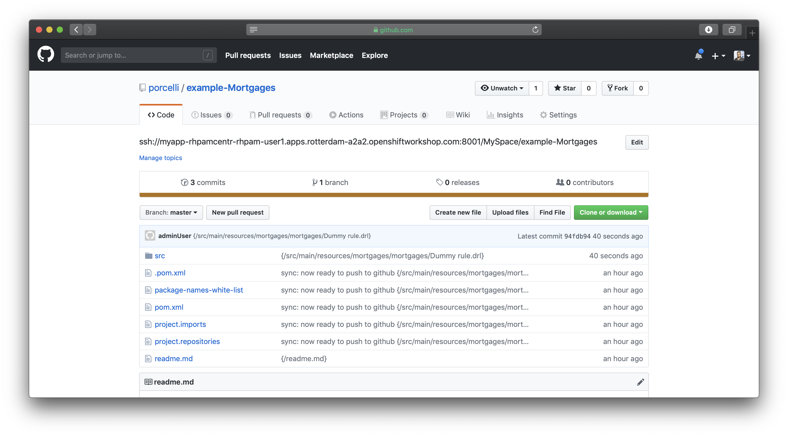

Business Automation Business Central Git Hook Lab
=================================================

In this lab, we will integrate Business Central to GitHub to automatically push changes made in Business Central to GitHub.

## Goals

-   Create the post-commit hook and upload it to Business Central.

-   Change existing Business Central deployment config to host and execute the git hook.

-   Explore the integration of Business Central and GitHub.

## Pre reqs

-   An existing, accessible, PAM 7.3+ environment.
-   An existing OpenShift environment;
-   GitHub credentials

    -   In case you have two-factor authentication enabled in your GitHub account, you will need to generate a Personal Access Token. For more information, please open the following link `https://help.github.com/en/articles/creating-a-personal-access-token-for-the-command-line`

Problem Statement
=================

In this lab, the goal is to integrate Business Central git repositories with GitHub. To be able to sync the repositories you will write a small shell script that will delegate the integration to a java based application.

-   Create a post-commit hook script that invokes the java application with the correct parameters

-   Add to an already existing Business Central environment a mounted volume that will store the git hook script and the java application

-   Rsync the script and the java application to the mounted volume

-   Explore the Business Central to GitHub integration.

Creating the post-commit hook
=============================

For this lab you’ll use a java application to integrate Business Central git repositories with GitHub, the git post-commit hook will execute this application. The java application code that’ll use has the code published [here](https://github.com/porcelli/bc-git-integration), but we’ll download an already released version of it.

1.  Open your terminal and create a new directory

    $ mkdir ~/bc-git-hook
    $ cd ~/bc-git-hook

2. Download the java application available at [github](https://github.com/porcelli/bc-git-integration/releases/tag/1.0.0-Beta1)

    $ wget https://github.com/porcelli/bc-git-integration/releases/download/1.0.0-Beta1/bc-github-githook-1.0.0-Beta1.jar

3. Create a new file named post-commit and give execution permission to it

    $ touch post-commit
    $ chmod a+x post-commit

4. Change the content of the post-commit file to execute the java application with your credentials and the business central URL

    #!/bin/bash
    
    java -jar -Dsync.mode=on_sync -Dbc.url=myapp-rhpamcentr-rhpam-user1.apps.rotterdam-a2a2.openshiftworkshop.com:8001 -Dgh.username={your-user} -Dgh.password={your-password-or-token} /opt/eap/standalone/data/kie/git/hooks/bc-github-githook-1.0.0-Beta1.jar

Change the Business Central environment
=======================================

In this part of the lab, we’ll continue to use the command line to change your current provisioned environment on OpenShift to support git hooks.

1.  Back to your terminal and go to the folder you just created in the previous section.

    $ cd ~/bc-git-hook

2. Login to OpenShift. *(replace the values in {} with your own. i.e. Considering your user for OpenShift if `userAdmin`, replace {username} for `userAdmin` )*

    $ oc login {openshift_master} -u {username} -p {password}

3. Change the project from default to your Business Central environment

    $ oc project rhpam-user1

4. Add a pvc to Business Central deployment config with `/opt/eap/standalone/data/kie/git/hooks` as the mount path. This will result in a new version of the deployment config that, as consequence, will kill existing pod and create a new updated one. This operation may take a while.

    $ oc set volume dc/myapp-rhpamcentr --add --name=myapp-rhpamcentr-rhpamcentr-githook-pvol --claim-name=myapp-rhpamcentr-githook-claim --mount-path /opt/eap/standalone/data/kie/git/hooks --type pvc --claim-size=1G

5. List the pods and identify the Business Central running pod

    $ oc get pods

6. Copy the pod name and let’s use it to rsync the local content into the pvc created in the step 4.

    $ oc rsync ./ myapp-rhpamcentr-2-csxp5:/opt/eap/standalone/data/kie/git/hooks/

7. To be sure that all files have been rsync’ed, let’s list the content of the mounted volume

    $ oc rsh myapp-rhpamcentr-2-csxp5 ls -las /opt/eap/standalone/data/kie/git/hooks

8. Finally, we’ll now make the last change to the Business Central deployment config. We’ll set the environment variable `GIT_HOOKS_DIR`. This will result in a new version of the deployment config, as a consequence we’ll have the current pod killed, and a new one provisioned, that will take a while to finish.

    $ oc set env dc/myapp-rhpamcentr GIT_HOOKS_DIR=/opt/eap/standalone/data/kie/git/hooks

Explore the Business Central
============================

1.  Log in in Business Central and import the mortgages example. 

2.  Now open your GitHub account and check your repositories. You’ll notice that a new repository called "example-Mortgages" has been created. 

3.  However, you’ll be able to notice that the repository still empty. You may be asking yourself, where’s the data? 

When we created the post-commit shell script, we set the sync.mode parameter to `on_sync`, which means that changes will be pushed to GitHub only when the magic word "sync" is used in the comments of the save action.

1.  Now create a new DRL file named GitHubSyncTest 

2.  Create the content of an empty rule and press the save button. Click on the "add comment" link and start the comment with the magic word "sync:". 

3.  Open your GitHub account and now check the content of the example-Mortgages repository 

Tweaking the Java Programming to save on every change
=====================================================

In this last section of the lab, we’ll tweak the post-commit hook of the existing example project and force the java programming to sync on every save, removing the need to use the magic word.

1.  Back to your command line and open an ssh session to your Business Central pod

    oc rsh myapp-rhpamcentr-3-xpl6t

2. Go to the following directory. This is where the git hook for the example-Mortgages is stored. Important to note that each repository has its copy of the original git-hook originally stored at `/opt/eap/standalone/data/kie/git/hooks`.

    cd /opt/eap/standalone/data/kie/.niogit/MySpace/example-Mortgages.git/hooks/

3. Open the post-commit file and change the "sync.mode" parameter to "always".

    java -jar -Dsync.mode=always -Dbc.url=myapp-rhpamcentr-rhpam-user1.apps.rotterdam-a2a2.openshiftworkshop.com:8001 -Dgh.username=porcelli -Dgh.password=6aff08153b2791ef95353b041375cfcbf9b35cea /opt/eap/standalone/data/kie/git/hooks/bc-github-githook-1.0.0-Beta1.jar

4. As we changed the post-commit directly into the running pod, we don’t need any restart. So get back to Business Central, open the Dummy rule file change it and hit save. This time without any comment. 

5. Now back to your GitHub account and verify that you now have one more commit with the change you just made. 