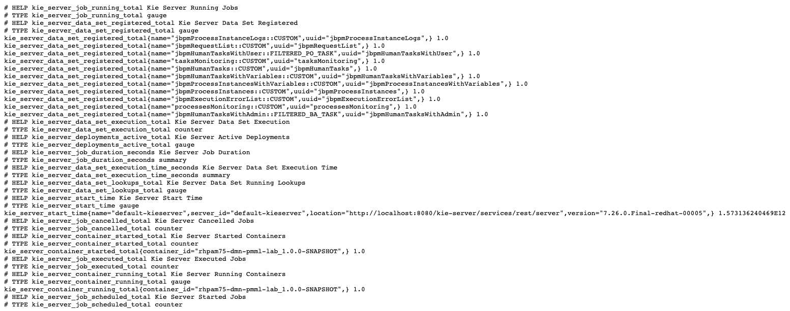
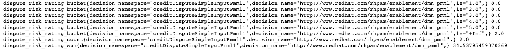

Prometheus: Monitoring DMN decisions with KIE-Server and Prometheus
===================================================================

In this lab we will build a custom Prometheus KIE-Server plugin to monitor DMN decisions. We will build an extension that monitors the `Dispute Risk Rating` and `Cardholder Risk Rating` decisions of the DMN model of the previous lab.

## Goals

-   Enable the Prometheus KIE-Server extension.

-   Implement a custom KIE-Server Prometheus plugin.

-   Install the Prometheus plugin into KIE-Server.

## Pre reqs

-   Successful completion of the *Environment Setup Lab* or

-   An existing, accessible, DM/PAM 7.5+ environment.

-   Successful completions of the 12 - *DMN PMML Lab*

Problem Statement
=================

In this lab we will create a custom KIE-Server Prometheus plugin that will monitor the results of the `Dispute Risk Rating` and `Cardholder Risk Rating` of our DMN model. We will implement the monitoring logic as a `DMNRuntimeEventListener` and register the extension using the [Java ServiceLoader](https://docs.oracle.com/javase/8/docs/api/java/util/ServiceLoader.html) mechanism.

Enabling the KIE-Server Extension
=================================

By default, the KIE-Server Prometheus extension is disabled. The extension can be enabled by setting the Java System Property `org.kie.prometheus.server.ext.disabled` to `false`. This can, for example, be done when starting the Red Hat JBoss Enterprise Application Platform (JBoss EAP) server, or by configuring the system-property in the <system-properties> section of the JBoss EAP server configuration file (e.g. standalone.xml).

When the extension is enabled, it provides a number of out-of-the-box metrics for Drools (both rules and DMN decisions), OptaPlanner, and jBPM deployments. The metrics are available at the URL: [http://<host>:<port>/kie-server/services/rest/metrics](http://<host>:<port>/kie-server/services/rest/metrics).

1. Start your Red Hat Process Automation Manager 7.5 with the system property that enables the KIE-Server Prometheus plugin

   ```bash
    $ ./standalone.sh -Dorg.kie.prometheus.server.ext.disabled=false 
   ```

2.  When KIE-Server has started, navigate to the KIE-Server Prometheus metrics endpoint at: <http://localhost:8080/kie-server/services/rest/metrics> . You should see the following page:

    

3.  We can see that KIE-Server provides out-of-the-box metrics for, for example, the response time of the DMN evaluations. Depending on the type of deployment (e.g., DMN, Drools, jBPM), the Prometheus extension enables different metrics.

Writing a KIE-Server Prometheus extension.
==========================================

The Prometheus KIE-Server plugin is able to load additional *metric providers* via the [Java ServiceLoader](https://docs.oracle.com/javase/8/docs/api/java/util/ServiceLoader.html) mechanism: <https://github.com/kiegroup/droolsjbpm-integration/blob/master/kie-server-parent/kie-server-services/kie-server-services-prometheus/src/main/java/org/kie/server/services/prometheus/PrometheusCustomMetricsSupport.java#L44>

Your metrics provider project must therefore contain a file with the name `org.kie.server.services.prometheus.PrometheusMetricsProvider` in the project’s `/META-INF/services` folder. The content of this file is the fully qualified class name of your `PrometheusMetricsProvider` implementation. When you place your `` PrometheusMetricsProvider`‘s JAR file in the `WEB-INF/lib `` folder of the KIE-Server, the provider is automatically discovered and registered.

A custom metrics provider needs to implement the [`PrometheusMetricsProvider` interface](https://github.com/kiegroup/droolsjbpm-integration/blob/master/kie-server-parent/kie-server-services/kie-server-services-prometheus/src/main/java/org/kie/server/services/prometheus/PrometheusMetricsProvider.java). This interface defines methods that return

-   DMNRuntimeEventListener: DMN support.

-   AgendaEventListener: Drools support

-   PhaseLifecycleListener: OptaPlanner support

-   AsynchronousJobListener: jBPM support

-   DeploymentEventListener: KIE-Server support

Hence, a *custom metrics provider* needs to be implement one or more of these interfaces. When the custom PrometheusMetricsProvider is registered, the extension registers the EventListeners dynamically with the various runtimes.

Let’s write our first provider, which offers simple metrics for our Credit Card Dispute *Process Automatically* DMN decisions.

1. Create a simple Java Maven project. We use the Maven archetype approach to scaffold a new project:

   ```bash 
   $ mvn archetype:generate -DgroupId=com.redhat.rhba.enablement -DartifactId=rhpam75-lab-prometheus-metrics-provider -Dversion=1.0.0 -DarchetypeArtifactId=maven-archetype-quickstart -DinteractiveMode=false
   ```

   

2.  Import the project in your IDE of choice (e.g. Eclipse, IntelliJ, Visual Studio Code).

3. Add the following dependency to the `pom.xml file`:

   ```xml
    <dependency> 
      <groupId>org.kie.server</groupId> 
      <artifactId>kie-server-services-prometheus</artifactId>
      <version>7.27.0.Final</version> 
      <scope>provided</scope> 
   </dependency>
   ```

   Add the Maven Compiler Plugin configuration to the build section of your `pom.xml` file. This sets that Java source and target versions to Java 8:

   ``` xml
   <build> 
     <plugins> 
       <plugin> 
         <groupId>org.apache.maven.plugins</groupId> 
         <artifactId>maven-compiler-plugin</artifactId> 
         <version>3.8.1</version> <configuration>
         <source>1.8</source> <target>1.8</target> 
         </configuration> 
       </plugin> 
     </plugins> 
   </build>
   ```

   

5.  In the project’s `src/main/java` directory, delete the *com.redhat.rhba.enablement.App.java* class that is auto-created by the Maven archetype.

6.  Create a Java package with the name `com.redhat.rhba.enablement.prometheus`.

7.  In this package, create a class with the name `DisputeRisksPrometheusMetricsProvider.java`. This class must implement the `PrometheusMetricsProvider` interface. Provide a default implementation for the methods that return *null*.

    ``` java
    package com.redhat.rhba.enablement.prometheus;
    import org.jbpm.executor.AsynchronousJobListener; 
    import org.jbpm.services.api.DeploymentEventListener; 
    import org.kie.api.event.rule.AgendaEventListener; 
    import org.kie.dmn.api.core.event.DMNRuntimeEventListener; 
    import org.kie.server.services.api.KieContainerInstance; 
    import org.kie.server.services.prometheus.PrometheusMetricsProvider; 
    import org.optaplanner.core.impl.phase.event.PhaseLifecycleListener;
     DisputeRisksPrometheusMetricsProvider public class DisputeRisksPrometheusMetricsProvider implements PrometheusMetricsProvider {
      	public DMNRuntimeEventListener createDMNRuntimeEventListener(KieContainerInstance kContainer) {
      		return null;
      	}
    
        public AgendaEventListener createAgendaEventListener(String kieSessionId, KieContainerInstance kContainer) {
            return null;
        }
          
        public PhaseLifecycleListener createPhaseLifecycleListener(String solverId) {
            return null;
        }
          
        public AsynchronousJobListener createAsynchronousJobListener() {
            return null;
        }
          
        public DeploymentEventListener createDeploymentEventListener() {
          return null;
        }
    
      }
    ```


We will now define our `DMNRuntimeEventListener`, which will react to events in our DMN engine and collect the Prometheus metrics.

1. In the same package, create a Java class with the name `DisputeRisksDMNRuntimeEventListener.java`. Have this class implement the `DMNRuntimeEventListener` interface:

   ```java
   package com.redhat.rhba.enablement.prometheus;
   import org.kie.dmn.api.core.event.DMNRuntimeEventListener;
   
   /**
    * DisputeRisksDMNRuntimeEventListener
    */
   public class DisputeRisksDMNRuntimeEventListener implements DMNRuntimeEventListener {
   }
   ```

2. Implement the `createDMNRuntimeEventListener` method in the `DisputeRisksPrometheusMetricsProvider` class and have it return the `DMNRuntimeEventListener` implementation we’ve just created:

```java
public DMNRuntimeEventListener createDMNRuntimeEventListener(KieContainerInstance kContainer) { 
  return new DisputeRisksDMNRuntimeEventListener(); 
}
```

3. Define a the Prometheus `Histograms` in the `DisputeRisksDMNRuntimeEventListener` which we will collect the *Cardholder Risk Rating* and *Dispute Risk Rating*.

```java
/* Cardholder Risk Rating. */ 
private static final Histogram crr = Histogram.build().name("cardholder_risk_rating") .help("Cardholder Risk Rating").labelNames("decision_namespace", "decision_name") .buckets(1, 2, 3, 4, 5).register();

/*** Dispute Risk Rating. */ 
private static final Histogram drr = Histogram.build().name("dispute_risk_rating").help("Dispute Risk Rating").labelNames("decision_namespace", "decision_name").buckets(1, 2, 3, 4, 5).register();  
```

Note that we define our `Histograms` as static class members. The reason for this is that the Prometheus Java client only allows you to register a single collector under a given name. Another option would have been to register the collector with a dynamic name. For example, one that depends on the Maven groupId, artifactId, and version of the `KieContainerInstance` for which we create the collector. . Implement the `afterEvaluateDecision` method of the `DMNRuntimeEventListener`, in which we can retrieve the outcome of the decision and add it to our Prometheus collector. What we do in this code is determine the name of the decision that has been taken, and if the name is equal to “Cardholder Risk Rating” or "Dispute Risk Rating", add the result of the decision (the risk) to the respective Prometheus histogram.

```java
public void afterEvaluateDecision(AfterEvaluateDecisionEvent event) { 
  DecisionNode decisionNode = event.getDecision(); 
  String decisionNodeName = decisionNode.getName(); 
  DMNDecisionResult result = event.getResult().getDecisionResultByName(decisionNodeName);

  double resultAsDouble = 0.0;
  Object resultAsObject = result.getResult();
    
  switch (decisionNodeName) {
  	case "Cardholder Risk Rating":
    	// We only store if we find and Integer.
      if (resultAsObject instanceof BigDecimal) {
      	resultAsDouble = ((BigDecimal) resultAsObject).doubleValue();
        crr.labels(decisionNode.getModelName(), decisionNode.getModelNamespace()).observe(resultAsDouble);
       }
       break;
    case "Dispute Risk Rating":
    	// We only store if we find and Integer.
			if (resultAsObject instanceof BigDecimal) {
				resultAsDouble = ((BigDecimal) resultAsObject).doubleValue();
				drr.labels(decisionNode.getModelName(), decisionNode.getModelNamespace()).observe(resultAsDouble);
			}
			break;
      default:
      // Not the decision we want to monitor. Discarding.
				break;
      }
    }

    double resultAsDouble = 0.0;
    Object resultAsObject = result.getResult();
			switch (decisionNodeName) {
			case "Cardholder Risk Rating":
          // We only store if we find and Integer.
          if (resultAsObject instanceof BigDecimal) {
              resultAsDouble = ((BigDecimal) resultAsObject).doubleValue();
              crr.labels(decisionNode.getModelName(),decisionNode.getModelNamespace()).observe(resultAsDouble);
         	}
          break;
      case "Dispute Risk Rating":
          // We only store if we find and Integer.
          if (resultAsObject instanceof BigDecimal) {
              resultAsDouble = ((BigDecimal) resultAsObject).doubleValue();
              drr.labels(decisionNode.getModelName(), decisionNode.getModelNamespace()).observe(resultAsDouble);
          }
          break;
      default:
          // Not the decision we want to monitor. Discarding.
          break;
      }
    }
```
+ In the `src/main/resources` folder, create the folder `META-INF/services`. . In this folder, create a file named `org.kie.server.services.prometheus.PrometheusMetricsProvider` with the following content. This file enables the ServiceLoader discovery mechanism to find our extension as a `PrometheusMetricsProvider`. ```com.redhat.rhba.enablement.prometheus.DisputeRisksPrometheusMetricsProvider ```

* Create a JAR file using Maven:

```shell
$ mvn clean package 
```

+  Copy the `rhpam75-lab-prometheus-metrics-provider-1.0.0.jar` file from your project’s `target` directory to the `WEB-INF/lib` directory of your `kie-server.war` deployment. . Restart your Red Hat Process Automation Manager instance. . Go to the KIE-Server Swagger UI at <http://localhost:8080/kie-server/docs>. . Scroll down until you see the section **DMN Models**. . Click on the `POST` operation to expand the API definition.

* Click on the **Try it out** button on the right-hand side of the screen. . Use the value `rhpam75-dmn-pmml-lab` as the *containerId*, set the *Paramater content type* dropdown box to `application/json`, set the *Response content type* (the dropdown box under the blue **Execute** button) to `application/json` and use the following JSON data as the *body*:

```json
{ "model-namespace":"http://www.redhat.com/rhpam/enablement/dmn_pmml", "model-name":"creditDisputeSimpleInputPmml1", "dmn-context": { "Age": 23, "Incident Count": 2, "Cardholder Status": "STANDARD", "Fraud Amount": 1000 } } 
```

* The response should look like this. Note that the result not only shows the result of the final decision (i.e. `Process Automatically`), but also the result of the other decisions (`Dispute Risk Rating` and `Cardholder Risk Rating`).

```json
{ "type": "SUCCESS", "msg": "OK from container *rhpam75-dmn-pmml-lab*", "result": { "dmn-evaluation-result": { "messages": [], "model-namespace": "http://www.redhat.com/rhpam/enablement/dmn_pmml", "model-name": "creditDisputeSimpleInputPmml1", "decision-name": [], "dmn-context": { "Dispute Risk Rating": 17.268977295351846, "Process Automatically": false, "Cardholder Risk Rating": 1.7805601031011, "Fraud Amount": 1000, "Cardholder Risk Model": "function Cardholder Risk Model( age, holder_index, incidents )", "Cardholder Status": "STANDARD", "Dispute Risk Model": "function Dispute Risk Model( amount, holder_index )", "Age": 23, "Incident Count": 2 }, "decision-results": { "_c4f764e7-52d0-489e-a1df-fe264a8615bf": { "messages": [], "decision-id": "_c4f764e7-52d0-489e-a1df-fe264a8615bf", "decision-name": "Cardholder Risk Rating", "result": 1.7805601031011, "status": "SUCCEEDED" }, "_2523907c-978f-4f2e-a9cb-3d349c83c335": { "messages": [], "decision-id": "_2523907c-978f-4f2e-a9cb-3d349c83c335", "decision-name": "Process Automatically", "result": false, "status": "SUCCEEDED" }, "_7806a972-6dc1-46b3-81e7-ff48ac763f0f": { "messages": [], "decision-id": "_7806a972-6dc1-46b3-81e7-ff48ac763f0f", "decision-name": "Dispute Risk Rating", "result": 17.268977295351846, "status": "SUCCEEDED" } } } } }
```

* Go to the Prometheus metrics page of the KIE-Server at <http://localhost:8080/kie-server/services/rest/metrics>. In the metrics you should now see the metrics for the *Credit Risk Rating* and *Dispute Risk Rating*.  

The finished project can be found here: <https://github.com/rhba-enablement/rhpam75-lab-prometheus-metrics-provider>
