Recommendation Engine
=====================

In this lab we will enable a *RandomForest* `PredictionService` on the Execution Server/KIE-Server and implement a process that will use this service from a *HumanTask*.

-   Deploy a `PredictionService` implementation on KIE-Server.

-   Define and implement a process that uses the `PredictionService`.

-   Successful completion of the *Environment Setup Lab* or

-   An existing, accessible, DM/PAM 7.5+ environment.

Problem Statement
=================

In this lab we will create a process that use a `PredictionService` to, potentially, automatically complete a HumanTask based on a machine learning model.

Red Hat Process Automation Manager 7.5 introduces a *Prediction* and *Recommendation* engine API for HumanTasks that is capable of recommending an output value for a given task, and, if the recommendation is above a certain *confidenceThreshold*, automatically complete the task.

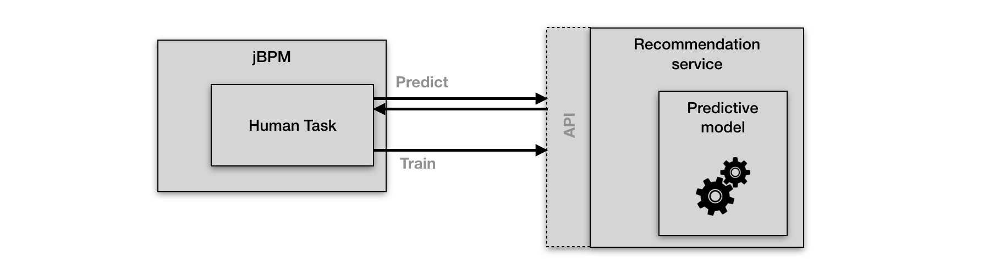

Building the PredictionService
==============================

For this lab, we will provide you with [SMILE](http://haifengl.github.io/smile/)-based `PredictionService`. We will compile this service and deploy it on the ExecutionServer, after which we will configure the environment to use the `PredictionService` when interacting with Human Tasks.

1. Clone the following repository to your machine: <https://github.com/ruivieira/jbpm-recommendation-demo.git> 

   ``` shell
   $ git clone <https://github.com/ruivieira/jbpm-recommendation-demo.git> 
   ```

2. Import the repository into your editor of choice (e.g. IntelliJ, Eclipse, Visual Studio Code).

3. In the *services* folder you will see a project called `jbpm-recommendation-smile-random-forest`. Open this project and open the file `org.jbpm.prediction.randomforst.SmileRandomForest.java`.

4. The `SmileRandomForest.java` implements the jBPM `PredictionService` interface. Open this interface in your IDE.

The `PredictionService` interface defines 3 methods:

-   `getIdentifier()`: returns the identifier of your `PredictionService` implementation. You can configure the `PredictionService` to be used via the SystemProperty `org.jbpm.task.prediction.service`. The `PredictionServiceRegistry` will return the `PredictionService` of which the identifier matches the value configured on the SystemProperty.

-   `predict(Task task, Map<String, Object> inputData)`: returns a `PredictionOutcome`, which is used in the *Human Task* to either give a recommendation of the response value, or to automatically complete the task if the confidence of the `PredictionOutcome` is higher than the `confidenceThreshold`.

-   `train(Task task, Map<String, Object> inputData, Map<String, Object> outputData)`: trains the model with the provided input and output data.

Your `PredictionService` needs to implement at least the `getIdentifier` and `predict` method. The `train` method can be implemented by implementations that support live model training (like our SMILE implementation).

When a HumanTask is created, and the `PredictionService` is configured, [the `predict` method will be called]( https://github.com/kiegroup/jbpm/blob/master/jbpm-human-task/jbpm-human-task-workitems/src/main/java/org/jbpm/services/task/wih/LocalHTWorkItemHandler.java#L70). The response of this method is, as said, a `PredictionOutcome`. The HumanTask will [call the `PredictionOutcome.isCertain()` method](https://github.com/kiegroup/jbpm/blob/master/jbpm-human-task/jbpm-human-task-workitems/src/main/java/org/jbpm/services/task/wih/LocalHTWorkItemHandler.java#L72) to determine whether the task can be automatically completed. This is true when the `confidenceLevel` of the `PredictionOutcome` is higher than its `confidenceThreshold`.

This execution flow is shown in the following image:

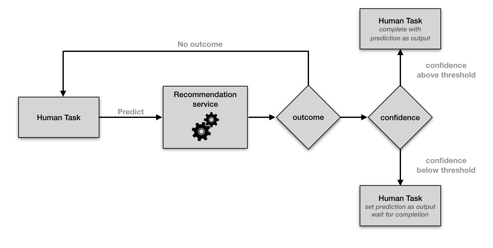

The `train` method of the `PredictionService` is [called by the `ExternalTaskEventListener`](https://github.com/kiegroup/jbpm/blob/master/jbpm-human-task/jbpm-human-task-workitems/src/main/java/org/jbpm/services/task/wih/ExternalTaskEventListener.java#L64) when the task is completed. The `train` method receives both the task, it’s input-data and output-data, which can be used to further train the model. This is shown in the image below:

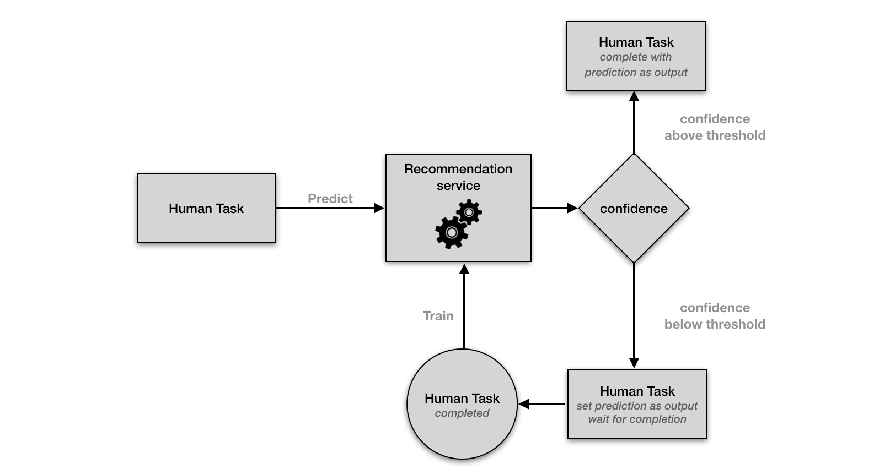

1. Compile and package the `jbpm-recommendation-smile-random-forest` project using Maven:

   ``` shell
   mvn clean package 
   ```

2. Copy the `jbpm-recommendation-smile-random-forest-7.27.0.Final.jar` file in the project’s `target` directory to the `WEB-INF/lib` directory of your `kie-server.war`.

3. The SMILE implememtation of our `PredictionService` also requires us to add the following SMILE JARs to the `WEB-INF/lib` directory of `kie-server.war`:

   -   smile-core-1.5.2.jar

   -   smile-data-1.5.2.jar

   -   smile-math-1.5.2.jar

4. In a terminal, go to the `WEB-INF/lib` directory of your `kie-server.war` deployment, and execute the following commands:

   ``` shell
   wget -O smile-core-1.5.2.jar https://search.maven.org/remotecontent?filepath=com/github/haifengl/smile-core/1.5.2/smile-core-1.5.2.jar
   wget -O smile-data-1.5.2.jar https://search.maven.org/remotecontent?filepath=com/github/haifengl/smile-data/1.5.2/smile-data-1.5.2.jar
   wget -O smile-math-1.5.2.jar https://search.maven.org/remotecontent?filepath=com/github/haifengl/smile-math/1.5.2/smile-math-1.5.2.jar
   ```

5.  Restart your RHPAM environment, enabling our SMILE `PredictionService` via the `org.jbpm.task.prediction.service` SystemProperty:

    ``` bash
    $ standalone.sh -Dorg.kie.prometheus.server.ext.disabled=false -Dorg.jbpm.task.prediction.service=SMILERandomForest
    ```

    

6. The KIE-Server is now configured to use our SMILE `PredictionService` when a task is generated.

Our SMILE `PredictionService` has been specifically created and trained for a single human task that accepts a `price` and an `item` and that returns an `approval` boolean. You can support multiple different tasks in your implementation logic by filtering the prediction based on, for example, the task name, as the `Task` object is passed in the `predict` method.

Creating the Process
====================

To demonstrate the usage of our `PredictionService`, we will build a very simple process with a single human task. The process implements an hardware order approval process. You provide the process with an item *name* and *price*,

-   Lenovo

-   Apple

The final process will look like this:


1.  Open your RHPAM Business Central workbench.

2.  Go to "Menu → Design → Projects" and go the space in which you want to create your project (by default this is `MySpace`).

3.  Create a new project called `recommendation-demo`:

    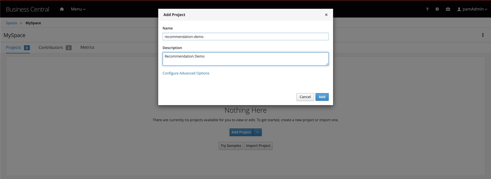

4.  Create a new business process. Give it the name `Human task`:

    

5.  Implement the following process:

    

6.  Open the property panel on the right-hand-side of the screen. Expand the *Process Data* section and configure the following process variables:

    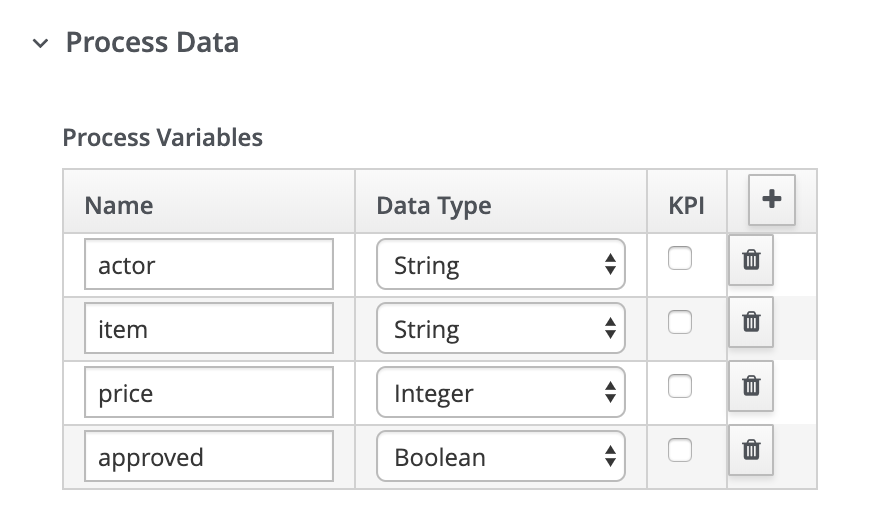

7.  Select the `Task` human task, open the property panel on the right-hand-side of the editor.

8.  Give the actor field the value `#{actor}`. This dynamically configures the actor of the task to be the value of the `actor` process variable:

    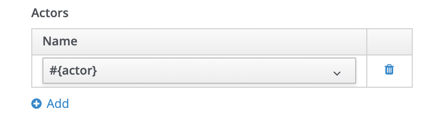

9.  Scroll down to the *Assignments* section, and click on the *pencil* icon to open the *Data Inputs and Assignments* editor. Configure the following *Data I/O*:

    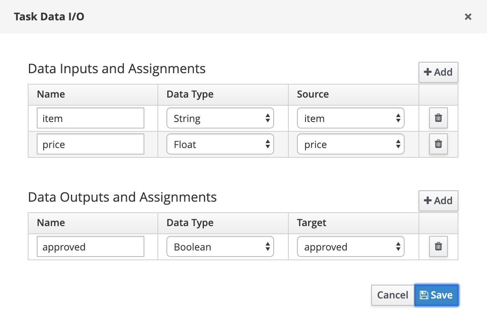

10. Generate the process forms by clicking on the "*Generate all forms*" button:

    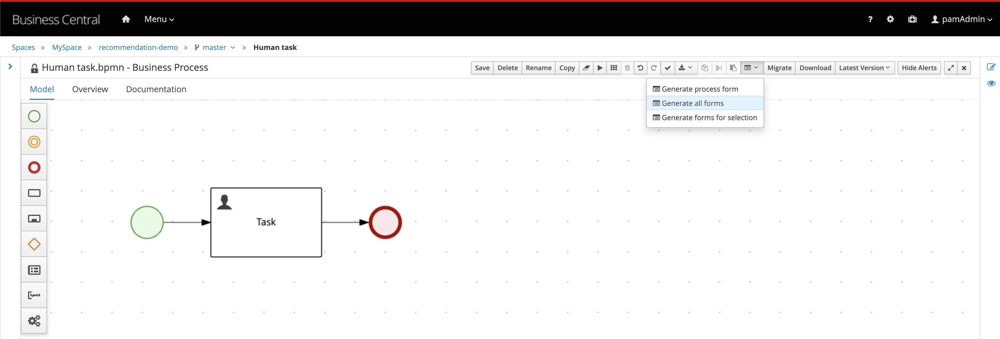

11. Open the *recommendation-demo.Humantask-tasform* and remove the `approved` field:

    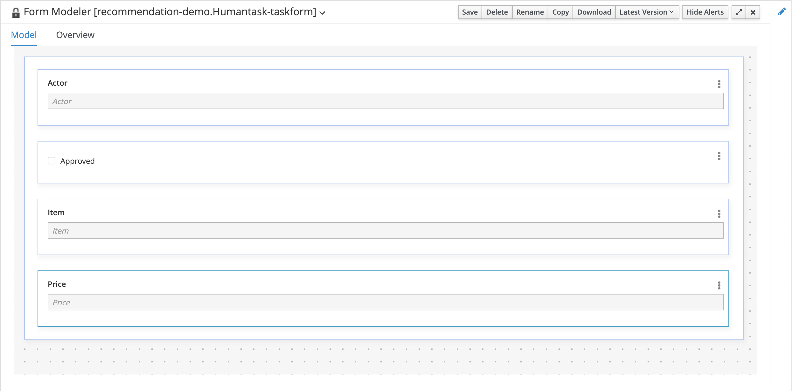 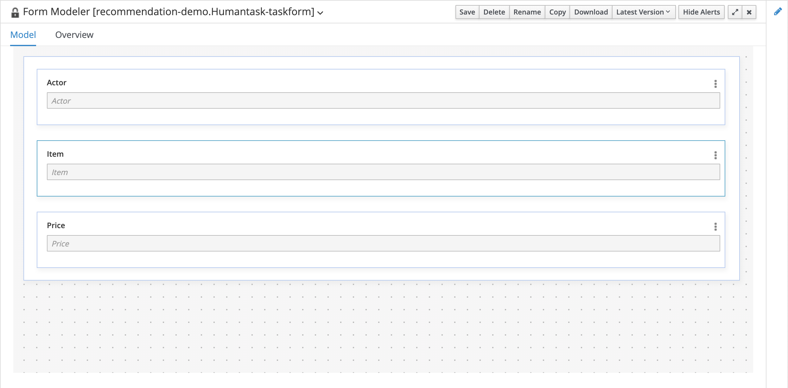

12. Save the form.

13. Open the `Task-taskform`.

14. Under the `approved` model field, add a new *Textbox* Form Control with the following properties:

    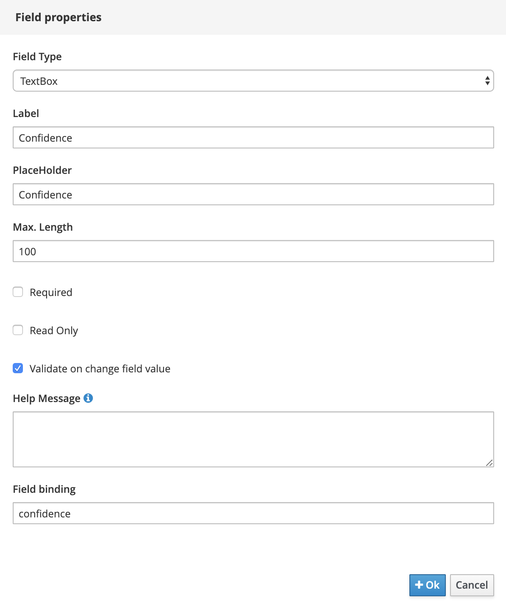

15. Save the form and go back to the project’s Asset Library view.

16. Click on the `Deploy` button in the top right corner to build the project and deploy it the Execution Server.

Training the Model
==================

Before our *SMILE Random Forest* model can do proper predictions and recommendations, it first needs to be trained. For that, the repository we’ve cloned at the beginning of this lab contains a *client* project. We will configure this client project for our environment and run it against our project. This will automatically create instances of our process and complete its task, which will effectively train the model.

1.  In your IDE, open the `client` project.

2.  Open the file `RESTClient.java`.

3. At the top of the file, configure the `OWNER`, `PASSWORD` and `PROCESS_ID` constants to match the username, password and process-id of our environment:

   ```java
   private static final String OWNER = "pamAdmin" private static final String PASSWORD = "redhatpam1!" private static final String PROCESS_ID = "recommendation-demo.Humantask";
   ```

   

4.  Run the `RESTClient.java` class directly from your IDE, or start it from a terminal using Maven:

    ```java
    $ mvn exec:java -Dexec.mainClass="org.jbpm.recommendation.demo.RESTClient"
    ```

    

    You will see the process instances being created and completed.

Testing the Process
===================

We can now test the process and the automatic approval of the tasks via our recommendation service.

This is currently hardcoded to 1201, i.e. the number of data points created by our RESTClient plus one. This means that our first request, although it has a high confidence level, will still not be automatically approved as the `confidenceThreshold` is still set to 1.

1.  Open the Business Central workbench.

2.  Go to "Menu → Manage → Process Definitions".

3.  Start a new instance of the `Human task` process:

    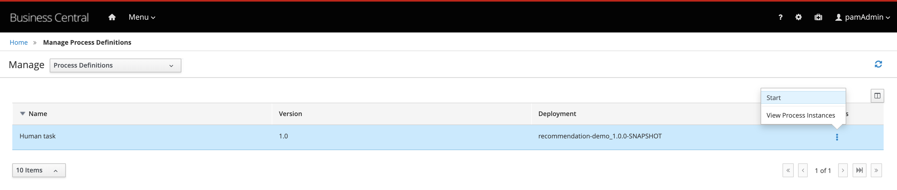

4.  Use the actor *pamAdmin*, item *Lenovo* and the price *1500*. Such a request should be automatically approved by our *Prediction Service*:

    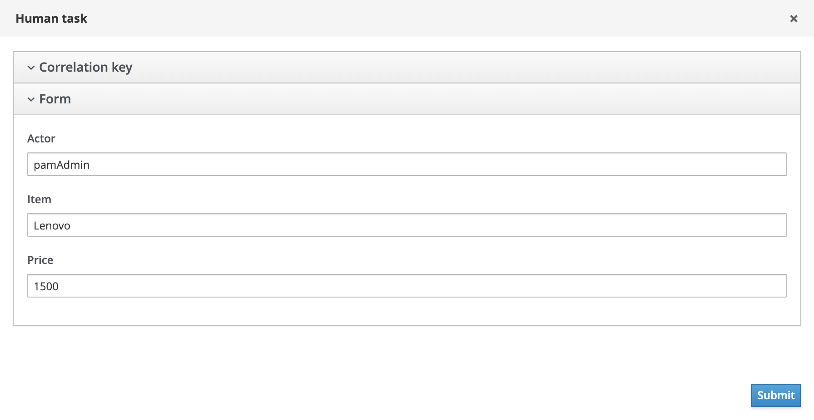

5.  Open the process diagram. Observe that the process is waiting at the task:

    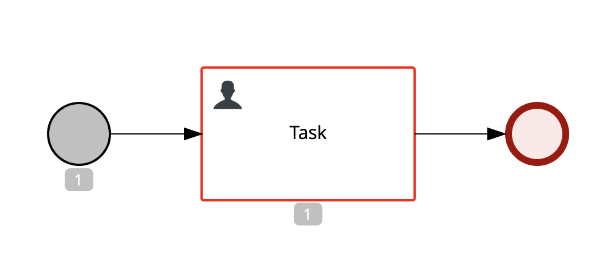

6.  Go to "Menu → Track → Task Inbox". Your inbox will contain 1 task.

7.  Click on the task to open it. Note that the *Confidence* is set to "0.8836853159056169" and that the `approved` field is already checked. However, because the `confidenceThreshold` of our `PredictionService` is still set to 1, the task is not auto-completed.

    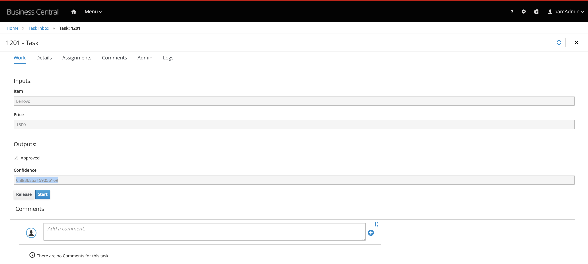

8.  Click on the **Start** button to start the task.

9.  Click on the **Complete** button to accept the recommended value for the `Approved` field and complete the task.

10. Start a new process instance with the exact same data.

11. Open the diagram of the process instance. Note that the task has now been automatically completed:

    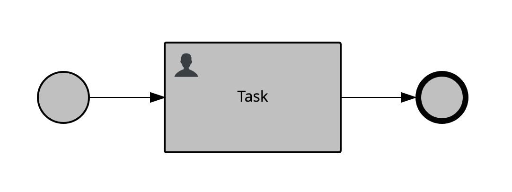

12. Open the *Process Variables* tab of the process instance and observe that the `approved` field has been set to `true`:

    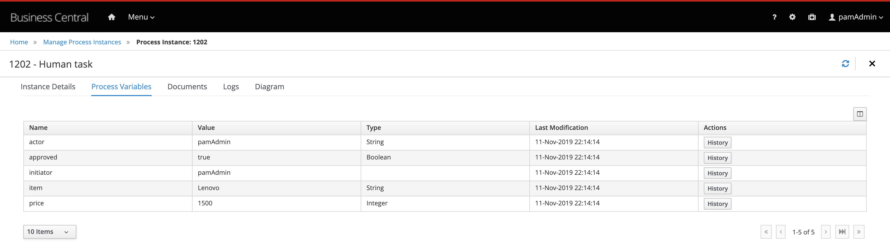

13. Start a new process instance. This time use the values `Lenovo` and `2500` for the item and price

    

14. Open the process instance diagram and observe that the process is waiting on the user task.

15. Go to your task inbox. It should contain 1 task. Click on the task to open it.

16. Note that the `Confidence` level of this task instance is set to "0.7458849644217932". This is below the `confidenceThreshold` of "0.75", hence the task is not auto-completed: 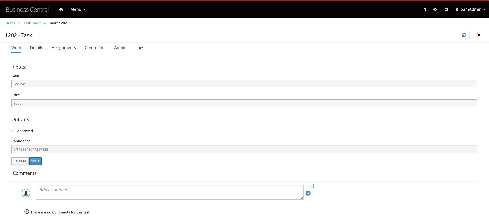

17. Complete the task.

Conclusion
==========

In this lab we’ve compiled and deployed our own *SMILE PredictionService* to the Red Hat Process Automation Manager Execution Server. We’ve configured the Execution Server to use this recommendation engine for human task recommendations and even automatic completion of human tasks. We’ve implemented a simple service and we’ve seen how our `PredictionService` was not only able to provide recommendations, but indeed was able to auto-complete our tasks.
