Operators on OCP 4
==================

In this lab we will use the enhanced Business Automation Operator **7.5+** to deploy a number of Red Hat Process Automation Manager environments on OpenShift **4.**

## Goal

-   Install the Business Automation Operator on OCP4.
-   Use the Business Automation Operator 7.5  to deploy a number of Process Automation Manager environments.
-   Change the KIE-App deployment CRDs to show reconciliation.
-   Change Operator ConfigMaps to make advanced configuration changes to the KIE-App.

## Pre reqs

-   An existing, accessible, OpenShift 4 environment in which the user has access rights to work with the operator. _You can find instruction on how to setup a local OpenShift environment on lab [00: OpenShift Setup](00-openshift-setup.md)_. 

Problem Statement
=================

In this lab, the goal is to provision and manage various Red Hat Process Automation Manager architectures using the Business Automation Operator on OpenShift 4.

-   We deploy an RHPAM Trial environment, which is a basic ephemeral environment that does not require any form of storage (e.g. persistent volume, database).
-   We explore Operator reconciliation features by removing provisioned resources like Services and Deployment Configs.
-   We alter the deployment through the Operator to show how the provisioned environment changes.
-   We change a KIE configuration parameter in the Business Automation Operator ConfigMap to demonstrate advanced configuration changes.
-   We provision a more sophisticated Production environment, to show creation of PVCs, deployment of databases and integration with RHPAM Smart Router.
-   We use the Operator Installer console to install a new KIE-App deployment.

## First steps

If you are using your OpenShift environment, follow the steps below to create a project and install the operator. If you are trying this lab in an environment provisioned by the Red Hat team, skip to the section `Inspect the Lab environment`.

1. Create a new project in OpenShift. We suggest the name `rhpam75-operator-lab-user1`.

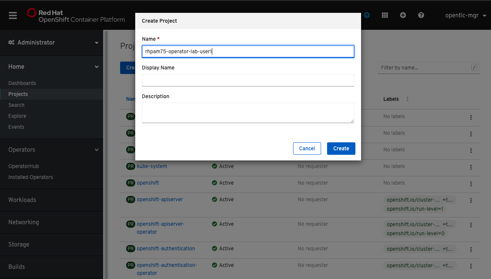

2. Navigate to `Operators`, `Operator Hub`, and search for `Business Automation`:


3. Click on the Business Automation and then, click `Install`. 

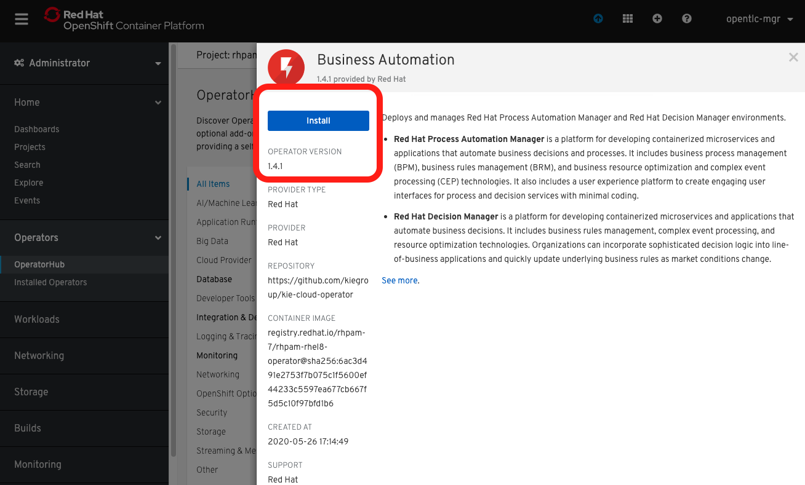

4. You can select the following options, and click on `Submit`:


5. Once subscribed, you should wait for the operator to get provisioned. Then you can proceed with the lab.


Inspect the Lab environment
===========================

If you attending to an enablement with a provisioned environment. We provisioned an environment where each user already has a subscription to the Business Automation Operator. These Operator subscriptions are managed by the OpenShift cluster admin.

1.  Navigate to [OpenShift Master](https://console-openshift-console.apps-crc.testing/)
2.  Login to the platform with the provided username and password.

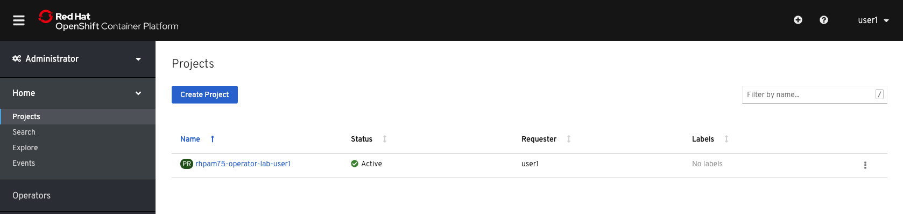

1.  Open the project. Open the *Workloads* tab. Observe that the `business-automation-operator` has already been provisioned to your project. This has been done by the cluster-admin by subscribing your project to the Business Automation Operator. 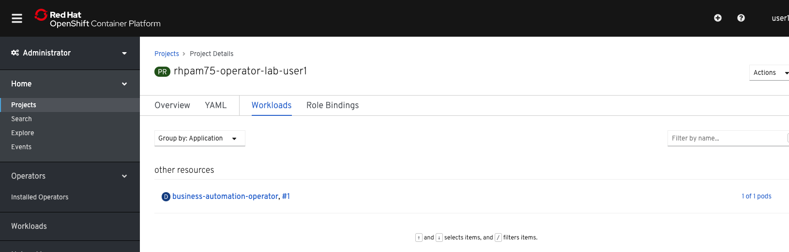

2.  Expand the **Operators** menu group in the left-hand-side of the screen and click on **Installed Operators**. This will show the installed Operators, or Operator Subscriptions, in your OpenShift namespace. 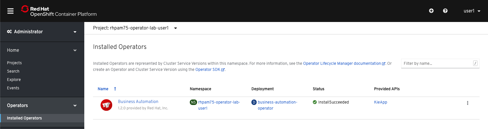

3.  Click on **Business Automation** to access the **Business Automation** Operator instance in your project. 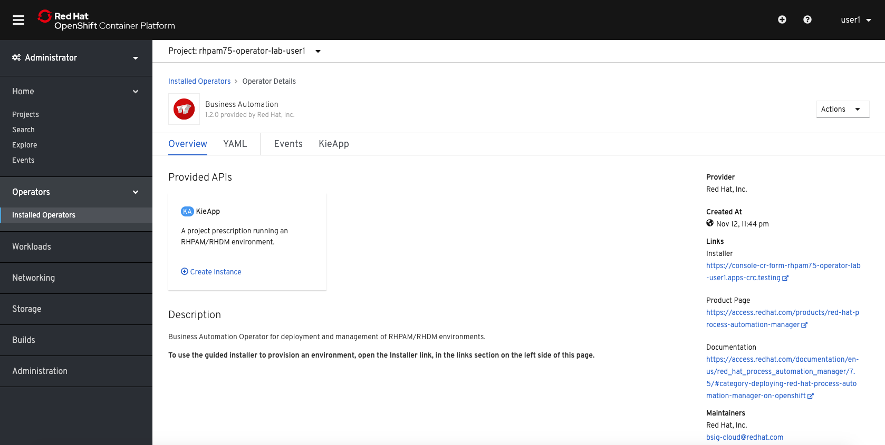

Deploy an RHPAM Trial Environment
=================================

1.  From the **Business Automation** page in your OpenShift Console, open the **KieApp** tab and click on **Create KieApp**. 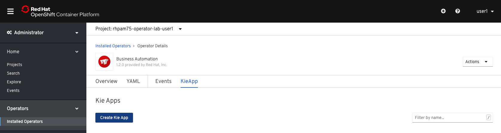

2.  In the YAML definition that is presented, notice the `environment` field. In this field we define the type of the environment we want to provision. In this case we want to provision the **Trial** environment, so we accept the default values.

3.  Click on the **Create** button at the bottom of the page.

4.  In the **KieApp** tab, we can see our new **rhpam-trial** environment being listed. 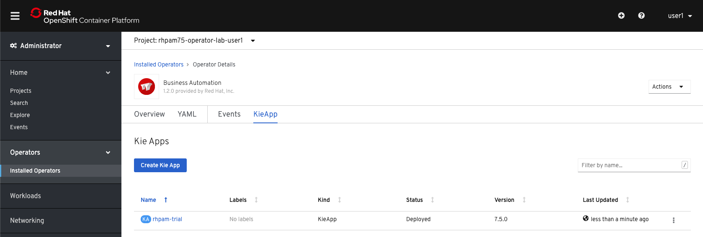

5.  Expand the **Workloads** menu on the left side of the screen. Click on **Deployment Configs**. Observe that the Operator has created 2 Deployment Configs, one for Business Central and one for KIE-Server. 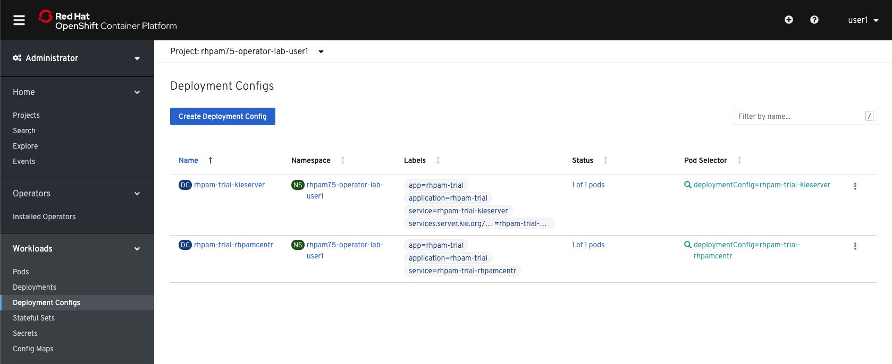

6.  Open the **Developer Console** by clicking on the link in the dropdown box at the top left of the screen. 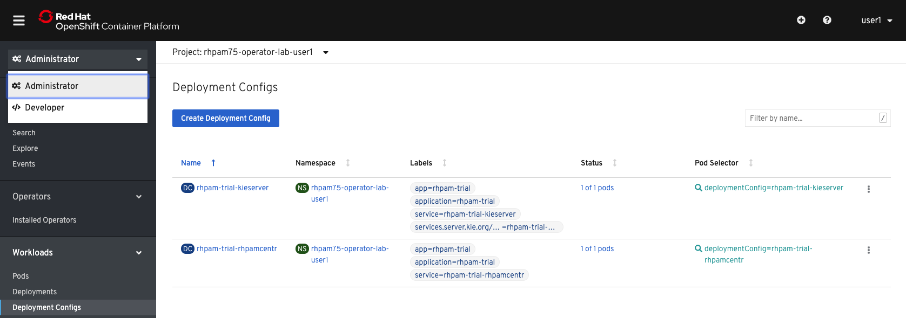

7.  Click on the **Toppology** link to show a graphical representation of the topology of our namespace, which includes an Operator DC, a Business Central DC, and a KIE-Server DC. 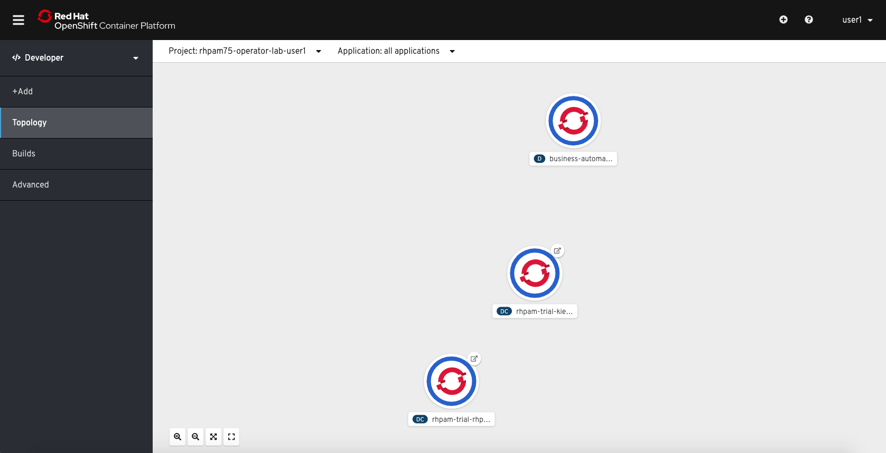

8.  Go back to the **Adminstator** console.

9.  Open **Operators → Installed Operators → Business Automation → KieApp → rhpam-trial** to go back to the `rhpam-trial`KieApp overview screen. 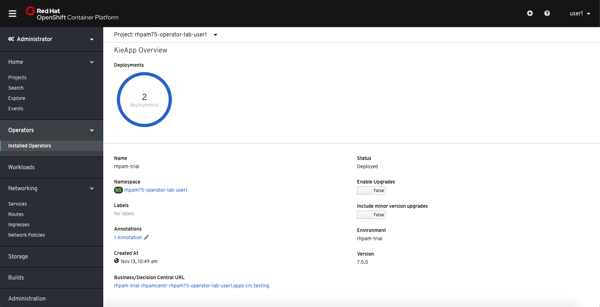

10. At the bottom of this overview page, click on the **Business/Decision Central URL** link to navigate to the RHPAM Business Central workbench: 

11. As the Operator is responsible for deployment and configuration of the RHPAM environment, we can find the details if this deployment in the **KieApp** instance details screen. In the `rhpam-trial` KIE-App screen, and click on the **YAML** tab. 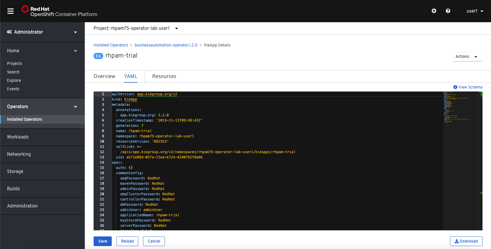

12. We can see in the YAML description that the **adminPassword** has been set to `RedHat`. Navigate back to the **Business Central** workbench and login with u: `adminUser` p: `RedHat`.

13. Explore the **Business Centrall** workbench. In particular, go to **Menu → Deploy → Execution Servers** to see the **Execution Server** connected to the workbench.

Version Upgrades
================

The Operator of RHPAM 7.5 is also capable of doing both patch and minor upgrades. This means that, for example, the Operation can upgrade an RHPAM environment from 7.5.0 to 7.5.1 or from 7.5.1 to 7.6.0.

1.  Navigate to **Operators → Installed Operators → Business Automation → rhpam-trial**. 

2.  Enable both the **Enable Upgrades** and **Include minor version upgrades** settings in the KieApp Overview screen. 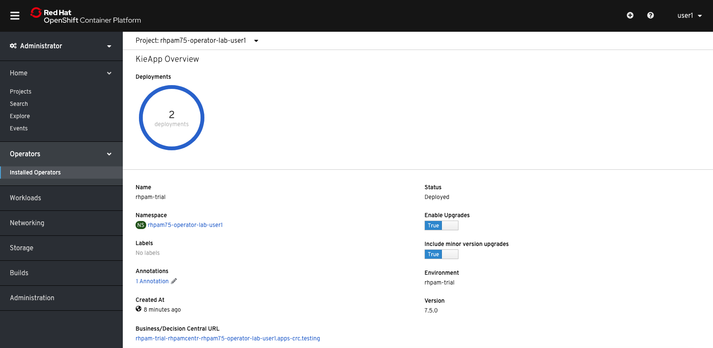

The version upgrade mechanism of the Operator is now enabled for the given KieApp.

Reconciliation
==============

The OpenShift Operators provide functionality to reconciliate an existing environment in order to bring it back to its expected state. We will now test this feature by removing one of the required resources from our deployment.

1.  

2.  Open the **Resources** tab. This will show all the resources of the application deployed and managed by the Operator. 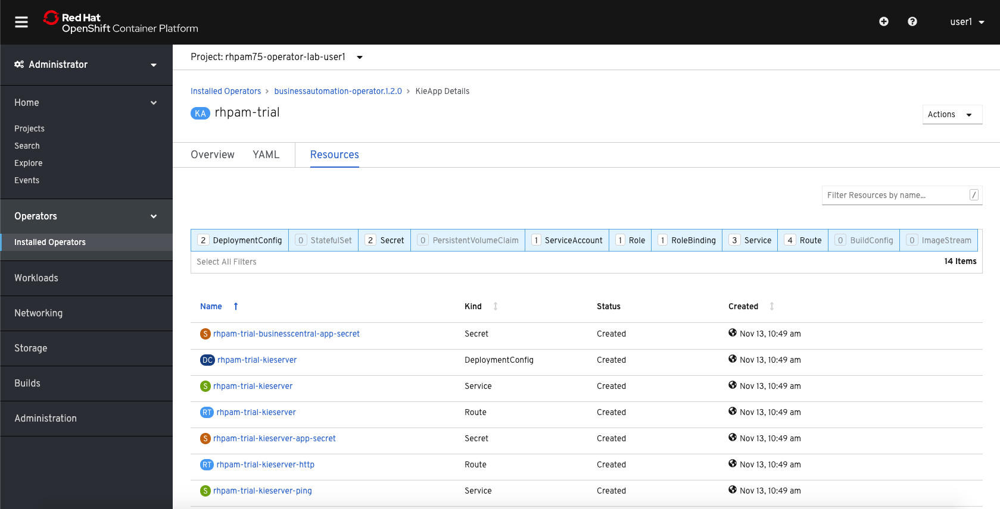

3.  On the third row, we can see the `rhpam-trial-kieserver` **Service** resource.

4.  In the left menu, go to **Networking → Services**. Open `rhpam-trial-kieserver`.

5.  Delete the **Service** by clicking on the **Actions** button at the upper right of the screen and clicking on **Delete**. 

6.  Notice the **Service** disappearing and immediately reappearing. This is the Operators reconciliation logic at work, bringing the environment back in its expected state.

KIE-App Configuration
=====================

The definition of the expected state of KIE-App environment is defined in the YAML definition the KIE-App. In this section we will slightly change this configuration to see how the Operator applies changes in the configuration of your Red Hat Process Automation Manager environment.

Changing Credentials
--------------------

1.  Go back to the YAML definition of your `rhpam-trial` KieApp.

2.  In the `commonConfig` section, set the `adminUser` to the value `pamAdmin`, and the `adminPassword` to `redhatpam1!`. Click on the **Save** button.

3.  Click the **Reload** button to reload the YAML view.

4.  Click on the **Overview** tab. Notice the deployments re-deploying.

5.  Click on the **Business/Central Central URL** to open the Business Central console.

6.  Log in with the new username and password: `pamAdmin`/`redhatpam1!`.

Adding a KIE-Server
-------------------

Apart from changing some configuration parameters, we can also change the topology our deployment in the KieApp YAML file.

1.  Go back to the YAML definition of your `rhpam-trial` KieApp.

2.  Navigate to the `servers` section and set the `deployments` parameter of the `rhpam-trial-kieserver` to **2**.

3.  Click the **Save** button.

4.  Go to **Workloads → Deployment Configs**. Note that there are now 2 KIE-Server Deployment Configs. 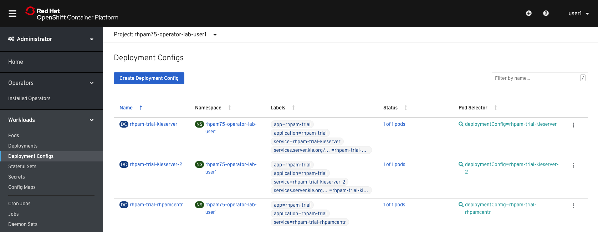

5.  Go back tom the YAML definition of your `rhpam-trial` KieApp.

6.  Navigate to the `servers` section and add the property `replicas` with the value **2**.

    ``` objects: console: resources: {} servers: - deployments: 2 name: rhpam-trial-kieserver replicas: 2 resources: {} ```

7.  Click the **Save** button.

8.  Go to the **Workloads → Deployment Configs**. Note that our 2 KIE-Server Deployments now both have 2 Pods/Replicas.

9.  Go back to the YAML definition of your `rhpam-trial` KieApp.

10. Navigate to the `servers` section and add a new server configuration

    ``` objects: console: resources: {} servers: - deployments: 2 name: rhpam-trial-kieserver replicas: 2 resources: {} - deployments: 1 name: rhpam-trial-other-kieserver replicas: 1 resources: {} ```

11. Click the **Save** button.

12. Go to the **Workloads → Deployment Configs**. Note that there is now another KIE-Server Deployment Config with 1 Pod.

13. Go to the Business Central console and log in.

14. Go to **Menu → Deploy → Execution Servers**. The Execution Server view has 3 KIE-Server Configurations, one for each Deployment Config. 

ConfigMaps
----------

The Operator stores its configuration in a number of *ConfigurationMaps*. These ConfigurationMaps can be used to change more advanced configurations that can not be configured in the KieApp YAML. In the case the Operator upgrades the version of your RHPAM environment, the Operator is aware that one of the ConfigMaps has changed and will make a backup of it during the upgrade.

1.  In the OpenShift Console, open **Workloads → Config Maps**. 

2.  Note that the Operator keeps the current ConfigMaps, and the ones of the last 2 versions.

3.  Click on the `kieconfigs-7.5.0` ConfigMap and open the YAML tab.

4.  Explore the configuration options.

5.  Set the `initialDelaySeconds` of the `livenessProbe` of the Business Central console from 180 to 240.

6.  Click the **Save** button to save the configuration.

7.  Go to "Workloads → Deployment Configs", open the `rhpam-trial-rhpamcentr` Deployment Config and open the YAML tab.

8.  Find the LivenessProbe `initialDelaySeconds` configuration and notice that it’s still set to 180.

9.  Delete the DeploymentConfig. This will have the Operator reconciliation recreate the DC.

10. Open the YAML configuation of this recreated DeploymentConfig.

11. Find the LivenessProbe `initialDelaySeconds` configuration and note that this time it has been set to 240, the value set in the ConfigMap.

Deleting an application
=======================

Apart from provisioning an RHPAM application, the Operator also allows us to easily delete an application.

1.  Navigate to **Operators → Installed Operators → Business Automation → KieApp**.

2.  Click on the kebab icon of the `rhpam-trial` KieApp and click **Delete**. 

3.  Navigate back to **Workloads → Deployment Configs** and note that the RHPAM Deployment Configs have been removed. 

Operator Installer
==================

The Business Automation Operator contains an *Operator Installer Console*. This console gives you a *wizard* experience to deploy Red Hat Process Automation Manager environments.

1.  Go the OpenShift Console and navigate to "Networking → Routes". Click on link in the **Location** column. 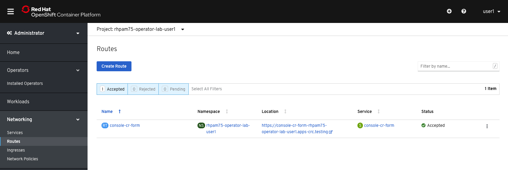 

2.  Give the application the name `my-rhpam-prod`.

3.  Select the `rhpam-production` for the Enviroment.

4.  Check the **Enable Upgrades** checkbox.

5.  Scroll down and set the Username and Password to `pamAdmin`:`redhatpam1!`.

6.  Click the **Next** button.

7.  Don’t change any values in the **Security** section. Click on **Next**.

8.  Go through the **Components** section of the installer and observe the possible options. Don’t change any values for now.

9.  Keep clicking next until you reach the **Confirmation** screen and click **Deploy**.

10. Go back to the OpenShift Console.

11. Navigate to **Workloads → Deployment Configs** and observe that a new Red Hat Process Automation Manager production environment has been deployed. Note that this environment has a PostgreSQL database deployed. Also note that both the Business Central and KIE-Server Deployment Configs have their ReplicationController set to 3 pods. 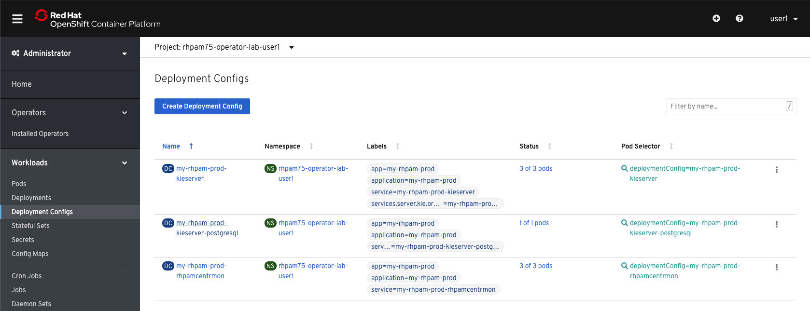

12. Go back to the **Operators → Installed Operators → Business Automation → KieApp**.

13. Delete the `my-rhpam-prod` we’ve just deployed with the Installer.

We will now deploy a new production environment using the installer, but this time we will configure our KIE-Server in the wizard and set the replications of the KIE-Server to 2 instead of 3.

1.  Go back to the Operator Installer via **Networking → Routes → console-cr-form**.

2.  Create a new RHPAM Production Environment. Conutinue until you reach the **KIE Servers** screen. 

3.  Click **Add new KIE Server** and use the following configuration for your KIE-Server. 

4.  Click through the rest of the screens until you can press the **Deploy** button to deploy the environment.

5.  Navigate to the **Workloads → Deployment Configs** screen to see your RHPAM production environment, including the KIE-Server you configured.

Conclusion
==========

This concludes the lab on the Business Automation Operator. If you have time left, feel free to explore more features of the operator.
