Business Central: Creating a better environment for collaboration
=================================================================

Business Central is step-by-step walking towards providing a greater experience for users who are used to working with development approaches like GIT flow.

Let’s try out some of the features in RHPAM 7.5 that supports the collaboration within people who works in related or even the same projects.

**Goals.**

Manage branches and configure security settings for a new user. Additionally, understand how the general security management, the spaces settings and the project settings align within each other.

**Pre-requisites.**

- Finish 00 Environment Setup.
- Have access to an externally accessible environment running Business Central on RHPAM 7.5+

Lab Overview
============

**Use Case Scenario.**

You are the lead of a business automation project and responsible for managing a central Business Central authoring environment to meet the teams needs.

A new developer (*your teammate*) has joined the team and needs access to the project he/she will work on.

Since this developer is new, he/she shouldn’t have access to deploy or delete the branch master.

Once you finish the setup, share the credentials with a teammate so he/she can validate the accesses and permissions.

Try to execute the following steps without checking the detailed instructions. If you need additional guidance and tips, give a look at the detailed instructions.

**Important:** If you are not working with a teammate on this lab, you can simulate the lab by using an incognito browser window.

Providing access to the authoring environment
---------------------------------------------

1.  Allow a teammate to access your authoring environment by creating a new user for him/her in business central settings.

2.  Assign proper roles for this user

The contributors configuration is case sensitive! If your user is `JohnDoe` make sure you write exactly `JohnDoe` on the contributors configuration.

Import the sample project
-------------------------

1.  Add a new space, feel free to choose the name.

    -   If you need a name suggestion, you can use "BA\_Team\_Space"

2.  Within this new space, import **only the master and dev branches**.

    -   Project URL: <https://github.com/rhba-enablement/simple-sample>

Configure the environment
=========================

Now, configure this authoring environment for the new teammate in a way where the user:

-   *Space*:

    -   Can only see your newly created space (and no other space);

    -   Cannot delete this space;

-   *Project*:

    -   Can access, update, build and deploy the simple-sample project **dev** branch;

    -   Cannot edit, build or deploy the master branch.

    -   Cannot delete projects;

    -   Can read, write and deploy the **dev** branch;

    -   Can read the master branch;

**Expected result for branch master.**

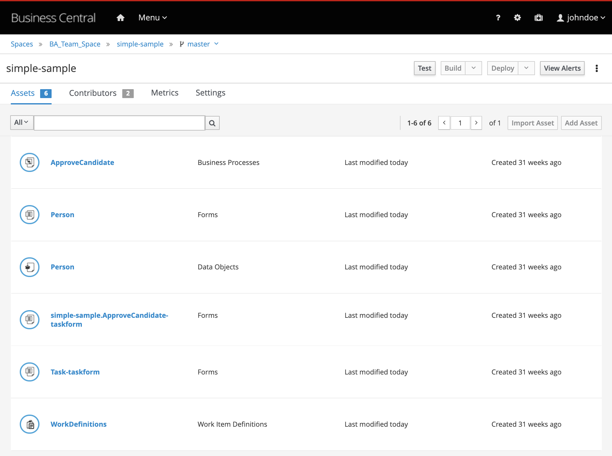

**Expected result for branch dev (Notice there is no `delete project` option).**

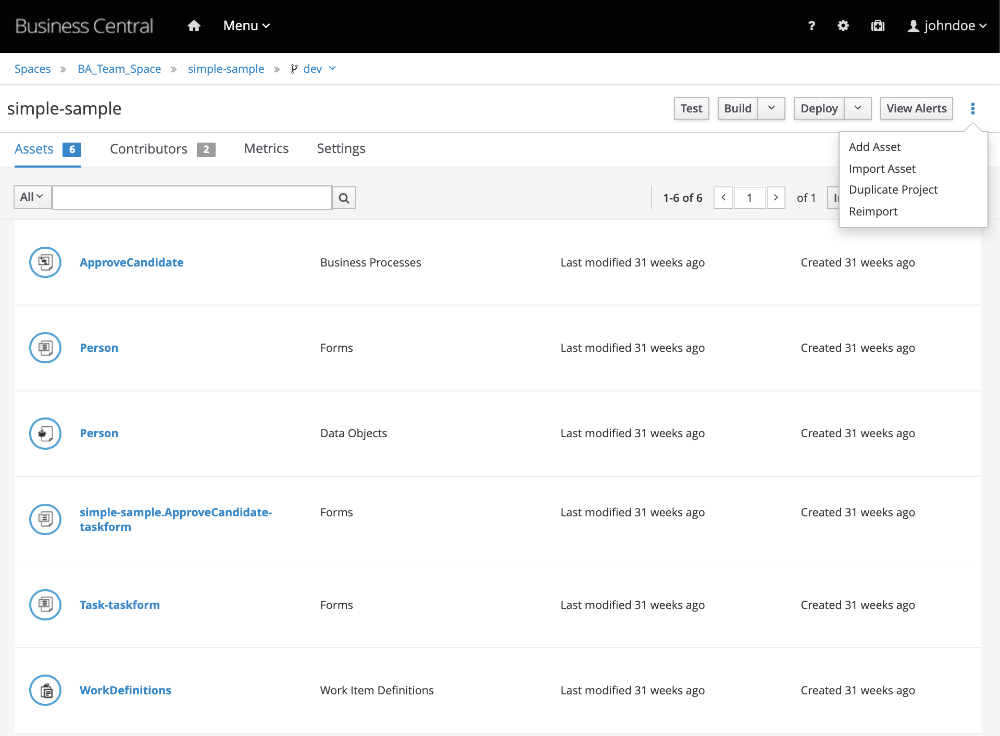

Detailed instructions
=====================

This instructions considers the following:

-   You created a new space named "**BA\_Team\_Space**";

-   You added a new user named "**johndoe**";

-   You gave this user the "**developer**" role;

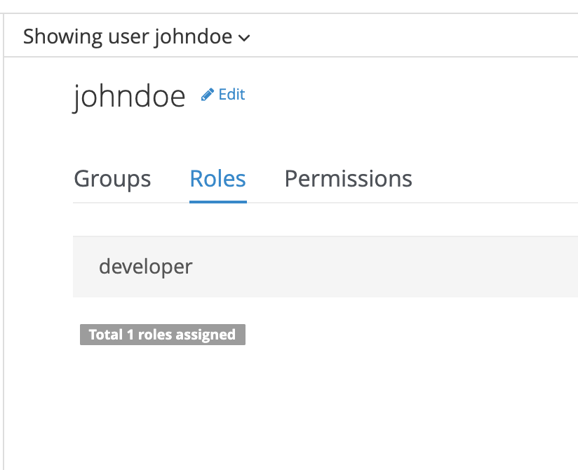

Importing specific branches
===========================

1.  Access the "BA\_Team\_Space";

2.  Click on the `Import Project` button

3.  Input the following URL: <https://github.com/rhba-enablement/simple-sample>

4.  On the pop-up, click the blue `import` button.

5.  Click on the `branch` icon

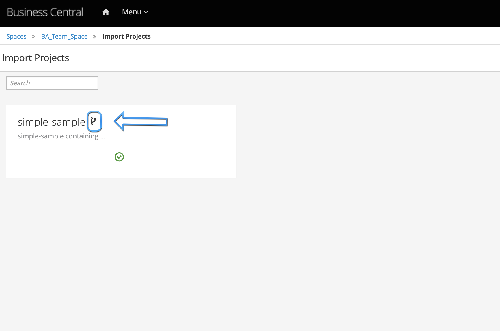

1.  Choose the **dev** and **master** branches:

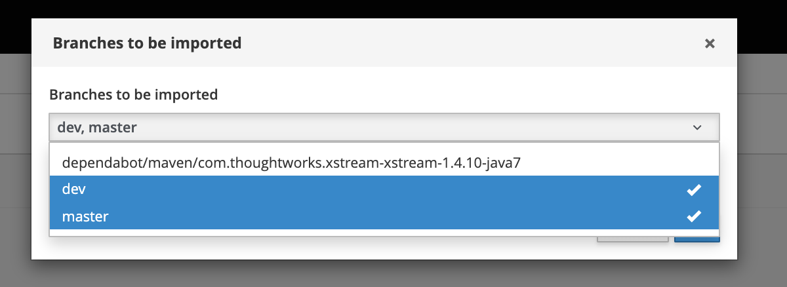

You should now have the project available for authoring in your new space with only the selected branches.

Configuring the general settings
--------------------------------

1.  To access business central general security settings, select the gear on the top right of the menu;

2.  Select the `role` settings;

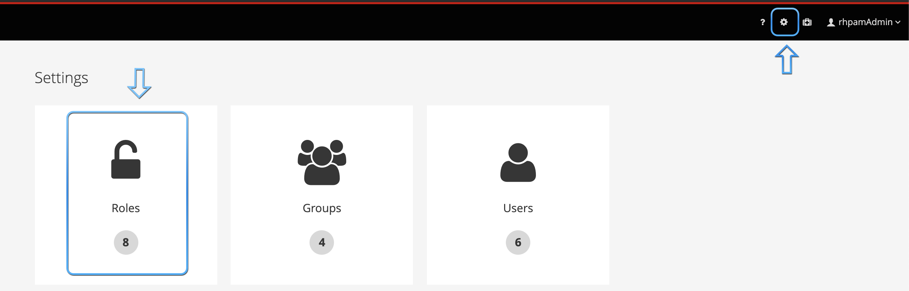

1.  Select the `develop` role. A list of permissions should be displayed. This is one of the possible configurations to reach the objective of this lab: 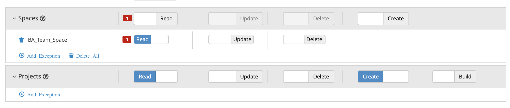

Configuring Space and Project contributors
==========================================

To be able to work on a project, first, the user should be a contributor of the space.

1.  Next, go back to the project settings and choose the `BA_Team_Space`.

2.  Next, select the contributors menu and add **johndoe** as a contributor.

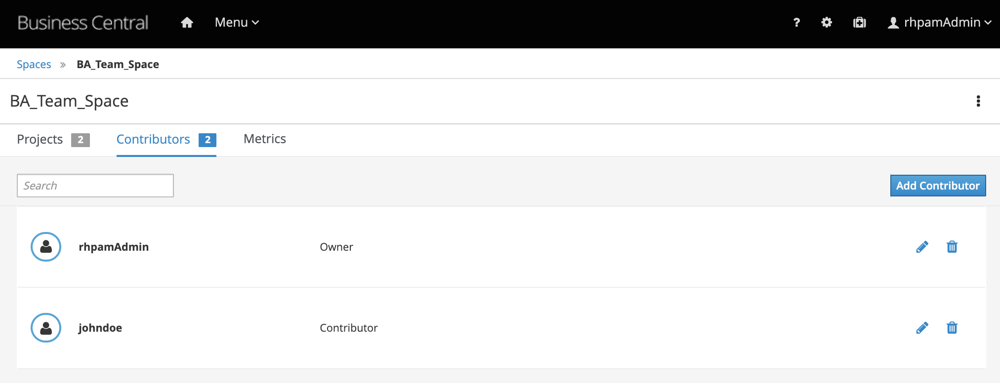

1.  Add **jonhdoe** as a project contributor too. 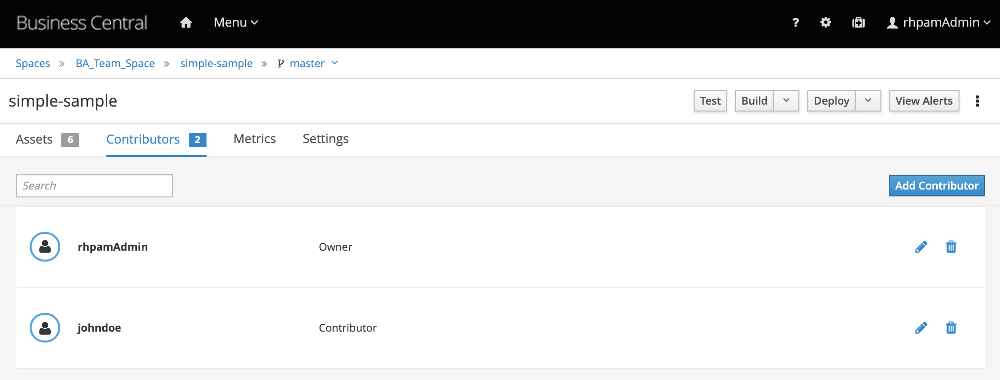

Branch Security Management
==========================

Now, let’s set the permissions for **johndoe** in each branch.

1.  We don’t want this new user messing up with master branch, so let’s configure it like this: 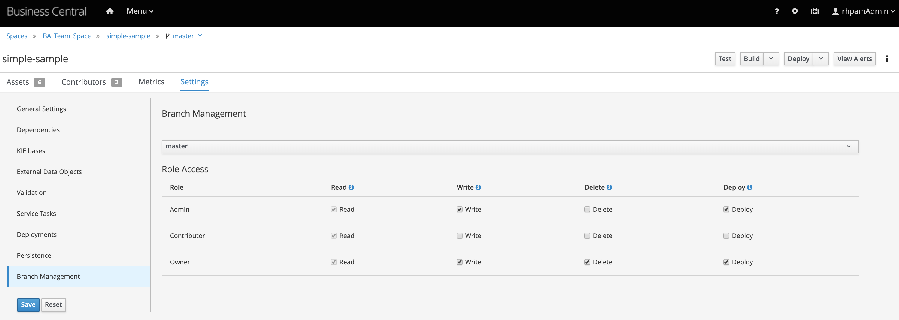

2.  For the dev branch, this user should be able to do all the tasks, **except** deleting the dev branch:s 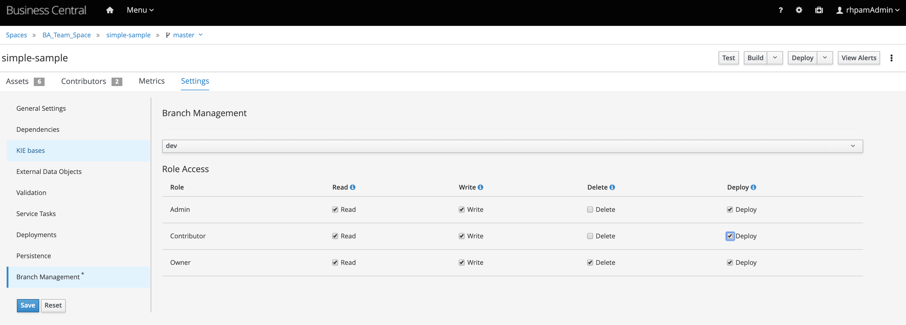

3.  Login as **johndoe** and test you reached the lab goals.

Conclusion
==========

Congratulations! With this, you are now ready to manage the permissions and accesses of a unified business central environment.

This experience will be greatly increased with the new collaboration features that are yet to come. To know more about it, check this [change requests](https://medium.com/kie-foundation/workspace-collaboration-via-change-requests-65b5fe96564e) feature blog poost. If you have some extra time, feel free to download jBPM 7.29+ in [jbpm.org](https://www.jbpm.org/) and try it out.
