:scrollbar:
:toc2:

== Test Scenario editor Lab

This lab will cover the new Test Scenario editor for DMN model testing and basic DRL.

.Goals
* Create multiple test scenarios for an existing DMN model using the Red Hat DM/PAM Test Scenario editor
* Create a test scenario for the rules available in the default KieSession using the Red Hat DM/PAM Test Scenario editor

.Prerequisite
* Successful completion of the _Decision Model & Notation Lab: Intermediate_
* An existing, accessible, DM/PAM 7.3+ environment.
* `call centre` DMN model file imported to the project
* `checkFatherRule` DRL file and `Person` data  object, both imported to the project

:numbered:

== DMN model testing

=== Introduction

During this lab we are going test quite complex DML model that contains most of the DMN features:

* Input nodes
* Decision tables
* Decision services
* Relations

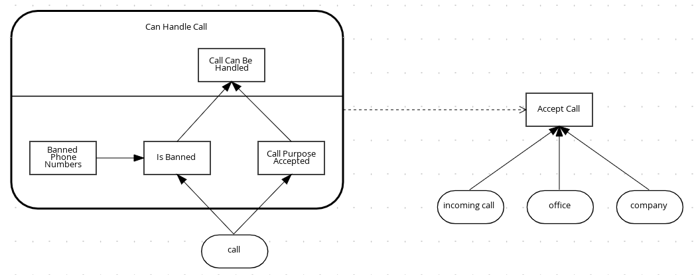

=== Create the Scenario

A Test Scenario file can be created using the `Add Asset` button, choosing `Test Scenario` and then specifying name, package, type of the scenario (DMN in our lab) and which DMN Model wants to be tested

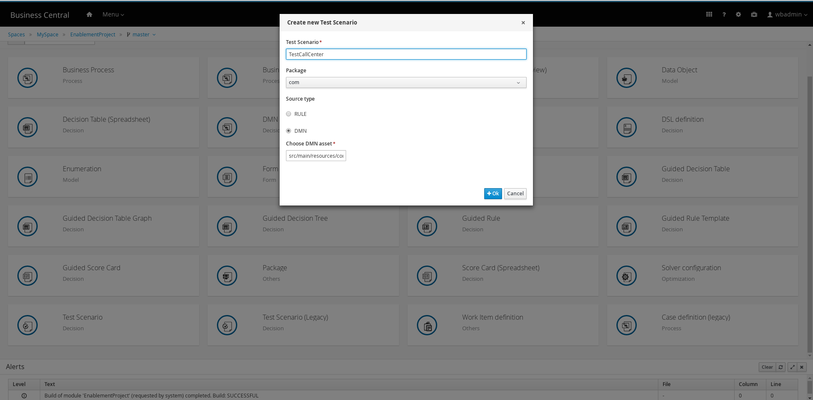

After that Business Central will create the file, load all inputs/outputs from the DMN model and automatically create the scenario template. During this process it also perform additional checks on the DMN file and it can raise a warning message if contains any unsupported feature.

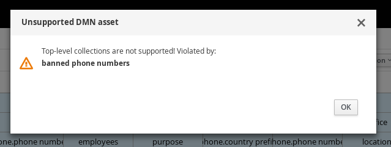

=== Edit template

In our example the Decision `banned phone numbers` is a relation (a constant) that generate a top level list. This is not supported yet but it is not a problem in this model because it is useless to test a constant so we will just remove the columns related to that decision.

NOTE: Empty cells are skipped so it is the same to keep the columns and just not populate them

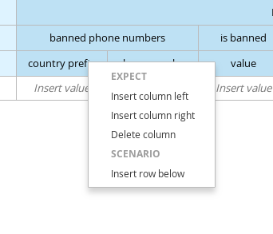

Every column that has been removed can be added again using the contextual menu and the Test Tools panel: first add a new column, then use the Test Tools panel to navigate through the elements and select the property to add back.

NOTE: one useful use case based on the editing of the template is the possibility to test a sub decision in DMN: it is enough to isolate a decision in the `EXPECT` section and keep as `GIVEN` all the elements that are input to it (input or decision nodes)

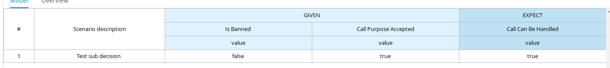

=== Populate a scenario

Now we already have the full template of the simulation created so we can start fill the data. Double click on each cell to enable inline editing

NOTE: All the expressions are parsed as FEEL expression

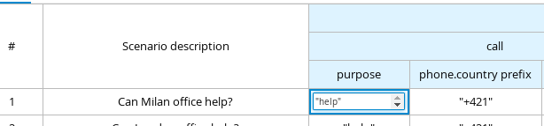

If the column contains a list, the collection editor popup will be opened to allow user to add all the values

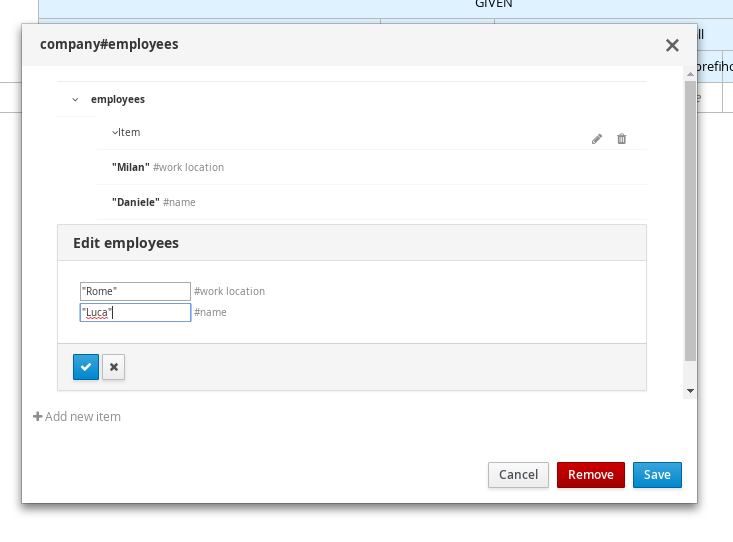

Any operation related to the grid can be done using the contextual menu

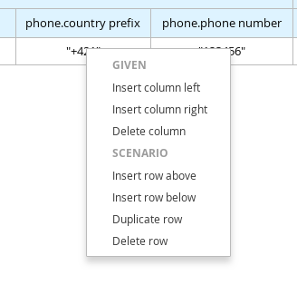

=== Run a scenario

In any moment user can run the scenario and see if contains any error just using the play button in the toolbar. Each wrong value will be highlighted by a red background

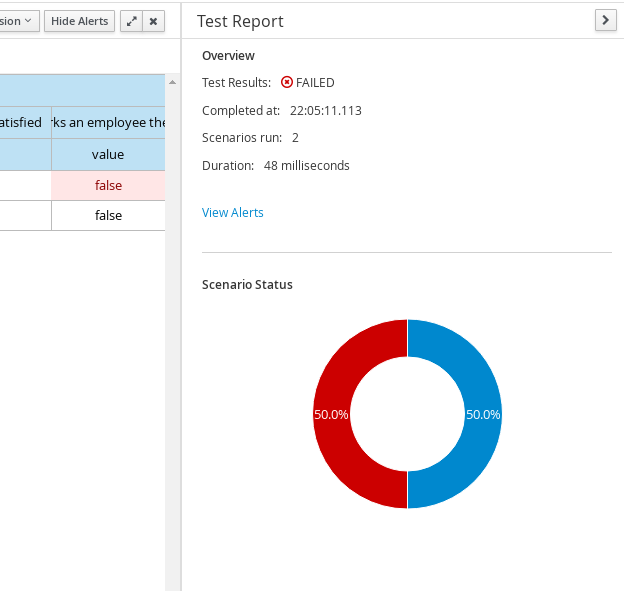

If the simulation contains no error the success report will appear

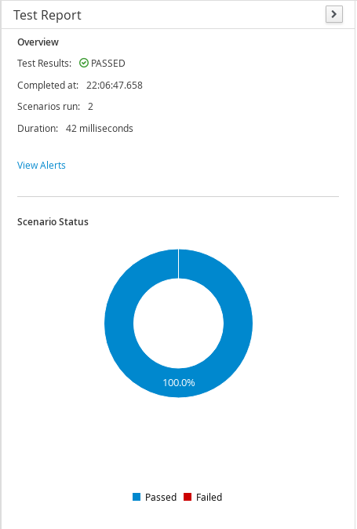

=== External runner

Business Central creates, during first Test Scenario creation, a jUnit activator class `ScenarioJunitActivatorTest` that allow all the scenarios to be executed as classic Maven tests.

After that a project can be cloned locally and built using `mvn test` command

image:images/10_junit_activator.png[]

== Rule testing

=== Create the Scenario

Quite the same of DMN testing: just choose `RULE` in the creation popup instead of `DMN`

NOTE: Only default `KieSession` testing is supported at the moment

TIP: Create the scenario in the same package of the data model will be used to have them automatically imported

=== Create the template

Rule testing is different compared to DMN because it is not possible to generate automatically the template. Extract all the possible input to the rule system is not an option and there is not explicit concept for output: each rule can alter an existing fact, insert a new one of the same type or even of a different type.

User needs to import data types manually using the Data Objects tab, restart the editor and then create one by one the columns.

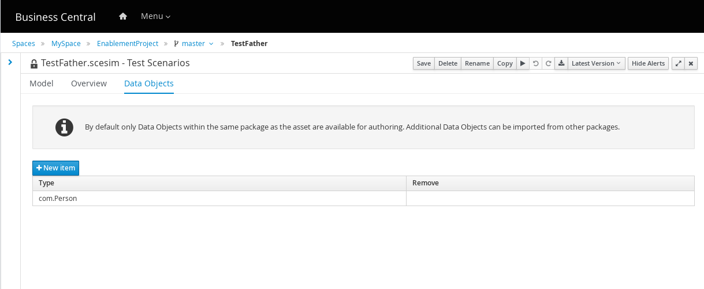

The process to add a column is quite simple:

* Right click on an instance header to open the contextual menu and add a new instance (before/after) or on a property header to add a new property of the same object
* Select the new column created, use the Test Tools panel to navigate the object
* Select the field to use and press `Add`

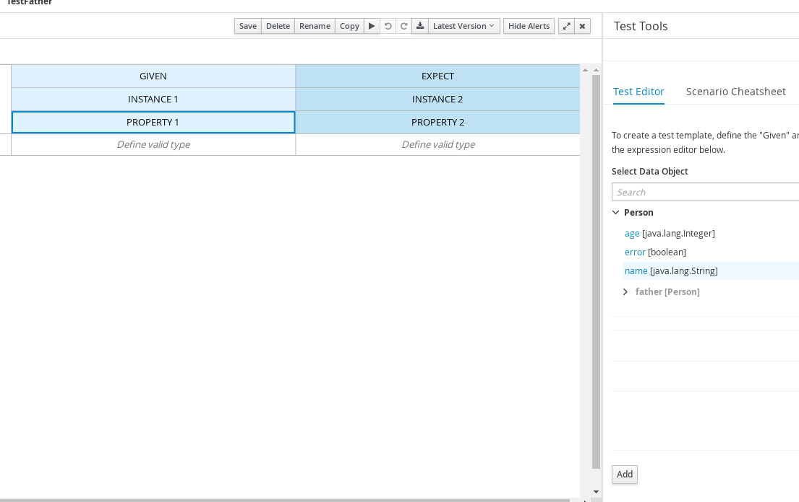

=== Work with alias

Each instance/property will have a default name generate by the system. User can edit it using the inline editing: double click on the header to enable edit mode.

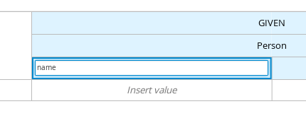

=== Multiple instances

Alias can be used also when user needs to have more than a single instance of a type in the scenario: rename an instance enable the possibility to add a new column of the same type to the scenario

Using all these features, lets create this template

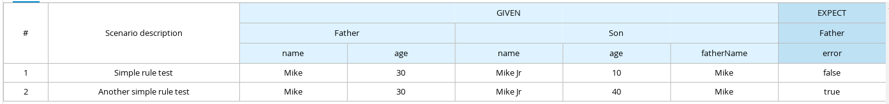

=== Populate the scenario

Similar to DMN. Have a look to cheatsheet to verify accepted syntax

=== Run a scenario

Same of DMN

=== External runner

Same of DMN