Process Modeling Lab: The new BPMN editor
=========================================

Since RHPAM 7 it is possible to author business assets using a new BPMN editor based on Stunner. This editor allows users to author processes, cases and decision modeling.

Now with RHPAM 7.5, this authoring tool has feature parity with the legacy process designer, allowing users to author all the required business logic based on the BPMN and DMN specifications.

**Legacy Designer.**

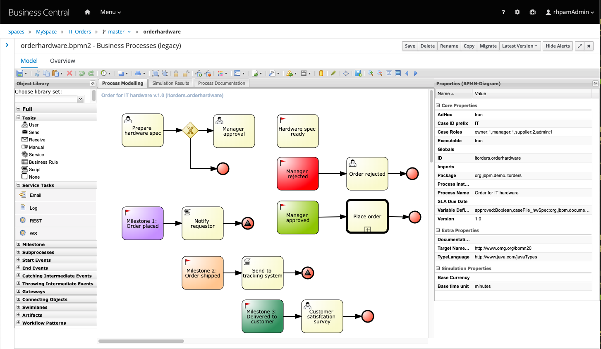

**Stunner.**

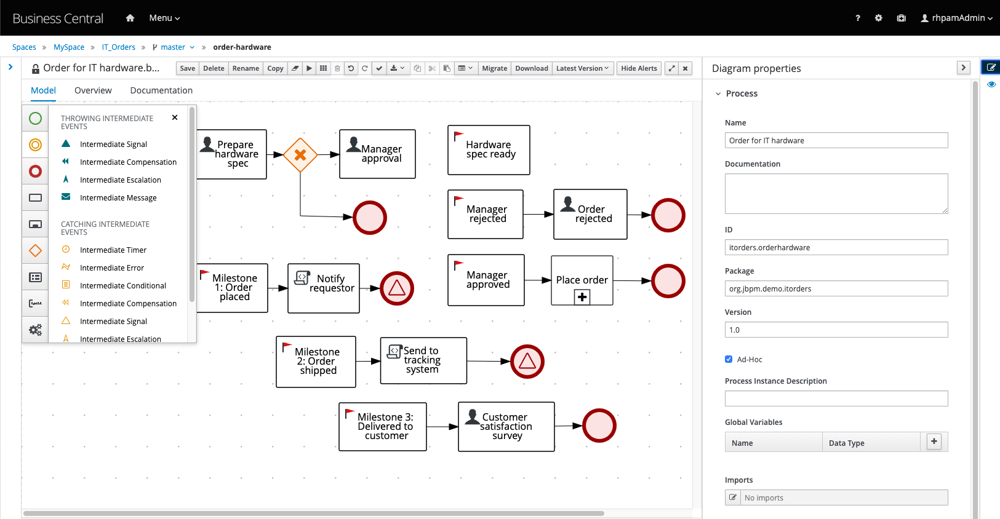

Since this new editor is based on Stunner, you will find out many other tooling built on top of Stunner that will provide a similar experience and will allow users to create processes and decision modeling not only using Business Central, but also, in different environments. Two examples of other tooling are the BPMN VSCode Extension and the BPMN Extension for Chrome.

Today, the BPMN VSCode Extension and the BPMN Extension for Chrome are not officially supported by Red Hat.

## Pre Reqs

-   Using Business Central, learn how to migrate processes from legacy process designer to the new BPMN Editor.
-   See some of the new supported components in action, including process authoring, process execution and visualization.

-   Have a clean installation of RHPAM 7.5 running with Business Central and a managed Kie Server.

# Goals

-   Add the groups: **supplier** and **manager** to your business central instance and, for the sake of simplicity, include **adminUser** to both.

-   Create the external Vertx order application in your environment. This application will be invoked by one of the rest tasks in our process.

    - If running locally: 

      ```shell
  git clone <https://github.com/kmacedovarela/rhpam7-order-it-hw-demo-vertx-app> cd rhpam7-order-it-hw-demo-vertx-app mvn clean install java -jar target/order-mgmt-app-1.0.0-fat.jar
      ```

    - If running the vertx service on OCP: Replace the USERNAME with your openshift username\*, to provide the correct the namespace to create the project: 
    
      ```shell
      oc new-app java:8~https://github.com/rhba-enablement/rhpam7-order-it-hw-demo-vertx-app --name rhpam7-oih-order-mgmt-app -e JAVA_OPTIONS=*-Duser=maciek -Dpassword=maciek1!* -e JAVA_APP_JAR=order-mgmt-app-1.0.0-fat.jar -n USERNAME
      ```
    
    - Expose the service. **Replace the USERNAME with your openshift username** 
    
      ```shell
      oc expose service rhpam7-oih-order-mgmt-app -n USERNAME
      ```
    
      

Problem Statement
=================

Let’s try the new BPMN Editor and feel the experience of migrating a legacy project to the new designer.

**Suggestion:** Read the requirements and try to implement the requests by yourself. If you need additional guidance, you can check the instructions or ask the instructors.

Use Case: Business project upgrade
----------------------------------

The customer who hired your company to implement the `IT_Orders` application now wants to migrate to RHPAM 7.5 and wants to use the new BPMN Editor. You are now responsible for helping this customer achieving their goals.

### Instructions:

-   Business central should have the groups: **supplier**,**manager**;

-   You should add your business central user, **adminUser**, to the groups above;

-   This is the URL of the legacy business project provided by the customer:

    -   <https://github.com/rhba-enablement/IT_Orders>

-   You can find two business processes developed on the legacy designer that needs to be migrated. It didn’t work properly on previous versions but now with feature parity, the customer wants to use the new BPMN Designer. Please migrate both.

Due to the issue reported in [RHPAM-2521](https://issues.jboss.org/browse/RHPAM-2521) make sure the task **Manager Approval** output variable **approved_** is targeted to **caseFile_managerDecision**.

-   On the **place-order** process, change the `catching intermediate timer event` duration to **45 seconds**.

-   Deploy and test to confirm that the project is still working after the migration.

### How to test the project:

- After the deployment, create a new case instance using Kie Server REST API.

  -   **POST** `kie-server/services/rest/server/containers/itorders/cases/itorders.orderhardware/instances`

  - Body: 

    ```json
    { "case-data" : { }, "case-user-assignments" : { "owner" : "rhpamAdmin", "manager" : "rhpamAdmin" }, "case-group-assignments" : { "supplier" : "supplier" } }
    ```

-   The human tasks can be claimed, started and completed via Business Central.

-   Once the manager approves the order, a subprocess named **place-order** should be created, and you should be able to see the events in action.


Additional Requests
-------------------

If you have time, you can do the following enhancements:

-   The human task **Prepare hardware spec** does not have SLA tracking. Please add an SLA of one minute for this task.

-   When accessing business central task list, we need to see the `SLA Compliance` so we can track the `SLA Compliance` and the `Due Date` of the tasks.

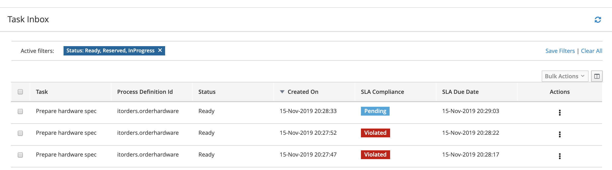

To focus on the new designer, this lab focuses exclusively on business central and kie server usage, without a direct interaction with external application.

Detailed Guide
==============

If you need additional guidance you can check the detailed instructions below.

Importing the project with legacy assets
----------------------------------------

1.  Open business central and login

2.  On the right side of the page, locate the option to import a project: 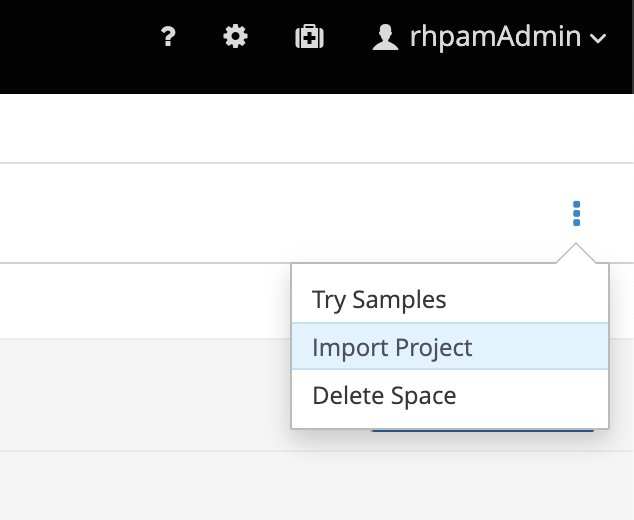

3.  Import the project from the repository straight to business central by using the following URL:

    -   <https://github.com/rhba-enablement/IT_Orders> 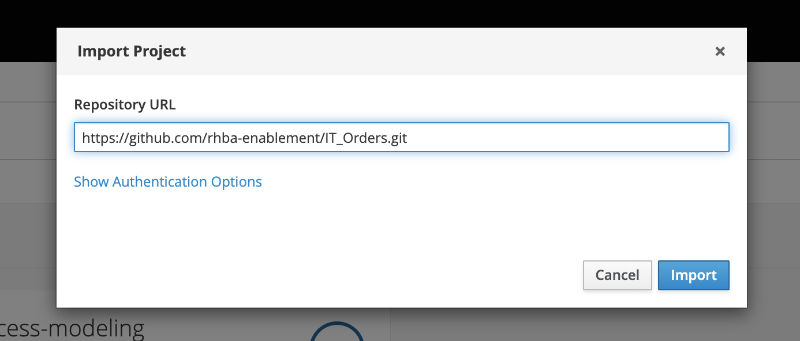

4.  Select the project **IT_Orders** to import and click the **Ok** button;

5.  If everything goes well, you should see the list of assets.

Migrating legacy processes
--------------------------

1.  Open the `Space` and select the **IT_Orders** project;

2.  Filter the list to see only `Processes`. 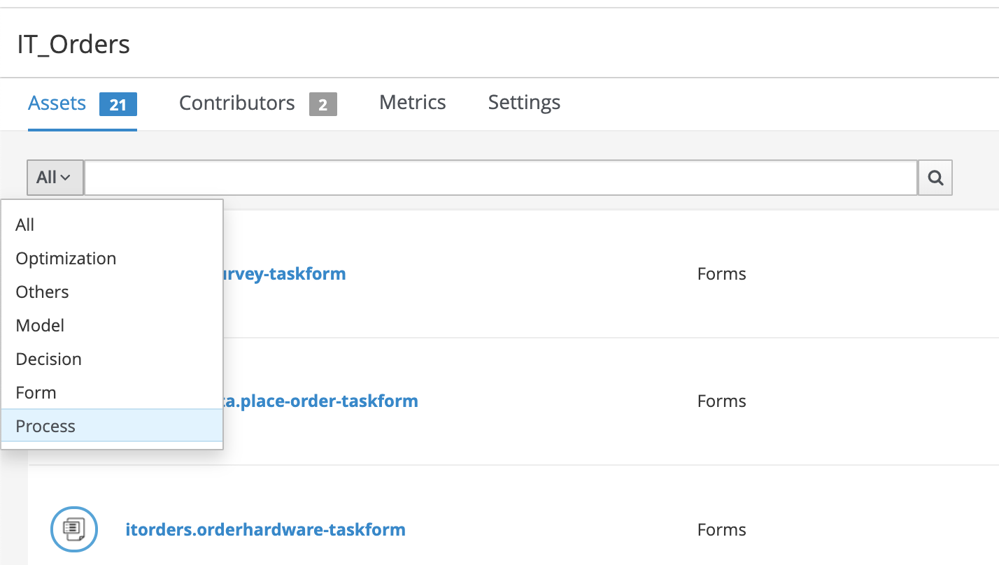

3.  You will be able to see two processes **orderhardware** and **place-order**. Both these processes are on BPMN2 format.

4.  Open the **orderhardware** process. This `ad-hoc` process represents a `case` that receives a request for hardware, and registers `milestones` as the approvals and shippings happens. 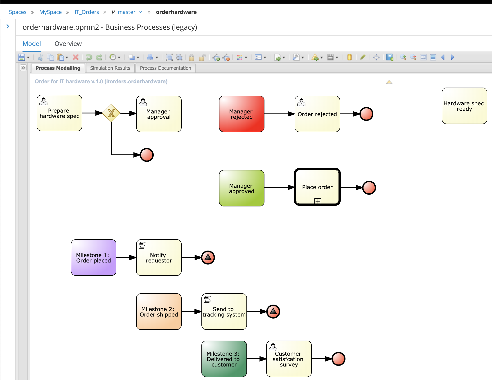

5.  Now, let’s migrate this process to be able to open it with the new designer based on Stunner. On the legacy designer, locate the migration button on the top tool bar. 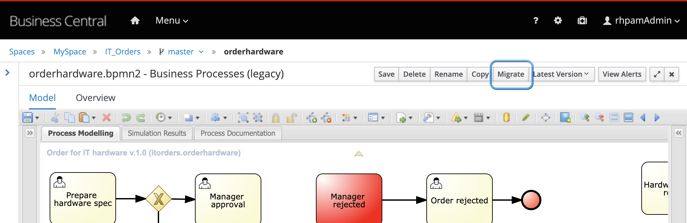

6.  Click on the **migrate** button and confirm by clicking on **Migrate Diagram** on the pop-up.

7.  Business Central should show you warnings for this migration. Confirm by clicking on **Migrate Diagram**. 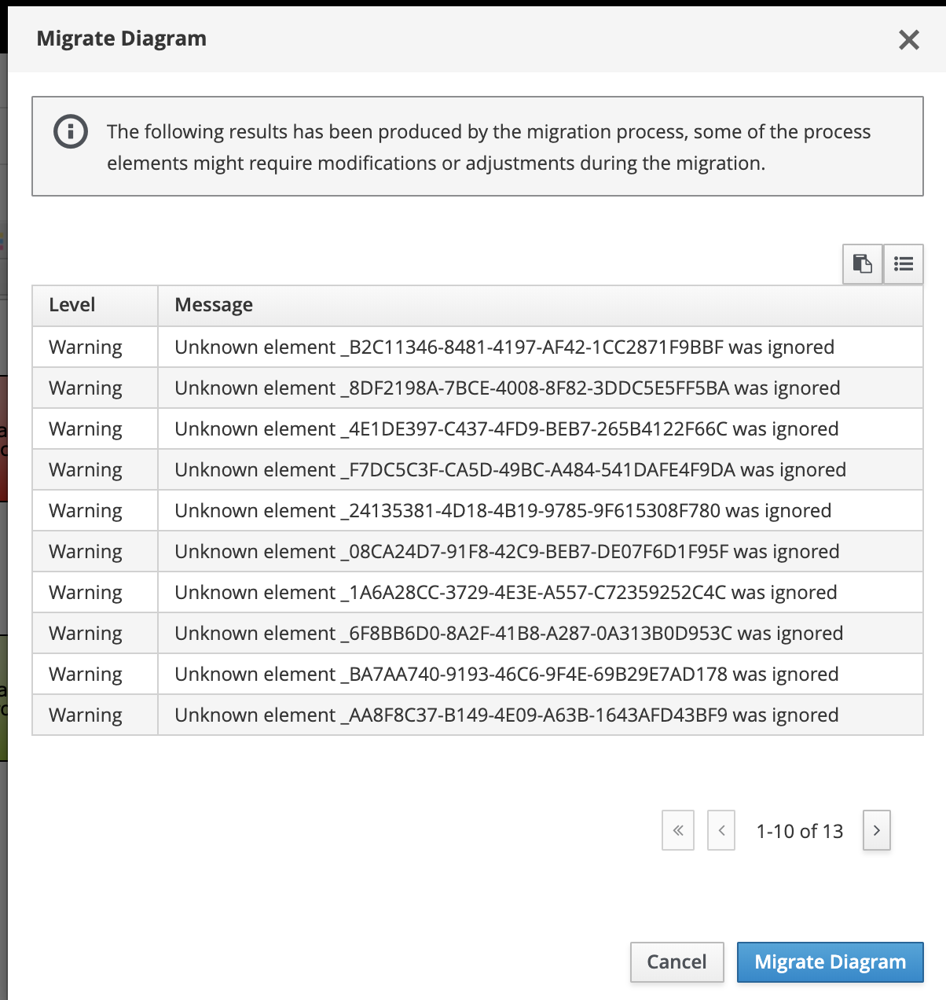

8.  You should now see the business process displayed on the new designer. It probably needs some layout adjustments so go on and make this process look good again.

If you clone the project to your local environment, change the legacy assets extension from `bpmn2` to `bpmn`, and import it back to business central, you will notice it will be displayed on the new editor. Although, this is not a supported path.

1.  Once you finish click save and go back to the assets list.

2.  You will notice two assets with the same name. An alert is probably on the panel with the error: ``` Process with same id already exists: itorders.orderhardware ```

3.  Open the process with type `Business Processes(legacy)` and delete it.

4.  Build and install your project to confirm that there are no other errors.

5.  Now, repeat the migration process for the **place-order** process. Notice that it contains an `event based gateway`.

6.  Click on the `catching intermediate timer event` and set it to fire once after duration of **45s**, which represents 45 seconds. 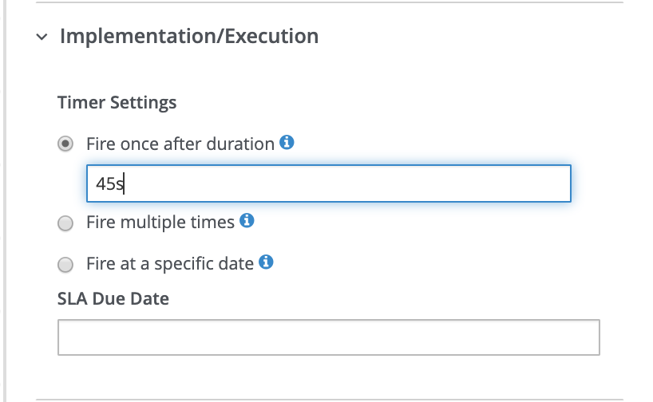

7.  Delete the legacy version of **place-order** process.

Testing the Project
-------------------

1.  Click on **Deploy**, to deploy this project in the managed Kie Server; 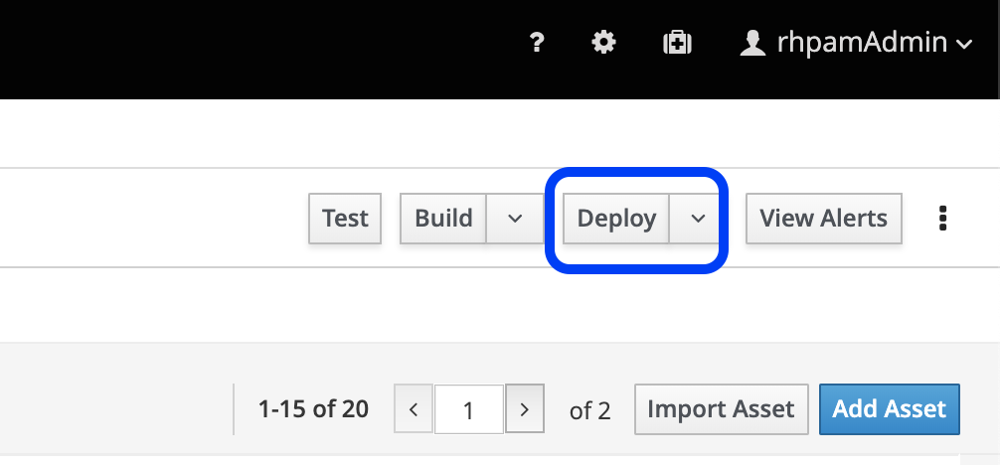

2.  Create a new case informing that the owner of this request is the user **adminUser**. Execute a request for your Kie Server URL using the information below. You can do the request using the Kie Server swagger page (accessing kie-server [KIE Server Swagger Page](https://localhost:8080/kie-server/docs) ) or using `cURL` on your terminal.

    -   **POST** <http://kie_server_url/services/rest/server/containers/itorders/cases/itorders.orderhardware/instances>

    -   body: ``` { "case-data" : { }, "case-user-assignments" : { "owner" : "adminUser", "manager" : "adminUser" }, "case-group-assignments" : { "supplier" : "supplier" } } ```

**Swagger Page.**

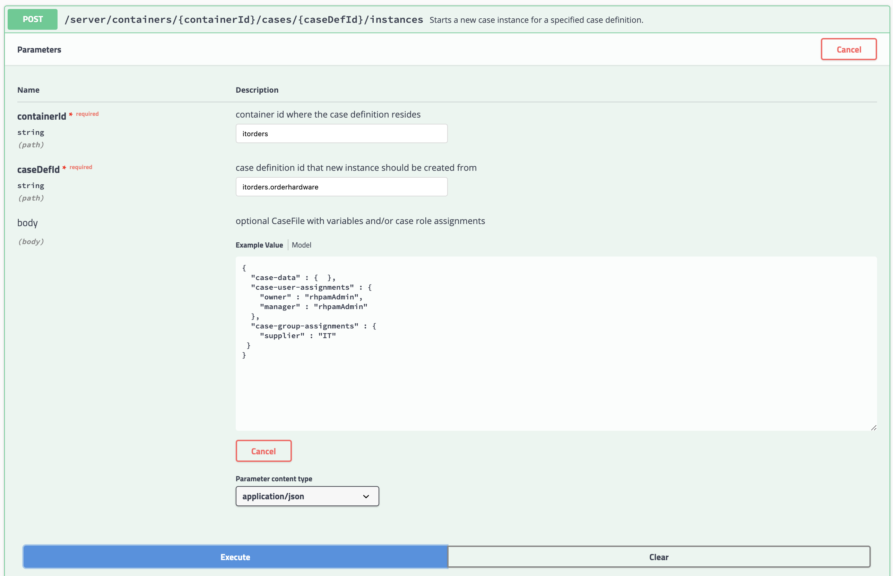

1.  If everything works properly, the response of this request will be a case ID like: **IT-0000000001**.

2.  Open the `Task Inbox` in Business Central and select the task **Prepare hardware spec**.

3.  `Claim` and `Start` the task. Upload a PDF and complete the task.

Here’s a PDF sample if you need one: [Sample PDF](http://www.africau.edu/images/default/sample.pdf).

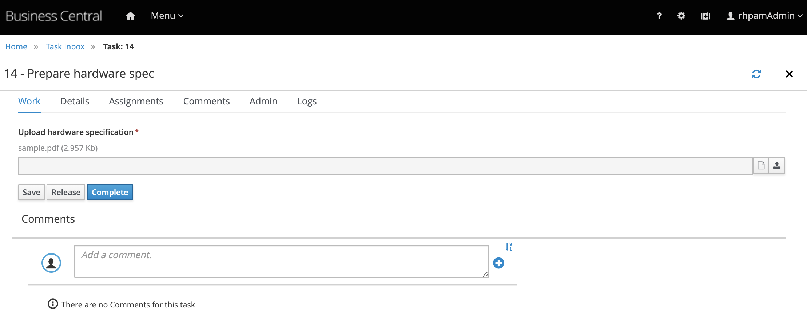

1.  Go to the task inbox. `Start` the **Manager Approval** task. Check the **approved** checkbox and complete the task. 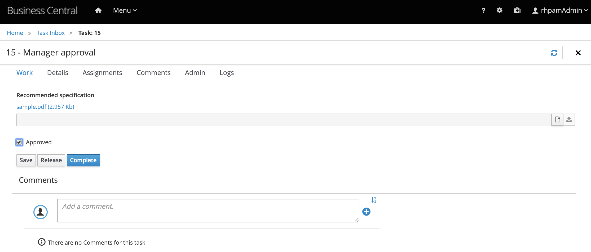

2.  Check the process instances and notice a **place-order** process instance has been created. Initially, it will be waiting for one of the events to occur in order to define what path to follow. 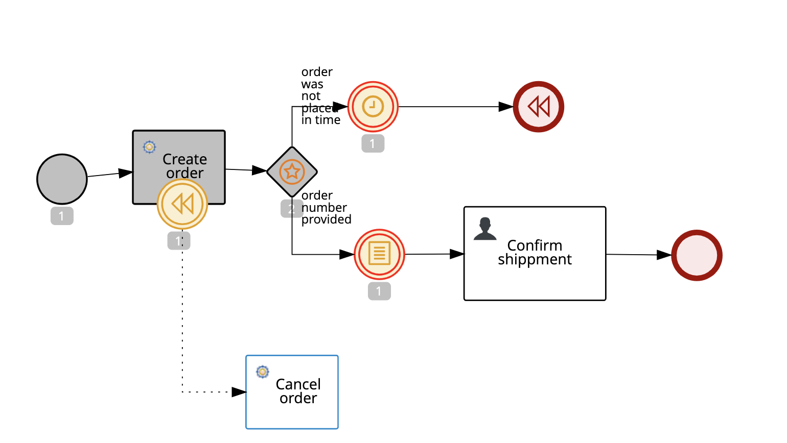

3.  After 45s, refresh the diagram. What tasks were triggered and why?

Conclusion
==========

As we could see in this example, Business Central now offers a migration process to have the processes that ran on legacy designer. Additionally, advanced modeling components are now available for authoring on the new BPMN diagram.
