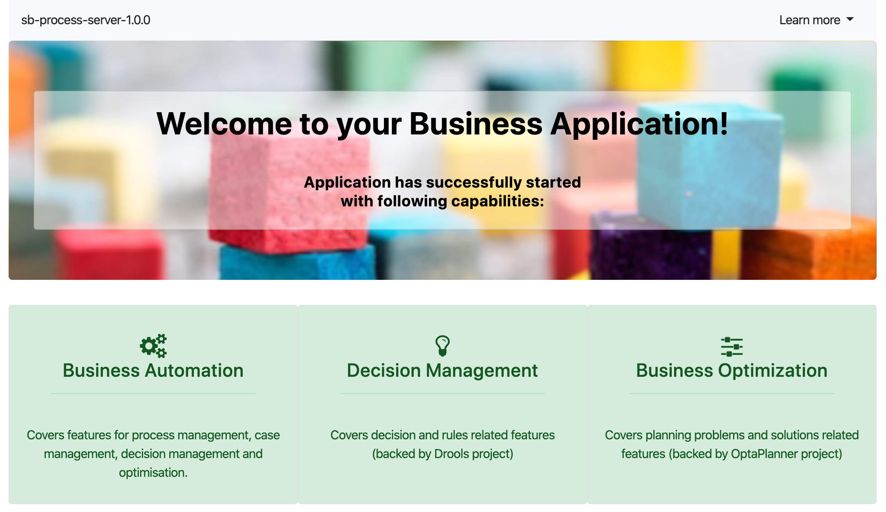
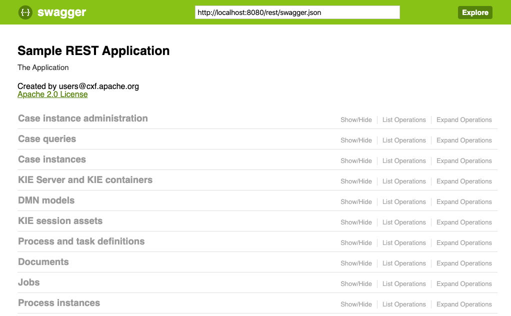
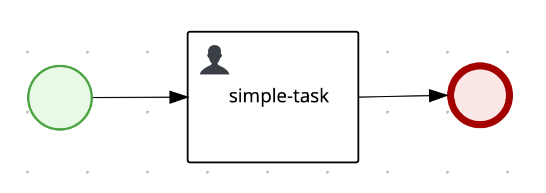
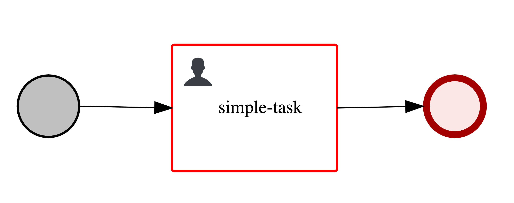
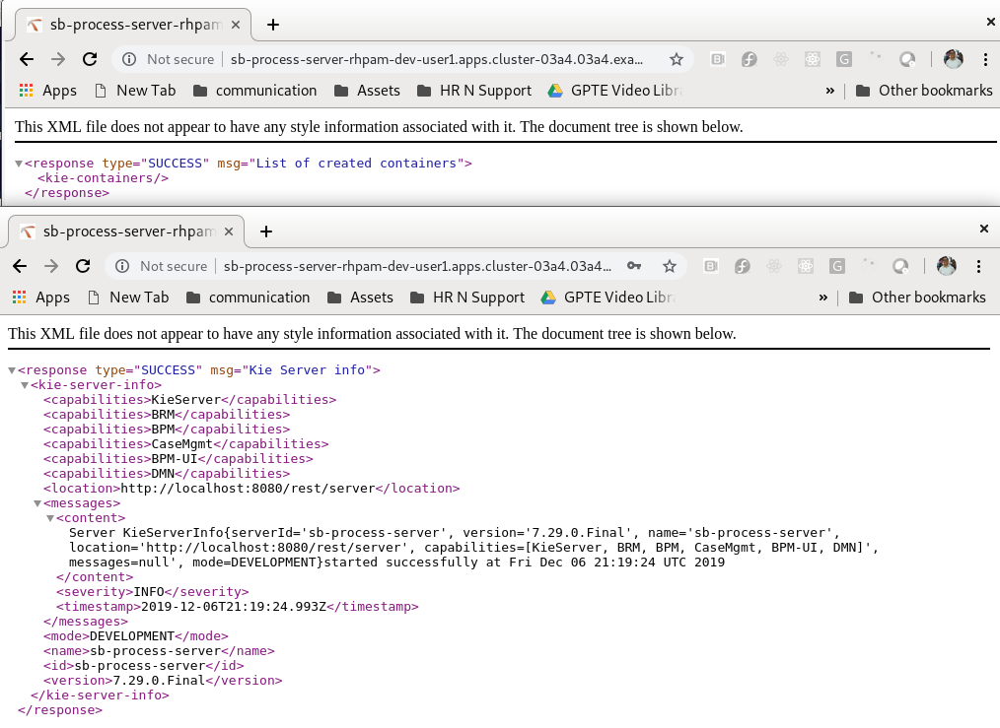

Spring Boot Kie Server Lab
==========================

## Goals

-   Create a SpringBoot Business Application.
-   Create and deploy a process on the Process Server/Runtime in a Spring Boot application.
-   Deploy a KJAR in the Spring Boot Process Server using the kie-server REST API.
-   Deploy a KJAR in the Spring Boot Process Server using kie-server xml configuration.
-   Create and deploy an event listener Spring component.
-   Create and deploy a work item handler Spring component.
-   Deploy a Spring Boot Business Application on OpenShift.

## Pre Reqs

-   JDK 1.8+
-   Java IDE editor
-   Git 2.x or superior
-   Maven 3.5 or superior
-   Running Openshift Environment
-   OC utility

Create an Spring Boot project
=============================

In this section you will use a **Maven Archetype** to create a spring boot component that hosts a kie-server.

1.  On your local file system, create a directory where the Spring Boot project will be created.

        $ mkdir -p ~/labs/sboot

2.  Using a terminal change the working directory to the newly created directory.

        $ cd ~/labs/sboot

3.  Execute a `mvn archetype:generate` command using the `kie-service-spring-boot-archetype`:

    **7.32.0.Final Community version**:

        $ mvn archetype:generate \
         -DarchetypeGroupId=org.kie \
         -DarchetypeArtifactId=kie-service-spring-boot-archetype \
         -DarchetypeVersion=7.32.0.Final \
         -DgroupId=org.acme.sb \
         -DartifactId=sb-process-server \
         -Dversion=1.0.0

    **RHPAM 7.6.0.GA Product version**:

        $ mvn archetype:generate \
         -DarchetypeGroupId=org.kie \
         -DarchetypeArtifactId=kie-service-spring-boot-archetype \
         -DarchetypeVersion=7.30.0.Final-redhat-00003 \
         -DgroupId=org.acme.sb \
         -DartifactId=sb-process-server \
         -Dversion=1.0.0

4.  A summary confirmation will appear in the console: Approve the summary by hitting \[Enter\] or type \[Y\] and then press \[Enter\]

        Confirm properties configuration:
        groupId: org.acme.sb
        artifactId: sb-process-server
        version: 1.0.0
        package: org.kie
        appServerAddress: localhost
        appServerPort: 8090
        appType: bpm
        archetypeCatalog: local
        jbpmConsolePort: 8080
        kieVersion: 7.30.0.Final-redhat-00003
        kjarArtifactId: none
        kjarGroupId: none
        kjarVersion: none
        remoteDebugEnabled: false
        runtimeStrategy: PER_PROCESS_INSTANCE
        springbootVersion: 2.1.1.RELEASE
         Y: :

5.  A new directory will be created as result of the `archetype:generate` command named as the `artifactId` parameter, in our case the new directory will be named as **sb-process-server**.

We can now run our SpringBoot-based business application. The project contains 2 types of *launch* files to build and launch the application:

-   launch-dev.sh/launch-dev.bat: Launches the application with the `dev` profile, thereby using the `application-dev.properties` file. This profile will start the application in *managed*-mode, and needs a connection to a `Controlller` (e.g. Business Central). KJARs can then be deployed onto the application via the `Controller`.

-   launch.sh/launch.bat: Launches the application in *unmanaged*-mode using the standard profile, thereby using the `application.properties` file. KJARs are deployed programmatically or via configuration. In this mode, no `Controller` component is required. This script also allows to launch the application as a Docker container and to deploy it to OpenShift.

By default, the application exposes it’s web interface (and therefore it’s REST endpoints) on port `8090`. Let’s first change that to `8080` in the default profile (i.e. `application.properties`).

1.  Using any text editor or Java IDE, open and edit the `application.properties` under the directory: `src/main/resources`, change the `server.port` property to expose the application in the port **8080**:

        #
        # https://docs.spring.io/spring-boot/docs/current/reference/htmlsingle/#common-application-properties
        #
        #server configuration
        server.address=0.0.0.0
        server.port=8080
        ...

2.  Also, in the same `application.properties` file, make sure to change the kieserver.location to reflect the port change:

        kieserver.location=http://localhost:8080/rest/server

3.  Save the changes made to the `application.properties` file.

4.  If the `launch.sh` and `launch-dev.sh` (Linux/macOS) or `launch.bat` and `launch-dev.bat` (Windows) file are not yet executable, make them executable. For example in Linux:

        $ chmod 755 launch.sh launch-dev.sh

5.  Start the application with the `launch` script. The script accepts Maven arguments:

        $ ./launch.sh clean package

The SpringBoot Business Application will launch and print the following in your terminal

    Launching the application locally...
       _ ______ ______ ___  ___  ______              _                            ___                 _  _              _    _
      (_)| ___ \| ___ \|  \/  |  | ___ \            (_)                          / _ \               | |(_)            | |  (_)
       _ | |_/ /| |_/ /| .  . |  | |_/ / _   _  ___  _  _ __    ___  ___  ___   / /_\ \ _ __   _ __  | | _   ___  __ _ | |_  _   ___   _ __
      | || ___ \|  __/ | |\/| |  | ___ \| | | |/ __|| || '_ \  / _ \/ __|/ __|  |  _  || '_ \ | '_ \ | || | / __|/ _` || __|| | / _ \ | '_ \
      | || |_/ /| |    | |  | |  | |_/ /| |_| |__ \| || | | ||  __/__ \__ \  | | | || |_) || |_) || || || (__| (_| || |_ | || (_) || | | |
      | |____/ _|    _|  |_/  ____/  __,_||___/|_||_| |_| ___||___/|___/  _| |_/| .__/ | .__/ |_||_| ___|__,_| __||_| ___/ |_| |_|
     _/ |                                                                              | |    | |
    |__/                                                                               |_|    |_|
                                                        sb-process-server :: v.1.0.0

    2020-02-27 14:36:32.373  INFO 73460 --- [           main] org.kie.Application                      : Starting Application v1.0.0 on MacBook-Pro with PID 73460 (/Users/ddoyle/labs/sboot/sb-process-server/target/sb-process-server-1.0.0.jar started by ddoyle in /Users/ddoyle/labs/sboot/sb-process-server)
    2020-02-27 14:36:32.379  INFO 73460 --- [           main] org.kie.Application                      : No active profile set, falling back to default profiles: default

You can now access the application at <http://localhost:8080>

1.  Shutdown the application.

Enabling Swagger
================

The Business Applications come with an optional Swagger-UI. The Swagger-UI is useful to inspect, and interact with, the RESTful API of the execution server. To enable Swagger:

1.  Add the following dependency to the `pom.xml` file to enable the Swagger core:

        <dependency>
          <groupId>org.apache.cxf</groupId>
          <artifactId>cxf-rt-rs-service-description-swagger</artifactId>
          <version>3.1.11</version>
        </dependency>
        <dependency>
          <groupId>io.swagger</groupId>
          <artifactId>swagger-jaxrs</artifactId>
          <version>1.5.15</version>
          <exclusions>
            <exclusion>
              <groupId>javax.ws.rs</groupId>
              <artifactId>jsr311-api</artifactId>
            </exclusion>
          </exclusions>
        </dependency>

2.  Add the following dependency to the `pom.xml` file to enable the Swagger-UI:

        <dependency>
          <groupId>org.webjars</groupId>
          <artifactId>swagger-ui</artifactId>
          <version>2.2.10</version>
        </dependency>

3.  And enable the feature with the following setting in the `application.properties` file (in the `#kie server capabilities` section):

        kieserver.swagger.enabled=true

4.  Start the application:

        $ ./launch.sh clean package

The Swagger interface can be found at: <http://localhost:8080/rest/api-docs?url=http://localhost:8080/rest/swagger.json#/> Use the username/password combination `user/user`.

Adding Users
============

Spring Boot Business Applications use the [Spring Security `WebSecurityConfigurer` mechanism](https://spring.io/guides/gs/securing-web/) to secure the application. The default generated application uses simple *inMemoryAuthentication* to configure user, passwords and roles. This is obviously not the recommended way to secure an enterprise application. The [Red Hat Process Automation Manager documentation](https://access.redhat.com/documentation/en-us/red_hat_process_automation_manager/7.6/html/creating_red_hat_process_automation_manager_business_applications_with_spring_boot/business_application_configuration#bus-app-rh-sso_business-applications) contains instructions on how to configure a Spring Boot application to use Red Hat SSO/KeyCloak.

We will add a new user that we can use in the rest of this lab.

1.  In your IDE, open the file `org/kie/DefaultWebSecurityConfig.java`, in the `src/main/java` folder.

2.  In the `` configureGlobal`method, add a new user with name `pamAdmin ``, password `redhatpam1!` and roles `admin, kie-server`:

        auth.inMemoryAuthentication().withUser("pamAdmin").password("redhatpam1!").roles("admin, kie-server");

3.  Restart the application using the launch script:

        $ ./launch.sh clean package

4.  Access the Swagger-UI at: <http://localhost:8080/rest/api-docs?url=http://localhost:8080/rest/swagger.json#/> . You can now login with your new username and password.

Use the REST-API to deploy a kjar
=================================

In this section you will deploy a simple KJAR, containing a simple process to the spring boot kie-server using its REST API. This BPMN2 process is pre-made, and can be found here: <https://github.com/rhba-enablement> The process is extremely simple, and consists of a start event, a single task and an end-event:

1.  In a terminal, navigate to your labs directory, and clone the `simple-kjar` Git repository locally:

        $ cd ~/labs/sboot
        $ git clone https://github.com/rhba-enablement/simple-kjar.git

2.  Navigate into the directory you’ve just cloned, and build the `simple-kjar` project locally:

        $ cd simple-kjar
        $ mvn clean install

    With the `simple-kjar` built, we can now launch our Spring Boot application and deploy it. . Launch the `sb-process-server` again using the launch script:

        $ cd ~/labs/sboot/sb-process-server
        $ ./launch.sh clean install

    The *launch.sh* will also do a Maven build of the `simple-kjar` project, as it resided in the parent folder of the `sb-process-server`. The launch script will always build all projects in the parent folder of the SpringBoot Business Application.

3.  When the application has started, navigate to the Swagger-UI: <http://localhost:8080/rest/api-docs?url=http://localhost:8080/rest/swagger.json#/>

4.  Expand the section `KIE Server and KIE containers`, and open the `PUT /server/containers/{containerId}` operation.

5.  For `containerId` use the value `simple-kjar_1.0,0`, and use the following JSON as the `body`:

        {
          "container-alias": "simple-kjar",
          "release-id": {
            "group-id": "com.acme",
            "artifact-id": "simple-kjar",
            "version": "1.0.0"
          }
        }

6.  Click on the *Try it out* button in the lower-left corner. The result will print that the KIE Container has been successfully deployed.

7.  The REST API can be also accessed via terminal using `cURL`. Execute the following `cURL` command to inspect the KIE-Containers and KJARs deployed on the application:

        $ curl -X GET --header 'Accept: application/json' 'http://localhost:8080/rest/server/containers'

8.  The result shows that our `KIE-Container` is running and ready to serve requests:

        {
          "type" : "SUCCESS",
          "msg" : "List of created containers",
          "result" : {
            "kie-containers" : {
              "kie-container" : [ {
                "container-id" : "simple-kjar_1.0.0",
                "release-id" : {
                  "group-id" : "com.acme",
                  "artifact-id" : "simple-kjar",
                  "version" : "1.0.0"
                },
                "resolved-release-id" : {
                  "group-id" : "com.acme",
                  "artifact-id" : "simple-kjar",
                  "version" : "1.0.0"
                },
                "status" : "STARTED",
                "scanner" : {
                  "status" : "DISPOSED",
                  "poll-interval" : null
                },
                "config-items" : [ ],
                "messages" : [ {
                  "severity" : "INFO",
                  "timestamp" : {
          "java.util.Date" : 1582894154798
        },
                  "content" : [ "Container simple-kjar_1.0.0 successfully created with module com.acme:simple-kjar:1.0.0." ]
                } ],
                "container-alias" : "simple-kjar"
              } ]
            }
          }
        }

9.  The application also exposes an API from which we can retrieve the images of deployed process. Open the following URL to retrieve the image of our `simple-process`: <http://localhost:8080/rest/server/containers/simple-kjar_1.0.0/images/processes/simple-kjar.simple-process>

    The URL contains both the name of the KIE-Container, i.e. `simple-kjar_1.0.0` and the process-id, i.e. `simple-kjar.simple-process`.

10. We can start a new process instance with a simple RESTful request using `cURL`. Note that we’re sending the `String` hello as input value to our `request` process variable:

        $ curl -X POST --header 'Content-Type: application/json' --header 'Accept: application/json' -d '{ "request" : "Hello" }' http://localhost:8080/rest/server/containers/simple-kjar_1.0.0/processes/simple-kjar.simple-process/instances

11. The returned response will be the *process instance id* of the process, in this case *1*.

12. With the *process instance id*, we can retrieve the image of the running process: <http://localhost:8080/rest/server/containers/simple-kjar_1.0.0/images/processes/instances/1?svgCompletedColor=%23C0C0C0&svgCompletedBorderColor=%23030303&svgActiveBorderColor=%23FF0000>

13. We can see that the process instance is started and currently waiting at the `simple-task` task.

     . Shutdown the application.

    The `sb-process-server` directory contains a new file called `sb-process-server.xml`, in which the application stores the state of the deployed KJARs, KIE-Containers, etc. In the next lab, we will use this exact mechanism to deploy a KJAR without using the REST API.

Use KIE-Server xml configuration to deploy KJARS
================================================

In the previous section, we’ve deployed a simple KJAR using the application’s REST API. However, in a production environment, it’s usually not feasible, nor recommend, to deploy KJARs via this API. Therefore, the application supports deploying KJARs using a KIE-Server configuration file.

1.  In the `sb-process-server` directory, create an empty xml file with the name `sb-process-server.xml`.

        $ touch ~/labs/sboot/sb-process-server/sb-process-server.xml

    **Take the hat of to the kie-server id**: notice that the name given to this file matches with the kie-server id property in the `application.properties` file.

2.  Fill the `sb-process-server.xml` file with the following content. If the sb-process-server.xml was pre-created and already contains a configuration description, replace it with the configuration below:

        <kie-server-state>
          <controllers/>
          <configuration />
          <containers>
            <container>
              <containerId>simple-kjar_1.0.0</containerId>
              <releaseId>
                <groupId>com.acme</groupId>
                <artifactId>simple-kjar</artifactId>
                <version>1.0.0</version>
              </releaseId>
              <status>STARTED</status>
              <configItems/>
              <messages/>
              <containerAlias>simple-kjar</containerAlias>
            </container>
          </containers>
        </kie-server-state>

3.  Ensure that you saved the changes to the `sb-process-server.xml` kie-server configuration file.

4.  Launch the `sb-process-server` again using the launch script:

        $ cd ~/labs/sboot/sb-process-server
        $ ./launch.sh clean install

5.  We can again list the deployed `KIE-Containers` using the REST API:

        $ curl -X GET --header 'Accept: application/json' 'http://localhost:8080/rest/server/containers'

6.  The response shows the deployed `KIE-Containers`. We can see our `simple-kjar_1.0.0` deployed:

        {
          "type": "SUCCESS",
          "msg": "List of created containers",
          "result": {
            "kie-containers": {
              "kie-container": [
                {
                  "container-id": "simple-kjar_1.0.0",
                  "release-id": {
                    "group-id": "com.acme",
                    "artifact-id": "simple-kjar",
                    "version": "1.0.0"
                  },
                  "resolved-release-id": {
                    "group-id": "com.acme",
                    "artifact-id": "simple-kjar",
                    "version": "1.0.0"
                  },
                  "status": "STARTED",
                  "scanner": {
                    "status": "DISPOSED",
                    "poll-interval": null
                  },
                  "config-items": [],
                  "messages": [
                    {
                      "severity": "INFO",
                      "timestamp": {
                        "java.util.Date": 1582889531980
                      },
                      "content": [
                        "Container simple-kjar_1.0.0 successfully created with module com.acme:simple-kjar:1.0.0."
                      ]
                    }
                  ],
                  "container-alias": "simple-kjar"
                }
              ]
            }
          }
        }

7.  You can now execute the same task against this deployed KJAR as we did in the previous section, e.g. retrieve the process definition diagram, start a process instance, etc.

EventListeners as Spring Components
===================================

Up til now, we’ve used a very simple example to demonstrate how a KJAR can be deployed on a Spring Boot Business Application. Lets make our application more interesting by adding an `EventListener`. Red Hat Process Automation Manager supports various types of listeners, like `ProcessEventListener`, `TaskLifeCycleEventListener`, etc. We will implement a very simple `ProcessEventListener.`

1.  Open the `sb-process-server` project in your IDE.

2.  In the `org.kie` package, in the `src/main/java` folder, create a new file called `SbProcessEventListener.java`.

3.  Implement the class definition so that the class extends from `org.kie.api.event.process.DefaultProcessEventListener`:

        public class SbProcessEventListener extends DefaultProcessEventListener {

    `DefaultProcessEventListener` is a default implementation of the `ProcessEventListener` interface with no-op methods.

4.  Override the method `afterProcessStarted` and implement it as follows:

        @Override
        public void afterProcessStarted(ProcessStartedEvent event) {
            System.out.println("Process instance of '" + event.getProcessInstance().getProcessName()
                    + "' started with  with instance id: " + event.getProcessInstance().getId());
        }

5.  Annotate the class as a Spring Component using the `@Component` annotation:

        @Component
        public class SbProcessEventListener extends DefaultProcessEventListener {

6.  Save your custom `WorkItemHandler` implementation.

7.  Launch the application with the launch script:

        $ cd ~/labs/sboot/sb-process-server
        $ ./launch.sh clean install

8.  When the application has started, create a new process instance using `cURL`:

        $ curl -X POST --header 'Content-Type: application/json' --header 'Accept: application/json' -d '{ "request" : "Hello" }' http://localhost:8080/rest/server/containers/simple-kjar_1.0.0/processes/simple-kjar.simple-process/instances

9.  Notice that our `SbProcessEventListener` has been automatically registered in the runtime and prints a message to the console output of the application:

        2020-02-28 14:52:44.661  INFO 14956 --- [           main] org.kie.Application                      : Started Application in 23.704 seconds (JVM running for 24.416)
        Process instance of 'simple-process' started with  with instance id: 1

WorkItemHandlers as Spring Components
=====================================

We will now use the same Spring Component mechanism to create a custom `WorkItemHandler`. Work Items allow users of Red Hat Process Automation Manager to implement their own (custom) logic for BPMN2 nodes. This allows developers to build *domain specific* BPMN activity nodes that can be directly used in the business process. For example, one could create a Work Item that represents a lookup in the corporate CRM to fetch customer information.

In this lab we will not creating a process with a custom Work Item. If you want more information on this topic, please consult the [Red Hat Process Automation Manager documentation](https://access.redhat.com/documentation/en-us/red_hat_process_automation_manager/7.6/html-single/custom_tasks_and_work_item_handlers_in_business_central/index).

In this lab we will replace the logic of the Human Task/User Task, which is a standard node in BPMN2, with custom logic defined in a custom `WorkItemHandler`.

1.  Open the `sb-process-server` project in your IDE.

2.  In the `org.kie` package, in the `src/main/java` folder, create a new file called `SbWorkItemHandler.java`.

3.  Implement the class definition so that the class implements the `org.kie.api.runtime.process.WorkItemHandler` interface:

        public class SbWorkItemHandler implements WorkItemHandler {

4.  The `WorkItemHandler` inteface contains 2 methods, `executeWorkItem` and `abortWorkItem`. We will implement only the `executeWorkItem` method and leave the other one empty.

        @Override
        public void executeWorkItem(WorkItem workItem, WorkItemManager workItemManager) {
            System.out.println("Executing Work Item with id '" + workItem.getId() + "' on process instance: "
                    + workItem.getProcessInstanceId());
            Map<String, Object> results = new HashMap<>();
            workItemManager.completeWorkItem(workItem.getId(), results);
        }
    
        @Override
        public void abortWorkItem(WorkItem workItem, WorkItemManager workItemManager) {
        }

    The Work Item will print a statement to console, and will after that immediately complete the Work Item. This means that there is no *wait-state* anymore. Hence, when we replace the original *Human Task* implementation with our custom logic, our process instance will complete immediately, without waiting on the task.

5.  Annotate the class as a Spring Component using the `@Component` annotation. The name we configure on this `@Component` annotation defines the name of the `Work Item` that our component implements. In this lab, we want to override the default `Human Task` `WorkItemHandler` (which by default is handled the `LocalHTWorkItemHandler` class). Therefore, we configure our handler as follows:

        @Component("Human Task")
        public class SbWorkItemHandler implements WorkItemHandler {

6.  Save your custom `WorkItemHandler` implementation.

7.  Launch the application with the launch script:

        $ cd ~/labs/sboot/sb-process-server
        $ ./launch.sh clean install

8.  When the application has started, create a new process instance using `cURL`:

        $ curl -X POST --header 'Content-Type: application/json' --header 'Accept: application/json' -d '{ "request" : "Hello" }' http://localhost:8080/rest/server/containers/simple-kjar_1.0.0/processes/simple-kjar.simple-process/instances

9.  Notice that our `SbWorkItemHandler` has been automatically registered in the runtime and prints a message to the console output of the application:

        2020-02-28 16:17:11.859  INFO 19113 --- [           main] org.kie.Application                      : Started Application in 23.371 seconds (JVM running for 24.061)
        Executing Work Item with id '1' on process instance: 1
        Process instance of 'simple-process' started with  with instance id: 1

10. Open the image of our process instance at: <http://localhost:8080/rest/server/containers/simple-kjar_1.0.0/images/processes/instances/1?svgCompletedColor=%23C0C0C0&svgCompletedBorderColor=%23030303&svgActiveBorderColor=%23FF0000>

11. Observe that the process instance is no longer in a *wait-state* at the `simple-task`, but has completed. This is due to our custom `WorkItemHandler` immediately completing the workitem in the `executeWorkItem` method.

Deploy the Spring Boot server to OpenShift
==========================================

In this section you will install the newly created spring-boot application to Openshift using the binary build approach. To package our application, including our KJAR, into an OpenShift container, we need to add some additional files and configurations to our application. Most notably, we need to create a `Dockerfile` that packages our application and our KJAR into a container image. Up til now, our application has fetched our `simple-kjar-1.0.0.jar` from the local Maven repository where it was stored when we did a `mvn clean install`. When we build an OpenShift image, we need to make sure to create a local Maven repository inside the container from which our application can fetch the deployment on boot. I.e., we need to make sure to package the KJAR and all its dependencies so it is available and can be loaded at runtime.

We will be using OpenShift 4.x in this lab. If you’re doing this lab as part of a course, an OpenShift environment and accounts have been available to you. Otherwise, you can run this lab on a [CodeReady Containers](https://github.com/code-ready/crc).

1.  Using a terminal, navigate to the directory that was created in the previous section, the **sb-process-server** directory.

        $ cd ~/labs/sboot/sb-process-server

2.  Using the `oc` utility, login to the master host of your OpenShift environment.

        $ oc login https://api.cluster-685a.685a.example.opentlc.com:6443

3.  Create a new project for our application. Append the name of the project with your OpenShift username. So, if you are `user16`:

        $ DEV_NS=sb-process-server-user16
        $ oc new-project $DEV_NS

4.  Execute the `mvn package` command to generate a jar binary

        $ mvn clean package

5.  Create a binary Docker build and name it as `sb-process-server`

        $ oc new-build --binary=true --strategy=docker --name=sb-process-server --image-stream=redhat-openjdk18-openshift:1.5 -n $DEV_NS

6.  Create a new Dockerfile in the `src/main/docker` folder of the `sb-process-server` project. Give it the following content:

        FROM registry.redhat.io/redhat-openjdk-18/openjdk18-openshift:1.5
    
        COPY *.jar /deployments

    This Dockerfile states that the container image needs to be based on (or extend from) the `openjdk18-openshift:1.5` image (this will actually be replaced by the `ImageStream` we defined when we created the build config earlier). Second, it says that all the `` .jar`files in the current directory need to be added to the container's `/deployments `` folder. To run a build, we first need to create a (temporary) directory that containts all the required assets to build our container image.

7.  Prepare the build directory with the artefacts that needed for our Docker build

        $ mkdir -p /tmp/sb-process-server-openshift/
        $ cp ~/labs/sboot/sb-process-server/src/main/docker/Dockerfile /tmp/sb-process-server-openshift/
        $ cp ~/labs/sboot/sb-process-server/target/sb-process-server-1.0.0.jar /tmp/sb-process-server-openshift/

8.  With all the required files in our build directory, we can now start a build. We will use our build directory as the source of our build.

        $ oc start-build sb-process-server --from-dir=/tmp/sb-process-server-openshift --follow -n $DEV_NS

    Based in the upload capabilities of your network this process might take a couple minutes.

9.  Once the build finishes, deploy the application from the newly created image.

        $ oc new-app sb-process-server -n $DEV_NS
        $ oc expose svc/sb-process-server --port=8080 -n $DEV_NS

10. When the application is running, use the `oc` utility to gather the external route for the **sb-process-server** container.

        $ SBPS=http://$(oc get route -n $DEV_NS | awk '$2 ~ /process/ { print $2 }')
        $ echo $SBPS

    Monitor the status of the application start-up using the `oc log` utility:

        $ oc logs $(oc get pod -n  $DEV_NS | grep sb-process | awk ' !/build/ && !/deploy/ {print $1}') -f

    wait for a log to appear similar to the following:

        : About to install containers '[]' on kie server 'KieServer{id='sb-process-server'...}'
        : KieServer sb-process-server is ready to receive requests
        : KieServer (id sb-process-server) started successfully
        : Setting the server's publish address to be /
        : Tomcat started on port(s): 8080 (http) with context path ''
        : Started Application in 32.507 seconds (JVM running for 33.983)

11. Using a web browser, navigate to the `/rest/server` route of the **sb-process-server**

        $ echo $SBPS/rest/server

12. Use the username and password combination that we added in an earlier part of this lab: `pamAdmin/redhatpam1!`

13. Observe the results under the `/rest/server` and `/rest/server/containers` endpoints

    

    Note that the kie-server has started with no deployment units an that it’s running in an `unmanaged` topology (i.e. not connected to a controller).

To add our `simple-kjar` to our container, we need to copy it into the container. The KJAR will be stored into a local Maven2 structure in the container, from which the runtime can pull the KJAR and deploy it. Second, we need to configure and deploy an XML configuration file, like the one we created earlier, to our container. Also, the Maven `settings.xml` file in the container needs to be configured to set Maven to `offline` mode. This prevents our application to try to fetch deployment units (KJARs) and/or its dependencies from an external repository. Finally, we will also update the version number of our application (note that this is not strictly required).

Using this approach, the container image will be completely self-contained and will have all the assets required to run our process. An alternative approach is to not package the KJAR in the container image, but make it available via an external Maven repository (e.g. Nexus) that is accessible by the container. That way, the Spring Boot application will fetch the KJAR from the repository on boot. This however requires the Maven repository to be available when the container starts. From a pure container perspective, this no longer classifies as an immutable container.

1.  Using a Java IDE, open the `sb-process-server` for editing.

2.  Using the same `pom.xml`, change the version of the `sb-process-server` component to be `1.1.0`

        ...
        <modelVersion>4.0.0</modelVersion>
        <groupId>org.acme.sb</groupId>
        <artifactId>sb-process-server</artifactId>
        <version>1.1.0</version>
        <packaging>jar</packaging>
        <name>sb-process-server</name>
        ...

3.  Modify the `banner.txt` under the `src/main/resources` directory to display the component version (1.1.0) in the log when starting the application in openshift:

        ${Ansi.GREEN}|__/                                                                               |_|    |_|
        ${Ansi.RED}                                                    sb-process-server :: v.1.1.0

4.  Build the `sb-process-server-1.1.0.jar` using maven:

        $ cd ~/labs/sboot/sb-process-server
        $ mvn clean package

    Note that the resulting jar packages the simple-kjar-1.0.0.jar under the BOOT-INF/lib directory; this inclusion of the kjar inside of the jar that represents the kie-server allows the resulting kie-server to be aware about the kjar existence.

        $ jar tf target/sb-process-server-1.1.0.jar | grep simple-kjar
        BOOT-INF/lib/simple-kjar-1.0.0.jar

5.  Prepare the deployment directory with the artifacts that need to be copied into the container. Note that we first need to clean our build directory from our previous build.

        $ rm -rf /tmp/sb-process-server-openshift
        $ mkdir -p /tmp/sb-process-server-openshift/m2/repository
        $ cp ~/labs/sboot/sb-process-server/src/main/docker/Dockerfile /tmp/sb-process-server-openshift/
        $ cp target/sb-process-server-1.1.0.jar /tmp/sb-process-server-openshift/
        $ cp sb-process-server.xml /tmp/sb-process-server-openshift
        $ cp ~/labs/sboot/sb-process-server/src/main/docker/settings.xml /tmp/sb-process-server-openshift/m2
        $ cp -R ~/labs/sboot/simple-kjar/target/local-repository/maven/* /tmp/sb-process-server-openshift/m2/repository

    Note that we’re adding the files `settings.xml` and `sb-process-server.xml` directly to the container image. One could argue that these are configuration files and should be mounted in the container using a ConfigMap. This is definitely an option and a proper way to setup your application deployment. In this case however, we see these settings files highly coupled with the deployment. Changing settings in either one of these files would mean that the container images must be changed as well. Hence the decision to add these files directly to the image itself.

    Also note that the `~/labs/sboot/simple-kjar/target/local-repsository/maven` contains our KJAR and its dependencies. This is because of the 2 additional Maven goals we run when we build the KJAR: the Maven Install Plugin’s `install-file` goal to copy the KJAR, and the Maven Dependency Plugin’s `copy-dependencies` goal to copy the project’s dependencies. For more information, inspect the Maven POM file of the `simple-kjar` project.

6.  Open the `Dockerfile` we created earlier in the `src/main/docker` directory of our `sb-process-server`, and implement it as shown below:

        FROM registry.redhat.io/redhat-openjdk-18/openjdk18-openshift:1.5
    
        COPY *.jar /deployments
        COPY sb-process-server.xml /deployments/sb-process-server.xml
    
        COPY m2/settings.xml /home/jboss/.m2/settings.xml
        COPY m2/repository/ /home/jboss/.m2/repository/
        RUN find /home/jboss/.m2/repository -type d -exec chmod 775 {} +
        RUN find /home/jboss/.m2/repository -type f -exec chmod 664 {} +

7.  Start a new build from our build directory.

        $ oc start-build sb-process-server --from-dir=/tmp/sb-process-server-openshift --follow -n $DEV_NS

    Based in the upload capabilities of your network this process might take a couple minutes.

8.  Add an environment variable to the deployment that sets the `MaxMetaspaceSize` of the container. This is required to prevent out of memory errors, as the containers default value is set quite low:

        $ oc set env dc/sb-process-server GC_MAX_METASPACE_SIZE=200 -n $DEV_NS

* Monitor the status of the application start-up using the `oc log` utility:

    $ oc logs $(oc get pod -n  $DEV_NS | grep sb-process | awk ' !/build/ && !/deploy/ {print $1}') -f

* wait for a log to appear similar to the following:

    : About to install containers '[KieContainerResource [containerId=simple-kjar_1.0.0, releaseId=com.acme:simple-kjar:1.0.0, resolvedReleaseId=null, status=STARTED]]' on kie server ...
    : KieServer sb-process-server is ready to receive requests
    : KieServer (id sb-process-server) started successfully
    : Setting the server's publish address to be /
    : Tomcat started on port(s): 8080 (http) with context path ''
    : Started Application in 65.402 seconds (JVM running for 70.389)
    : Initializing Spring DispatcherServlet 'dispatcherServlet'
    : Initializing Servlet 'dispatcherServlet'
    : Completed initialization in 108 ms

1.  When the application is running (the sb-process-server pod is updated based on the image change by the previous command), observe the results under the `/rest/server` and `/rest/server/containers` endpoints. Observe that the application has contains our `simple-kjar`.

        $ echo $SBPS/rest/server
        $ echo $SBPS/rest/server/containers

2.  Using a terminal run the following command to start a process instance for the `simple-kjar`:

        $ TKN=$(echo -n 'pamAdmin:redhatpam1!' | openssl base64)
        $ curl -X POST -H "Accept: application/json" -H "Authorization: Basic $TKN" -H "content-type: application/json" $SBPS/rest/server/containers/simple-kjar/processes/simple-kjar.simple-process/instances --data '{ "request": "Hello"}'

3.  The URL at which we can find the process image is:

        $ echo "$SBPS/rest/server/containers/simple-kjar_1.0.0/images/processes/instances/1?svgCompletedColor=%23C0C0C0&svgCompletedBorderColor=%23030303&svgActiveBorderColor=%23FF0000"

4.  Open this URL in a browser to retrieve the image of the process instance. Note that, because we’re still using our custom `WorkItemHandler`, our task and process got completed automatically.

In this lab you’ve created a Spring Boot Business Application. You’ve deployed a simple process in this application, deployed an `EventListener` as a Spring Bean, and created a custom `WorkItemHandler`. Finally, you’ve packaged your application into a self-contained container image using a Dockerfile, and deployed the application to OpenShift.
